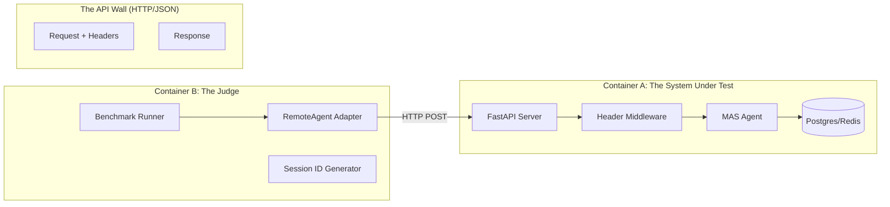

# ADR-009: Decoupling Benchmark via Containerized "API Wall"

**Title:** Decoupling `goodai-ltm-benchmark` from `mas-memory-layer` via Containerization and HTTP API ("The API Wall")
**Status:** Accepted
**Date:** February 10, 2026
**Author:** MAS Architecture Team

## 1. Context

The project currently operates as a monolithic Python repository where the Benchmark ("The Judge") interacts with the Memory Agent ("The System Under Test") via direct Python imports/class instantiation.

This architecture has led to critical stability and development velocity issues:

1. **Dependency Conflicts ("Split Brain"):** The root project uses Python 3.12 (modern features), while the Benchmark uses Python 3.11 (library compatibility). Maintaining a unified environment has become unmanageable.
2. **Environment Drift:** Code updates in `src/` are often not reflected in the benchmark runner due to caching/installation issues in the virtual environment.
3. **Lack of Isolation:** There is no strict boundary preventing test state from bleeding into agent state, or preventing the benchmark from accessing internal agent methods that would not be available in production.
4. **Verification Gap:** We cannot easily verify if the `FactExtractor` or `PromotionEngine` works in a production-like environment because the test runner bypasses the network/API layer.

## 2. Decision

We will transition from a Monolithic Import architecture to a **Two-Container Microservices Architecture**.

1. **Container A (mas-memory-layer):** Will run as a REST API server (FastAPI), exposing the Agent's capabilities.
2. **Container B (goodai-ltm-benchmark):** Will run as a client, executing test scripts and communicating with Container A via HTTP.
3. **The "API Wall":** A formal HTTP protocol will define the boundary between Judge and Contestant.

This decision enforces a "Share Nothing" architecture. The Benchmark will treat the Agent as a Black Box.

## 3. Technical Specification ("The API Wall")

Since developers do not have access to the preliminary research reports, this section defines the mandatory interface requirements.

### 3.1 Architecture Diagram

### 3.2 Protocol Design

We will separate the API into **Data Plane** (Standard Chat) and **Control Plane** (Benchmark Utilities).

#### **A. Data Plane (Standard Interaction)**

We will adopt the **OpenAI Chat Completions API** schema. This ensures future compatibility with other evaluation tools.

* **Endpoint:** `POST /v1/chat/completions`
* **Payload:** Standard OpenAI format (`messages`, `model`, `stream`).
* **Response:** Standard OpenAI `ChatCompletion` object.

#### **B. Control Plane ("God Mode")**

To perform rigorous LTM testing (e.g., testing decay over weeks), the Benchmark needs to manipulate the Agent's perception of time and state.

* **Endpoint:** `POST /control/session/reset`
* *Action:* Wipes all memory (Redis/Postgres) for the specific Session ID.

* **Endpoint:** `POST /control/memory/inject` (Optional Phase 2)
* *Action:* Forces specific facts into LTM for retrieval testing.

### 3.3 State & Context Propagation (Headers)

We will **not** pass control parameters in the JSON body of the chat. We will use HTTP Headers to maintain separation of concerns.

| Header Name | Purpose | Value Source | Behavior |
| --- | --- | --- | --- |
| **`X-Session-Id`** | **Mandatory.** Defines the isolation scope. | Generated by Benchmark Runner (UUID). | Agent uses this to namespace Redis/Postgres keys. |
| **`X-Mock-Time`** | **Critical.** Simulates time travel. | Benchmark Config (ISO 8601). | If present, Agent overwrites `datetime.now()` with this value to test memory decay. |
| **`traceparent`** | Observability. | Generated by OpenTelemetry. | Agent propagates this to internal spans so traces show a unified waterfall in Arize Phoenix. |

### 3.4 Data Schema Strategy

To avoid creating a third repository for shared code immediately:

* **Agent (Server):** Owns the Pydantic models for the API.
* **Benchmark (Client):** Will maintain a local, simplified definition of the request/response schemas or use generic dictionaries.
* *Rational:* The JSON protocol is the contract. We do not need shared Python code to share JSON schemas.

## 4. Implementation Plan

### Phase 1: Server Implementation (Container A)

1. Create `src/server.py` using `FastAPI`.
2. Implement `POST /v1/chat/completions` which maps to `Agent.run_turn()`.
3. Implement Middleware to extract `X-Session-Id` and `X-Mock-Time` and inject them into the `ActiveContext`.
4. Create `Dockerfile` for the root project.

### Phase 2: Client Adaptation (Container B)

1. Refactor `benchmarks/goodai-ltm-benchmark/model_interfaces/ltm_agent_wrapper.py`.
2. Replace `MemoryAgent` class import with a `RemoteAgent` class using `httpx` or `requests`.
3. Create `Dockerfile` for the benchmark project.

### Phase 3: Orchestration

1. Create `docker-compose.yml` to link the two services.
2. Verify the `FactExtractor` fix by running the benchmark container against the fresh agent container.

## 5. Consequences

**Positive:**

* **Environment Isolation:** Python 3.12 features can be used in the Agent without breaking the 3.11 Benchmark tools.
* **Deployment Parity:** The Agent runs as a web server, exactly as it will in production.
* **Debuggability:** We can verify the "Fact Extractor" prompt fix by inspecting the container logs via volume mapping.

**Negative:**

* **Debugging Complexity:** We cannot use a simple debugger breakpoint across the process boundary. We must rely on Logs and Traces (Phoenix).
* **Latency:** Adds slight HTTP overhead to benchmarks (negligible for LLM latency).