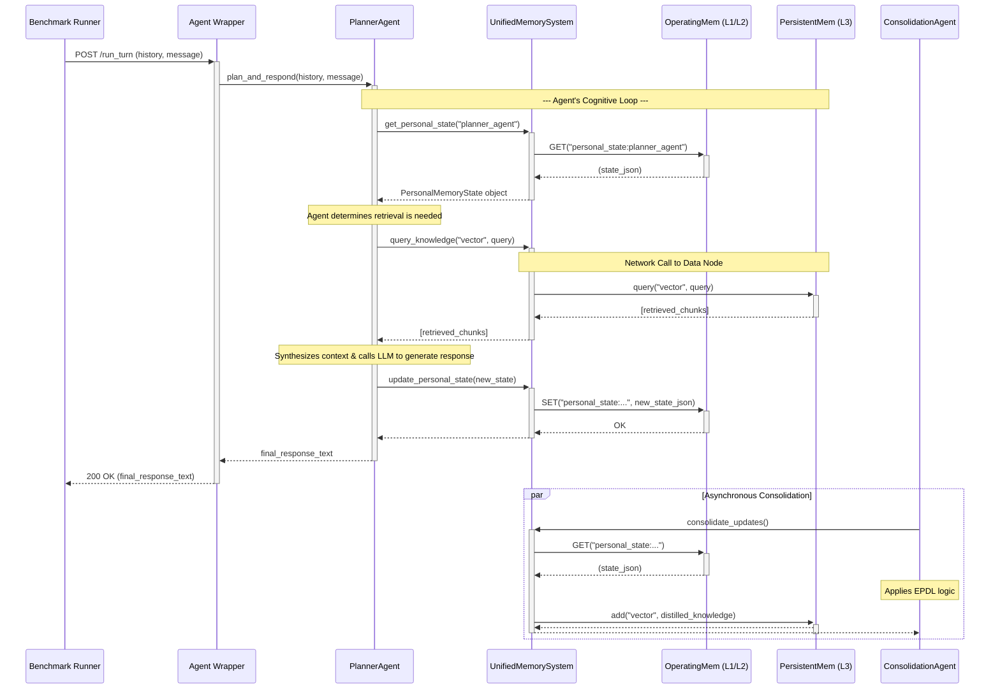
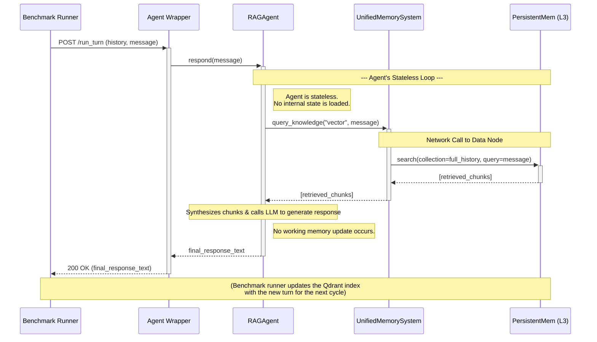
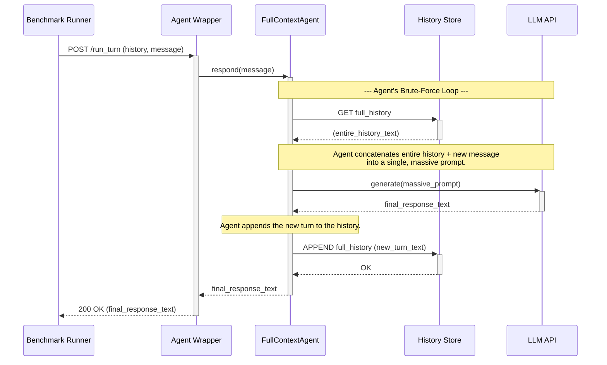

# Sequence Diagrams (Consolidated)

**Status:** Consolidated reference for UC-01, UC-02, UC-03 sequence diagrams

This document unifies the legacy SD-01, SD-02, and SD-03 files. The original files are preserved
as archived references.

---

## SD-01: Full System (UC-01)

Here is the Mermaid sequence diagram that visually represents the "Run GoodAI LTM Benchmark Test" use case (UC-01).

### **Mermaid Sequence Diagram Code**

You can copy and paste this code block into any Markdown editor that supports Mermaid (like GitHub, GitLab, or Obsidian) or into the Mermaid Live Editor to render the diagram.

### **Code Mentor Notes: How to Read This Diagram**

- **Lifelines:** Each vertical line represents a component from our architecture. I've separated `Redis` and `KSM (KnowledgeStoreManager)` from the main `UnifiedMemorySystem` to clearly show which layer is being accessed.
- **Solid Arrows (`->>`)**: These represent active function calls or requests. The `+` and `-` signs at the ends of the arrows show the activation/deactivation of a component on the call stack.
- **Dashed Arrows (`-->>`)**: These represent the return value from a function call.
- **Notes:** The `Note over...` boxes provide context for what's happening "inside the agent's head" or across the system, like the agent's internal decision to perform a retrieval or the fact that a call to `KSM` is a network call.
- **Parallel Block (`par`)**: The `par...end` block at the bottom is crucial. It correctly visualizes the **Asynchronous Consolidation** process, showing that the `ConsolidationAgent` runs in parallel to the main request-response flow, as specified in our Use Case. This is a key feature of our architecture's design for efficiency.

This diagram, combined with the Use Case Specification, provides a comprehensive picture of the first benchmark run.

---

## SD-02: Standard RAG Agent (UC-02)

Here is the Mermaid sequence diagram for the second experimental run, the **"Standard RAG Agent"** baseline (UC-02).

This diagram is intentionally simpler than the first. Its simplicity is key to visually communicating the architectural trade-offs to the reviewers. It highlights the direct, stateless nature of the RAG agent and contrasts it with the more complex, stateful interactions of our full system.

### **Mermaid Sequence Diagram Code (Standard RAG Agent)**

### **Code Mentor Notes: How to Read This Diagram & Its Strategic Importance**

- **Fewer Lifelines:** Notice there is no `Redis` (Operating Memory) or `ConsolidationAgent`. This immediately shows that the architecture is flatter and less complex.
- **Stateless by Design:** The `Note` blocks explicitly call out that the agent does not load any internal state at the beginning of its turn and does not save any state at the end. It starts "fresh" every time, relying solely on retrieval. This is the definition of a standard RAG agent.
- **Single, Heavy Retrieval:** The diagram shows only **one** interaction with memory: a single, large `search` query to the `Qdrant` collection that contains the entire history. This visually contrasts with the Full System's multi-step `get_personal_state` followed by `query_knowledge`.
- **No Asynchronous Process:** There is no `par...end` block. The process is a simple, linear request-response. The responsibility of updating the knowledge base for the next turn is pushed outside the agent's core logic (handled by the benchmark runner itself).

When placed next to the sequence diagram for our full system, this diagram will powerfully and intuitively communicate the architectural differences we are testing. It tells the reviewers: "This is the simple, standard way. The other diagram shows our more sophisticated, stateful, and multi-layered approach."

---

## SD-03: Full-Context Agent (UC-03)

This diagram is designed to visually emphasize the brute-force nature of this approach. The most important part of this diagram is the single, massive call to the LLM, which represents the extreme inefficiency we are trying to solve with our architecture.

### **Mermaid Sequence Diagram Code (Full-Context Agent)**

### **Code Mentor Notes: How to Read This Diagram & Its Strategic Importance**

- **Different Role for Redis:** Notice the lifeline is labeled **`History Store`**. This is a deliberate choice to distinguish it from the `OperatingMem (L1/L2)` in the full system diagram. Here, Redis is not being used as a sophisticated, structured cache or workspace; it's just a simple, "dumb" container for a single, massive string of text.
- **The Massive LLM Call:** The central and most important interaction is the call to the `LLM API`. The `Note` explicitly states that the prompt is "massive." This visually communicates the core weakness of this approach: immense token consumption and high latency. This single arrow represents the primary source of inefficiency that our hybrid architecture is designed to eliminate.
- **No Persistent Layer:** There is no `KSM` or Persistent Knowledge Layer involved. The agent cannot learn or access structured, long-term knowledge. Its only memory is the linear, raw text of the conversation.
- **Simplicity as a Weakness:** The diagram is very simple—a loop of "read all, process all, write all." This simplicity is not a strength; it's the reason for the inefficiency. When compared to the other diagrams, it powerfully illustrates that sophistication (like tiered retrieval and consolidation) is necessary for performance.

This diagram completes the visual narrative for our three experimental conditions. Together, the three diagrams will provide the reviewers with an immediate and intuitive understanding of the architectural differences we are testing.
