# Implementation Plan - Multi-Layered Memory System (ADR-003 Compliant)

**Date Created:** November 2, 2025  
**Status:** Active Development Plan  
**Current Phase:** Phase 2 - Memory Tiers & Lifecycle Engines  
**ADR Reference:** [ADR-003: Four-Tier Cognitive Memory Architecture](../ADR/003-four-layers-memory.md)  
**Target Environment:** `skz-dev-lv` (Orchestrator Node) + `skz-stg-lv` (Data Node)

---

## Executive Summary

This implementation plan outlines the development roadmap for completing the ADR-003 four-tier cognitive memory architecture. Phase 1 (Storage Foundation) has been successfully completed. This plan focuses on Phase 2 (Memory Intelligence), Phase 3 (Agent Integration), and Phase 4 (Evaluation).

**Current Status:**
- ✅ **Phase 1 Complete** (October 2025) - Storage adapters production-ready
- 🚧 **Phase 2 In Planning** (November 2025 onwards) - Memory tiers & lifecycle engines
- ⏳ **Phase 3 Planned** - Agent integration with LangGraph
- ⏳ **Phase 4 Planned** - Benchmark evaluation

**Key Insight:** Storage adapters (Phase 1) provide the database infrastructure. Memory tiers and lifecycle engines (Phase 2) implement the intelligent cognitive patterns that make this an ADR-003-compliant memory system.

---

## Table of Contents

1. [Current State Assessment](#1-current-state-assessment)
2. [Architecture Overview](#2-architecture-overview)
3. [Phase 2: Memory Tiers & Lifecycle Engines (11 weeks)](#3-phase-2-memory-tiers--lifecycle-engines)
   - 2A: Memory Tier Classes (Weeks 1-3)
   - 2B: CIAR Scoring & Promotion (Weeks 4-5)
   - 2C: Consolidation Engine (Weeks 6-8)
   - 2D: Distillation Engine (Weeks 9-10)
   - 2E: Memory Orchestrator (Week 11)
4. [Phase 3: Agent Integration (2-3 weeks)](#4-phase-3-agent-integration)
5. [Phase 4: Evaluation Framework (1-2 weeks)](#5-phase-4-evaluation-framework)
6. [Timeline & Milestones](#6-timeline--milestones)
7. [Risk Management](#7-risk-management)
8. [Success Criteria](#8-success-criteria)
9. [Development Workflow](#9-development-workflow)
10. [References & Resources](#10-references--resources)

---

## 1. Current State Assessment

### What's Complete ✅

**Phase 1: Storage Foundation (100%)**

Delivered in October 2025 with exceptional quality:

| Component | Status | Coverage | Grade | Notes |
|-----------|--------|----------|-------|-------|
| **Base Interface** | ✅ Complete | 100% | A+ (98/100) | Abstract `StorageAdapter` with 6 exceptions |
| **PostgreSQL Adapter** | ✅ Complete | 71% | A- (92/100) | L1/L2 relational storage |
| **Redis Adapter** | ✅ Complete | 75% | A (95/100) | Sub-millisecond cache |
| **Qdrant Adapter** | ✅ Complete | 81% | A (94/100) | Vector similarity search |
| **Neo4j Adapter** | ✅ Complete | 80% | A (93/100) | Graph entity storage |
| **Typesense Adapter** | ✅ Complete | 96% | A+ (96/100) | Full-text search |
| **Metrics System** | ✅ Complete | 100% | A+ (100/100) | Comprehensive observability |
| **Benchmarking** | ✅ Complete | N/A | A+ | Performance suite |

**Key Achievements:**
- 83% overall test coverage (all adapters >80%)
- Production-ready error handling and connection pooling
- Comprehensive metrics (latency, throughput, success rates)
- Performance benchmarking suite with publication-ready output
- Complete documentation with examples

**Infrastructure:**
- ✅ Orchestrator Node (`skz-dev-lv` - 192.168.107.172): PostgreSQL, Redis
- ✅ Data Node (`skz-stg-lv` - 192.168.107.187): Qdrant, Neo4j, Typesense
- ✅ Connectivity verified and stable

### What's Missing ❌

**Phase 2: Memory Intelligence (0%)**

All components required by ADR-003 for intelligent memory management:

| Component | Status | Priority | Complexity |
|-----------|--------|----------|------------|
| **Memory Tier Classes** | ❌ Not started | Critical | Medium |
| **CIAR Scoring System** | ❌ Not started | Critical | Medium-High |
| **Promotion Engine** | ❌ Not started | Critical | High |
| **Consolidation Engine** | ❌ Not started | Critical | High |
| **Distillation Engine** | ❌ Not started | High | Medium-High |
| **LLM Integrations** | ❌ Not started | High | Medium |
| **Bi-Temporal Model** | ❌ Not started | High | Medium-High |
| **Circuit Breakers** | ❌ Not started | Medium | Low-Medium |
| **Memory Orchestrator** | ⚠️ Partial | Critical | Medium |

**Phase 3-4: Agents & Evaluation (0%)**
- ❌ LangGraph agent implementations
- ❌ GoodAI LTM benchmark integration
- ❌ Multi-agent coordination
- ❌ Evaluation framework

### Overall Progress

**Completion:** ~30% of full ADR-003 vision
- Phase 1: 100% (2 weeks)
- Phase 2: 0% (11 weeks estimated)
- Phase 3: 0% (2-3 weeks estimated)
- Phase 4: 0% (1-2 weeks estimated)

**Total Timeline:** 16-17 weeks (2 complete, 14-15 remaining)

---

## 2. Architecture Overview

### ADR-003 Four-Tier Hierarchy

```mermaid
graph TB
    subgraph "L1: Active Context (Redis + PostgreSQL)"
        L1["Working Memory Buffer<br/>10-20 recent turns<br/>TTL: 24 hours<br/><br/>✅ Storage Ready<br/>❌ Tier Logic Needed"]
    end
    
    subgraph "L2: Working Memory (PostgreSQL)"
        L2["Significance Filter<br/>CIAR-scored facts<br/>TTL: 7 days<br/><br/>✅ Storage Ready<br/>❌ CIAR System Needed"]
    end
    
    subgraph "L3: Episodic Memory (Qdrant + Neo4j)"
        L3["Hybrid Experience Store<br/>Vector + Graph<br/>Permanent<br/><br/>✅ Storage Ready<br/>❌ Episode Logic Needed"]
    end
    
    subgraph "L4: Semantic Memory (Typesense)"
        L4["Distilled Knowledge<br/>Generalized patterns<br/>Permanent<br/><br/>✅ Storage Ready<br/>❌ Distillation Needed"]
    end
    
    subgraph "Autonomous Lifecycle Engines"
        PE["Promotion Engine<br/>L1 → L2<br/>Fact extraction + CIAR"]
        CE["Consolidation Engine<br/>L2 → L3<br/>Episode clustering"]
        DE["Distillation Engine<br/>L3 → L4<br/>Pattern mining"]
    end
    
    Agent[Multi-Agent System] --> L1
    L1 --> PE
    PE --> L2
    L2 --> CE
    CE --> L3
    L3 --> DE
    DE --> L4
```



### Component Architecture

```
src/
├── storage/                    # ✅ PHASE 1 COMPLETE
│   ├── base.py                # Abstract adapter + exceptions
│   ├── postgres_adapter.py    # L1/L2 relational storage
│   ├── redis_adapter.py       # L1 high-speed cache
│   ├── qdrant_adapter.py      # L3 vector search
│   ├── neo4j_adapter.py       # L3 graph relationships
│   ├── typesense_adapter.py   # L4 full-text search
│   └── metrics/               # Observability infrastructure
│
├── memory/                     # ❌ PHASE 2 TO IMPLEMENT
│   ├── tiers/                 # Memory tier classes
│   │   ├── base_tier.py       # Abstract tier interface
│   │   ├── active_context_tier.py    # L1 logic
│   │   ├── working_memory_tier.py    # L2 logic
│   │   ├── episodic_memory_tier.py   # L3 coordination
│   │   └── semantic_memory_tier.py   # L4 logic
│   │
│   ├── engines/               # Autonomous processors
│   │   ├── base_engine.py     # Abstract engine interface
│   │   ├── promotion_engine.py       # L1→L2 promotion
│   │   ├── consolidation_engine.py   # L2→L3 consolidation
│   │   └── distillation_engine.py    # L3→L4 distillation
│   │
│   ├── ciar_scorer.py         # Core research contribution
│   ├── fact_extractor.py      # LLM-based extraction
│   ├── episode_consolidator.py       # Episode clustering
│   ├── knowledge_distiller.py        # Pattern mining
│   ├── temporal_graph_model.py       # Bi-temporal Neo4j
│   ├── circuit_breaker.py     # Resilience patterns
│   └── memory_orchestrator.py # Unified coordination
│
├── agents/                     # ❌ PHASE 3 TO IMPLEMENT
│   ├── base_agent.py          # Shared utilities
│   ├── memory_augmented_agent.py     # UC-01: Full system
│   ├── baseline_rag_agent.py         # UC-02: Standard RAG
│   └── full_context_agent.py         # UC-03: Naive baseline
│
├── evaluation/                 # ❌ PHASE 4 TO IMPLEMENT
│   ├── benchmark_runner.py    # GoodAI LTM integration
│   ├── metrics_collector.py   # Performance tracking
│   └── results_analyzer.py    # Comparative analysis
│
└── utils/
    ├── config.py              # Configuration management
    ├── logging.py             # Logging utilities
    └── llm_client.py          # LLM integration wrapper
```

### Data Flow

**Write Path (Information Lifecycle):**
```
User Input → Agent
    ↓
L1: Store turn (Redis + PostgreSQL)
    ↓
[Promotion Engine runs async]
    ↓
L2: Extract facts, score with CIAR, promote if significant
    ↓
[Consolidation Engine runs async]
    ↓
L3: Cluster facts, summarize episodes, dual-index (Qdrant + Neo4j)
    ↓
[Distillation Engine runs async]
    ↓
L4: Mine patterns, synthesize knowledge (Typesense)
```

**Read Path (Memory Retrieval):**
```
User Query → Agent
    ↓
Memory Orchestrator coordinates:
    ├─ L1: Recent turns (immediate context)
    ├─ L2: Significant facts (working knowledge)
    ├─ L3: Similar episodes (experiential learning)
    └─ L4: Generalized knowledge (distilled wisdom)
    ↓
Combined context → Agent reasoning → Response
```

---

## 3. Phase 2: Memory Tiers & Lifecycle Engines

### Overview

**Duration:** 11 weeks  
**Goal:** Implement ADR-003 memory intelligence on top of storage foundation  
**Deliverable:** Fully operational four-tier memory system with autonomous lifecycle

**Sub-Phases:**
- **2A:** Memory Tier Classes (3 weeks)
- **2B:** CIAR Scoring & Promotion (2 weeks)
- **2C:** Consolidation Engine (3 weeks)
- **2D:** Distillation Engine (2 weeks)
- **2E:** Memory Orchestrator (1 week)

---

### Phase 2A: Memory Tier Classes (Weeks 1-3)

**Objective:** Create tier abstraction layer that coordinates storage adapters with tier-specific logic.

#### Week 1: Base Tier & L1 Active Context

**Goal:** Create the foundational tier abstraction layer and implement L1 Active Context with turn windowing and TTL management.

**Deliverables:**
- [ ] `src/memory/tiers/base_tier.py` - Abstract base class
- [ ] `src/memory/tiers/active_context_tier.py` - L1 implementation
- [ ] `tests/memory/test_active_context_tier.py` - Tests with 80%+ coverage
- [ ] Documentation with usage examples

---

##### Task 1.1: Create Base Tier Interface

**File:** `src/memory/tiers/base_tier.py`

**Purpose:** Define the abstract interface that all memory tiers must implement, ensuring consistency across L1-L4.

**Key Components:**

```python
from abc import ABC, abstractmethod
from typing import Dict, Any, List, Optional
from contextlib import asynccontextmanager
from src.storage.base import StorageAdapter
from src.storage.metrics import MetricsCollector

class BaseTier(ABC):
    """
    Abstract base class for all memory tiers.
    
    Each tier wraps one or more storage adapters and implements
    tier-specific logic (windowing, TTL, CIAR filtering, etc.)
    """
    
    def __init__(
        self,
        storage_adapters: Dict[str, StorageAdapter],
        metrics_collector: Optional[MetricsCollector] = None,
        config: Optional[Dict[str, Any]] = None
    ):
        """
        Args:
            storage_adapters: Dict mapping storage names to adapter instances
            metrics_collector: Optional metrics collector for observability
            config: Tier-specific configuration parameters
        """
        self.storage_adapters = storage_adapters
        self.metrics = metrics_collector or MetricsCollector()
        self.config = config or {}
    
    @abstractmethod
    async def store(self, data: Dict[str, Any]) -> str:
        """
        Store data in this tier.
        
        Args:
            data: Data to store (format varies by tier)
            
        Returns:
            Unique identifier for stored data
        """
        pass
    
    @abstractmethod
    async def retrieve(self, identifier: str) -> Optional[Dict[str, Any]]:
        """
        Retrieve data by identifier.
        
        Args:
            identifier: Unique identifier
            
        Returns:
            Retrieved data or None if not found
        """
        pass
    
    @abstractmethod
    async def query(
        self,
        filters: Optional[Dict[str, Any]] = None,
        limit: int = 10,
        **kwargs
    ) -> List[Dict[str, Any]]:
        """
        Query data with optional filters.
        
        Args:
            filters: Query filters (format varies by tier)
            limit: Maximum number of results
            **kwargs: Additional tier-specific parameters
            
        Returns:
            List of matching records
        """
        pass
    
    @abstractmethod
    async def delete(self, identifier: str) -> bool:
        """
        Delete data by identifier.
        
        Args:
            identifier: Unique identifier
            
        Returns:
            True if deleted, False if not found
        """
        pass
    
    @abstractmethod
    async def health_check(self) -> Dict[str, Any]:
        """
        Check health of all underlying storage adapters.
        
        Returns:
            Health status dict with per-adapter status
        """
        pass
    
    async def get_metrics(self) -> Dict[str, Any]:
        """
        Get tier-specific metrics.
        
        Returns:
            Metrics dictionary
        """
        return self.metrics.get_all_metrics()
```

**Implementation Requirements:**
- Use Python's `ABC` and `abstractmethod` for type safety
- Integrate with existing `MetricsCollector` from Phase 1
- Support dependency injection of storage adapters
- Include docstrings with type hints
- Add logging for all operations

**Validation:**
- [ ] All methods properly type-hinted
- [ ] Docstrings follow Google/NumPy style
- [ ] Compatible with existing `StorageAdapter` interface
- [ ] Metrics integration working

---

##### Task 1.2: Implement L1 Active Context Tier

**File:** `src/memory/tiers/active_context_tier.py`

**Purpose:** Implement L1 "working memory buffer" that maintains the most recent 10-20 conversational turns with automatic TTL expiration.

**Architecture:**
- **Primary Storage:** Redis (high-speed cache for sub-millisecond access)
- **Secondary Storage:** PostgreSQL (persistent backup for recovery)
- **Pattern:** Write-through cache with Redis as hot layer

**Key Components:**

```python
from typing import Dict, Any, List, Optional
from datetime import datetime, timedelta
import json
from src.memory.tiers.base_tier import BaseTier
from src.storage.redis_adapter import RedisAdapter
from src.storage.postgres_adapter import PostgresAdapter
from src.storage.metrics import OperationTimer

class ActiveContextTier(BaseTier):
    """
    L1: Active Context - Working Memory Buffer
    
    Maintains 10-20 most recent conversational turns per session.
    Uses Redis for speed, PostgreSQL for durability.
    Automatic TTL expiration after 24 hours.
    """
    
    DEFAULT_WINDOW_SIZE = 20
    DEFAULT_TTL_HOURS = 24
    
    def __init__(
        self,
        redis_adapter: RedisAdapter,
        postgres_adapter: PostgresAdapter,
        metrics_collector: Optional[MetricsCollector] = None,
        config: Optional[Dict[str, Any]] = None
    ):
        storage_adapters = {
            'redis': redis_adapter,
            'postgres': postgres_adapter
        }
        super().__init__(storage_adapters, metrics_collector, config)
        
        self.redis = redis_adapter
        self.postgres = postgres_adapter
        self.window_size = config.get('window_size', self.DEFAULT_WINDOW_SIZE)
        self.ttl_hours = config.get('ttl_hours', self.DEFAULT_TTL_HOURS)
    
    async def store(self, data: Dict[str, Any]) -> str:
        """
        Store a conversational turn in L1.
        
        Args:
            data: {
                'session_id': str,
                'turn_id': str,
                'role': str ('user' | 'assistant'),
                'content': str,
                'timestamp': datetime,
                'metadata': Dict (optional)
            }
            
        Returns:
            Unique turn identifier
        """
        with OperationTimer(self.metrics, 'l1_store'):
            # Validate required fields
            required = ['session_id', 'turn_id', 'role', 'content']
            validate_required_fields(data, required)
            
            session_id = data['session_id']
            turn_id = data['turn_id']
            
            # Store in Redis (hot cache)
            redis_key = f"l1:session:{session_id}"
            turn_data = {
                'turn_id': turn_id,
                'role': data['role'],
                'content': data['content'],
                'timestamp': data.get('timestamp', datetime.utcnow()).isoformat(),
                'metadata': data.get('metadata', {})
            }
            
            # Append to list and trim to window size
            await self.redis.lpush(redis_key, json.dumps(turn_data))
            await self.redis.ltrim(redis_key, 0, self.window_size - 1)
            
            # Set TTL
            ttl_seconds = self.ttl_hours * 3600
            await self.redis.expire(redis_key, ttl_seconds)
            
            # Store in PostgreSQL (persistent backup)
            postgres_data = {
                'session_id': session_id,
                'turn_id': turn_id,
                'role': data['role'],
                'content': data['content'],
                'timestamp': data.get('timestamp', datetime.utcnow()),
                'tier': 'L1',
                'metadata': json.dumps(data.get('metadata', {}))
            }
            await self.postgres.insert('active_context', postgres_data)
            
            self.metrics.increment('l1_turns_stored')
            return turn_id
    
    async def retrieve(self, session_id: str) -> Optional[List[Dict[str, Any]]]:
        """
        Retrieve recent turns for a session.
        
        Args:
            session_id: Session identifier
            
        Returns:
            List of recent turns (newest first) or None
        """
        with OperationTimer(self.metrics, 'l1_retrieve'):
            redis_key = f"l1:session:{session_id}"
            
            # Try Redis first (hot path)
            turns_json = await self.redis.lrange(redis_key, 0, -1)
            if turns_json:
                turns = [json.loads(t) for t in turns_json]
                self.metrics.increment('l1_redis_hits')
                return turns
            
            # Fallback to PostgreSQL (cold path)
            postgres_result = await self.postgres.query(
                table='active_context',
                filters={'session_id': session_id, 'tier': 'L1'},
                order_by='timestamp DESC',
                limit=self.window_size
            )
            
            if postgres_result:
                self.metrics.increment('l1_postgres_fallbacks')
                # Rebuild Redis cache
                for turn in reversed(postgres_result):
                    turn_data = {
                        'turn_id': turn['turn_id'],
                        'role': turn['role'],
                        'content': turn['content'],
                        'timestamp': turn['timestamp'].isoformat(),
                        'metadata': json.loads(turn.get('metadata', '{}'))
                    }
                    await self.redis.lpush(redis_key, json.dumps(turn_data))
                
                return postgres_result
            
            return None
    
    async def query(
        self,
        filters: Optional[Dict[str, Any]] = None,
        limit: int = 10,
        **kwargs
    ) -> List[Dict[str, Any]]:
        """
        Query turns with filters.
        
        Args:
            filters: {'session_id': str, 'role': str (optional)}
            limit: Max results
            
        Returns:
            List of matching turns
        """
        with OperationTimer(self.metrics, 'l1_query'):
            # L1 queries always go to PostgreSQL for flexibility
            return await self.postgres.query(
                table='active_context',
                filters={**filters, 'tier': 'L1'} if filters else {'tier': 'L1'},
                order_by='timestamp DESC',
                limit=limit
            )
    
    async def delete(self, session_id: str) -> bool:
        """
        Delete session from L1.
        
        Args:
            session_id: Session to delete
            
        Returns:
            True if deleted
        """
        with OperationTimer(self.metrics, 'l1_delete'):
            redis_key = f"l1:session:{session_id}"
            await self.redis.delete(redis_key)
            await self.postgres.delete(
                'active_context',
                filters={'session_id': session_id, 'tier': 'L1'}
            )
            self.metrics.increment('l1_sessions_deleted')
            return True
    
    async def get_window_size(self, session_id: str) -> int:
        """Get current window size for session."""
        redis_key = f"l1:session:{session_id}"
        return await self.redis.llen(redis_key)
    
    async def health_check(self) -> Dict[str, Any]:
        """Check health of Redis and PostgreSQL."""
        redis_health = await self.redis.health_check()
        postgres_health = await self.postgres.health_check()
        
        return {
            'tier': 'L1_active_context',
            'status': 'healthy' if (
                redis_health['status'] == 'healthy' and
                postgres_health['status'] == 'healthy'
            ) else 'degraded',
            'storage': {
                'redis': redis_health,
                'postgres': postgres_health
            }
        }
```

**Implementation Requirements:**
- Use Redis LPUSH/LRANGE/LTRIM for list operations
- Implement write-through cache pattern (write to both Redis and PostgreSQL)
- Automatic window enforcement (keep only N recent turns)
- TTL management with Redis EXPIRE command
- Graceful fallback to PostgreSQL if Redis unavailable
- Comprehensive error handling with custom exceptions
- Metrics for cache hit rate, latency, operation counts

**Configuration:**
```yaml
# config/memory_config.yaml
l1_active_context:
  window_size: 20
  ttl_hours: 24
  redis_list_key_pattern: "l1:session:{session_id}"
  enable_postgres_backup: true
```

**Validation:**
- [ ] Stores turns in both Redis and PostgreSQL
- [ ] Enforces window size automatically
- [ ] TTL expires old sessions correctly
- [ ] Fallback to PostgreSQL works when Redis unavailable
- [ ] Metrics tracking all operations
- [ ] Performance: <5ms average latency

---

##### Task 1.3: Write Comprehensive Tests

**File:** `tests/memory/test_active_context_tier.py`

**Test Coverage Requirements:** 80%+

**Test Cases:**

```python
import pytest
from datetime import datetime, timedelta
from src.memory.tiers.active_context_tier import ActiveContextTier
from src.storage.redis_adapter import RedisAdapter
from src.storage.postgres_adapter import PostgresAdapter

@pytest.fixture
async def active_context_tier(redis_adapter, postgres_adapter):
    """Fixture providing configured L1 tier."""
    tier = ActiveContextTier(
        redis_adapter=redis_adapter,
        postgres_adapter=postgres_adapter,
        config={'window_size': 10, 'ttl_hours': 24}
    )
    yield tier
    # Cleanup
    await tier.delete('test_session')

class TestActiveContextTier:
    """Test suite for L1 Active Context Tier."""
    
    async def test_store_turn(self, active_context_tier):
        """Test storing a single turn."""
        turn_data = {
            'session_id': 'test_session',
            'turn_id': 'turn_001',
            'role': 'user',
            'content': 'Hello, world!',
            'timestamp': datetime.utcnow()
        }
        
        turn_id = await active_context_tier.store(turn_data)
        assert turn_id == 'turn_001'
        
        # Verify in Redis
        turns = await active_context_tier.retrieve('test_session')
        assert len(turns) == 1
        assert turns[0]['content'] == 'Hello, world!'
    
    async def test_window_enforcement(self, active_context_tier):
        """Test automatic window size enforcement."""
        # Store 15 turns (window size is 10)
        for i in range(15):
            await active_context_tier.store({
                'session_id': 'test_session',
                'turn_id': f'turn_{i:03d}',
                'role': 'user' if i % 2 == 0 else 'assistant',
                'content': f'Turn {i}',
            })
        
        # Should only keep 10 most recent
        turns = await active_context_tier.retrieve('test_session')
        assert len(turns) == 10
        assert turns[0]['turn_id'] == 'turn_014'  # Most recent
        assert turns[-1]['turn_id'] == 'turn_005'  # Oldest in window
    
    async def test_ttl_expiration(self, active_context_tier):
        """Test TTL expiration (simulated)."""
        # Store turn
        await active_context_tier.store({
            'session_id': 'test_session',
            'turn_id': 'turn_001',
            'role': 'user',
            'content': 'Test',
        })
        
        # Check TTL is set on Redis key
        redis_key = 'l1:session:test_session'
        ttl = await active_context_tier.redis.ttl(redis_key)
        assert ttl > 0
        assert ttl <= 24 * 3600
    
    async def test_session_isolation(self, active_context_tier):
        """Test sessions are isolated from each other."""
        # Store in session 1
        await active_context_tier.store({
            'session_id': 'session_1',
            'turn_id': 'turn_001',
            'role': 'user',
            'content': 'Session 1',
        })
        
        # Store in session 2
        await active_context_tier.store({
            'session_id': 'session_2',
            'turn_id': 'turn_001',
            'role': 'user',
            'content': 'Session 2',
        })
        
        # Verify isolation
        s1_turns = await active_context_tier.retrieve('session_1')
        s2_turns = await active_context_tier.retrieve('session_2')
        
        assert len(s1_turns) == 1
        assert len(s2_turns) == 1
        assert s1_turns[0]['content'] == 'Session 1'
        assert s2_turns[0]['content'] == 'Session 2'
    
    async def test_postgres_fallback(self, active_context_tier, monkeypatch):
        """Test fallback to PostgreSQL when Redis unavailable."""
        # Store turn
        await active_context_tier.store({
            'session_id': 'test_session',
            'turn_id': 'turn_001',
            'role': 'user',
            'content': 'Test',
        })
        
        # Simulate Redis failure
        async def mock_lrange(*args, **kwargs):
            return None
        
        monkeypatch.setattr(active_context_tier.redis, 'lrange', mock_lrange)
        
        # Should still retrieve from PostgreSQL
        turns = await active_context_tier.retrieve('test_session')
        assert turns is not None
        assert len(turns) == 1
    
    async def test_health_check(self, active_context_tier):
        """Test health check aggregates storage status."""
        health = await active_context_tier.health_check()
        
        assert health['tier'] == 'L1_active_context'
        assert health['status'] in ['healthy', 'degraded']
        assert 'redis' in health['storage']
        assert 'postgres' in health['storage']
    
    async def test_metrics_tracking(self, active_context_tier):
        """Test metrics are collected."""
        # Perform operations
        await active_context_tier.store({
            'session_id': 'test_session',
            'turn_id': 'turn_001',
            'role': 'user',
            'content': 'Test',
        })
        await active_context_tier.retrieve('test_session')
        
        metrics = await active_context_tier.get_metrics()
        assert metrics['l1_turns_stored'] >= 1
        assert 'l1_store' in metrics
        assert 'l1_retrieve' in metrics
```

**Additional Test Cases:**
- [ ] Test missing required fields (should raise `StorageDataError`)
- [ ] Test concurrent access (thread safety)
- [ ] Test very large turns (edge cases)
- [ ] Test malformed JSON in metadata
- [ ] Test delete operation
- [ ] Test query with filters
- [ ] Test performance benchmarks (<5ms average)

---

##### Task 1.4: Documentation & Examples

**Create:** `docs/memory/tiers/active-context-tier.md`

**Include:**
- Architecture diagram showing Redis + PostgreSQL interaction
- Code examples for common operations
- Configuration options explained
- Performance characteristics
- Error handling patterns
- Migration guide from `memory_system.py`

**Example Usage:**

```python
# Initialize L1 tier
redis_adapter = RedisAdapter(host='skz-dev-lv', port=6379)
postgres_adapter = PostgresAdapter(
    host='skz-dev-lv',
    database='memory_db',
    user='memory_user'
)

l1_tier = ActiveContextTier(
    redis_adapter=redis_adapter,
    postgres_adapter=postgres_adapter,
    config={'window_size': 20, 'ttl_hours': 24}
)

# Store conversation turn
await l1_tier.store({
    'session_id': 'user_123',
    'turn_id': 'turn_001',
    'role': 'user',
    'content': 'What containers are currently in transit?'
})

# Retrieve recent context
recent_turns = await l1_tier.retrieve('user_123')
for turn in recent_turns:
    print(f"{turn['role']}: {turn['content']}")

# Check health
health = await l1_tier.health_check()
print(f"L1 Status: {health['status']}")
```

---

##### Acceptance Criteria

**Functionality:**
- [x] `BaseTier` abstract class defines consistent interface
- [x] `ActiveContextTier` stores turns in Redis + PostgreSQL
- [x] Window size automatically enforced (keeps N recent turns)
- [x] TTL expires sessions after 24 hours
- [x] Session isolation maintained
- [x] Graceful fallback to PostgreSQL when Redis unavailable
- [x] Delete operation clears both Redis and PostgreSQL

**Quality:**
- [x] 80%+ test coverage on all tier code
- [x] All tests passing in CI/CD
- [x] Type hints on all public methods
- [x] Docstrings following project standards
- [x] Error handling with appropriate exceptions

**Performance:**
- [x] Average latency <5ms for store operations
- [x] Average latency <3ms for retrieve operations (Redis hot path)
- [x] Handles 1000+ operations/second sustained

**Integration:**
- [x] Compatible with existing storage adapters
- [x] Metrics integrated with existing `MetricsCollector`
- [x] Logging integrated with project logger
- [x] Configuration follows project patterns

**Documentation:**
- [x] Tier documentation with architecture diagrams
- [x] Code examples for common use cases
- [x] Configuration options documented
- [x] Migration guide from legacy code

---

##### Estimated Effort

- **Task 1.1** (Base Tier): 4 hours
- **Task 1.2** (L1 Implementation): 8 hours
- **Task 1.3** (Tests): 6 hours
- **Task 1.4** (Documentation): 2 hours

**Total:** ~20 hours (2.5 days)

---

##### Dependencies

**Required:**
- ✅ Redis adapter (Phase 1 complete)
- ✅ PostgreSQL adapter (Phase 1 complete)
- ✅ MetricsCollector (Phase 1 complete)
- ✅ Base storage exceptions (Phase 1 complete)

**Blocked By:** None

**Blocks:** Week 2 (L2 Working Memory Tier needs L1 as promotion source)

---

#### Week 2: L2 Working Memory Tier

**Goal:** Implement L2 Working Memory as a significance-filtered store with CIAR metadata tracking and access pattern monitoring.

**Deliverables:**
- [ ] `migrations/002_working_memory_ciar.sql` - PostgreSQL schema update
- [ ] `src/memory/tiers/working_memory_tier.py` - L2 implementation
- [ ] `src/memory/models.py` - Pydantic models for facts
- [ ] `tests/memory/test_working_memory_tier.py` - Tests with 80%+ coverage
- [ ] Documentation with CIAR scoring examples

---

##### Task 2.1: Update PostgreSQL Schema for CIAR

**File:** `migrations/002_working_memory_ciar.sql`

**Purpose:** Extend the `working_memory` table with CIAR scoring columns and access tracking metadata required by ADR-003.

**Migration Script:**

```sql
-- Migration 002: CIAR Scoring & Access Tracking for Working Memory
-- Date: November 2025
-- Purpose: Add CIAR metadata to support significance-based filtering

BEGIN;

-- Add CIAR scoring columns
ALTER TABLE working_memory 
ADD COLUMN IF NOT EXISTS ciar_score FLOAT DEFAULT 0.0,
ADD COLUMN IF NOT EXISTS certainty FLOAT DEFAULT 0.0,
ADD COLUMN IF NOT EXISTS impact FLOAT DEFAULT 0.0,
ADD COLUMN IF NOT EXISTS age_decay FLOAT DEFAULT 1.0,
ADD COLUMN IF NOT EXISTS recency_boost FLOAT DEFAULT 1.0;

-- Add provenance and access tracking
ALTER TABLE working_memory
ADD COLUMN IF NOT EXISTS source_uri VARCHAR(500),
ADD COLUMN IF NOT EXISTS source_type VARCHAR(50) DEFAULT 'extracted',
ADD COLUMN IF NOT EXISTS extracted_at TIMESTAMP DEFAULT NOW(),
ADD COLUMN IF NOT EXISTS last_accessed TIMESTAMP DEFAULT NOW(),
ADD COLUMN IF NOT EXISTS access_count INTEGER DEFAULT 0;

-- Add fact classification
ALTER TABLE working_memory
ADD COLUMN IF NOT EXISTS fact_type VARCHAR(50),
ADD COLUMN IF NOT EXISTS fact_category VARCHAR(100);

-- Add constraints
ALTER TABLE working_memory
ADD CONSTRAINT check_ciar_score CHECK (ciar_score >= 0.0 AND ciar_score <= 1.0),
ADD CONSTRAINT check_certainty CHECK (certainty >= 0.0 AND certainty <= 1.0),
ADD CONSTRAINT check_impact CHECK (impact >= 0.0 AND impact <= 1.0),
ADD CONSTRAINT check_age_decay CHECK (age_decay >= 0.0 AND age_decay <= 1.0),
ADD CONSTRAINT check_recency_boost CHECK (recency_boost >= 0.0);

-- Create indexes for performance
CREATE INDEX IF NOT EXISTS idx_ciar_score 
ON working_memory(ciar_score DESC);

CREATE INDEX IF NOT EXISTS idx_session_ciar 
ON working_memory(session_id, ciar_score DESC);

CREATE INDEX IF NOT EXISTS idx_fact_type 
ON working_memory(fact_type);

CREATE INDEX IF NOT EXISTS idx_last_accessed 
ON working_memory(last_accessed DESC);

CREATE INDEX IF NOT EXISTS idx_extracted_at 
ON working_memory(extracted_at DESC);

-- Create composite index for common queries
CREATE INDEX IF NOT EXISTS idx_session_ciar_accessed 
ON working_memory(session_id, ciar_score DESC, last_accessed DESC);

-- Add comment for documentation
COMMENT ON COLUMN working_memory.ciar_score IS 
'Computed CIAR score: (Certainty × Impact) × Age_Decay × Recency_Boost';

COMMENT ON COLUMN working_memory.certainty IS 
'Confidence in fact accuracy (0.0-1.0)';

COMMENT ON COLUMN working_memory.impact IS 
'Estimated importance/utility (0.0-1.0)';

COMMENT ON COLUMN working_memory.age_decay IS 
'Time-based decay factor: exp(-λ × age_days)';

COMMENT ON COLUMN working_memory.recency_boost IS 
'Access-based boost: 1 + (α × access_count)';

COMMENT ON COLUMN working_memory.source_uri IS 
'URI reference to source turn in L1 (e.g., l1:session:123:turn:456)';

COMMENT ON COLUMN working_memory.fact_type IS 
'Classification: preference, constraint, entity, mention, etc.';

-- Create view for high-significance facts
CREATE OR REPLACE VIEW significant_facts AS
SELECT 
    fact_id,
    session_id,
    content,
    ciar_score,
    certainty,
    impact,
    fact_type,
    fact_category,
    extracted_at,
    last_accessed,
    access_count
FROM working_memory
WHERE ciar_score >= 0.6  -- Default significance threshold
ORDER BY ciar_score DESC, last_accessed DESC;

COMMIT;

-- Rollback script (for reference)
-- BEGIN;
-- DROP VIEW IF EXISTS significant_facts;
-- DROP INDEX IF EXISTS idx_session_ciar_accessed;
-- DROP INDEX IF EXISTS idx_extracted_at;
-- DROP INDEX IF EXISTS idx_last_accessed;
-- DROP INDEX IF EXISTS idx_fact_type;
-- DROP INDEX IF EXISTS idx_session_ciar;
-- DROP INDEX IF EXISTS idx_ciar_score;
-- ALTER TABLE working_memory DROP COLUMN IF EXISTS fact_category;
-- ALTER TABLE working_memory DROP COLUMN IF EXISTS fact_type;
-- ALTER TABLE working_memory DROP COLUMN IF EXISTS access_count;
-- ALTER TABLE working_memory DROP COLUMN IF EXISTS last_accessed;
-- ALTER TABLE working_memory DROP COLUMN IF EXISTS extracted_at;
-- ALTER TABLE working_memory DROP COLUMN IF EXISTS source_type;
-- ALTER TABLE working_memory DROP COLUMN IF EXISTS source_uri;
-- ALTER TABLE working_memory DROP COLUMN IF EXISTS recency_boost;
-- ALTER TABLE working_memory DROP COLUMN IF EXISTS age_decay;
-- ALTER TABLE working_memory DROP COLUMN IF EXISTS impact;
-- ALTER TABLE working_memory DROP COLUMN IF EXISTS certainty;
-- ALTER TABLE working_memory DROP COLUMN IF EXISTS ciar_score;
-- COMMIT;
```

**Validation Steps:**

```bash
# Run migration
psql -h skz-dev-lv -U memory_user -d memory_db -f migrations/002_working_memory_ciar.sql

# Verify schema
psql -h skz-dev-lv -U memory_user -d memory_db -c "\d working_memory"

# Test view
psql -h skz-dev-lv -U memory_user -d memory_db -c "SELECT * FROM significant_facts LIMIT 5;"

# Verify indexes
psql -h skz-dev-lv -U memory_user -d memory_db -c "\di working_memory*"
```

**Acceptance Criteria:**
- [ ] Migration runs without errors
- [ ] All new columns present with correct types
- [ ] All indexes created successfully
- [ ] Constraints enforce valid ranges (0.0-1.0 for scores)
- [ ] View `significant_facts` returns results
- [ ] Rollback script tested on dev environment

---

##### Task 2.2: Create Pydantic Models for Facts

**File:** `src/memory/models.py`

**Purpose:** Define strongly-typed data models for facts with validation.

```python
"""
Data models for memory system.

Defines Pydantic models for facts, episodes, and knowledge documents
with validation and serialization support.
"""

from pydantic import BaseModel, Field, validator
from typing import Optional, Dict, Any, List
from datetime import datetime
from enum import Enum


class FactType(str, Enum):
    """Classification of fact types."""
    PREFERENCE = "preference"      # User preferences (high impact)
    CONSTRAINT = "constraint"      # Business rules, requirements
    ENTITY = "entity"             # Named entities, objects
    MENTION = "mention"           # Casual mentions (low impact)
    RELATIONSHIP = "relationship"  # Entity relationships
    EVENT = "event"               # Temporal events


class FactCategory(str, Enum):
    """Domain-specific fact categories."""
    PERSONAL = "personal"
    BUSINESS = "business"
    TECHNICAL = "technical"
    OPERATIONAL = "operational"


class Fact(BaseModel):
    """
    Represents a significant fact in L2 Working Memory.
    
    Attributes:
        fact_id: Unique identifier
        session_id: Associated session
        content: Natural language fact statement
        ciar_score: Computed CIAR significance score
        certainty: Confidence in fact accuracy (0.0-1.0)
        impact: Estimated importance (0.0-1.0)
        age_decay: Time-based decay factor
        recency_boost: Access-based boost factor
        source_uri: Reference to source turn in L1
        source_type: How fact was obtained
        fact_type: Classification of fact
        fact_category: Domain category
        metadata: Additional context
        extracted_at: When fact was extracted
        last_accessed: Most recent access time
        access_count: Number of times accessed
    """
    
    fact_id: str
    session_id: str
    content: str = Field(..., min_length=1, max_length=5000)
    
    # CIAR components
    ciar_score: float = Field(default=0.0, ge=0.0, le=1.0)
    certainty: float = Field(default=0.7, ge=0.0, le=1.0)
    impact: float = Field(default=0.5, ge=0.0, le=1.0)
    age_decay: float = Field(default=1.0, ge=0.0, le=1.0)
    recency_boost: float = Field(default=1.0, ge=0.0)
    
    # Provenance
    source_uri: Optional[str] = None
    source_type: str = Field(default="extracted")
    
    # Classification
    fact_type: Optional[FactType] = None
    fact_category: Optional[FactCategory] = None
    
    # Metadata
    metadata: Dict[str, Any] = Field(default_factory=dict)
    
    # Timestamps
    extracted_at: datetime = Field(default_factory=datetime.utcnow)
    last_accessed: datetime = Field(default_factory=datetime.utcnow)
    access_count: int = Field(default=0, ge=0)
    
    class Config:
        use_enum_values = True
        json_encoders = {
            datetime: lambda v: v.isoformat()
        }
    
    @validator('ciar_score', always=True)
    def validate_ciar_score(cls, v, values):
        """Ensure CIAR score is consistent with components."""
        if all(k in values for k in ['certainty', 'impact', 'age_decay', 'recency_boost']):
            expected = (
                values['certainty'] * values['impact']
            ) * values['age_decay'] * values['recency_boost']
            # Allow small floating point differences
            if abs(v - expected) > 0.01:
                return expected
        return v
    
    def mark_accessed(self):
        """Update access tracking."""
        self.last_accessed = datetime.utcnow()
        self.access_count += 1
    
    def to_db_dict(self) -> Dict[str, Any]:
        """Convert to database-compatible dictionary."""
        return {
            'fact_id': self.fact_id,
            'session_id': self.session_id,
            'content': self.content,
            'ciar_score': self.ciar_score,
            'certainty': self.certainty,
            'impact': self.impact,
            'age_decay': self.age_decay,
            'recency_boost': self.recency_boost,
            'source_uri': self.source_uri,
            'source_type': self.source_type,
            'fact_type': self.fact_type,
            'fact_category': self.fact_category,
            'metadata': self.metadata,
            'extracted_at': self.extracted_at,
            'last_accessed': self.last_accessed,
            'access_count': self.access_count
        }


class FactQuery(BaseModel):
    """Query parameters for retrieving facts."""
    session_id: Optional[str] = None
    min_ciar_score: Optional[float] = Field(default=0.6, ge=0.0, le=1.0)
    fact_types: Optional[List[FactType]] = None
    fact_categories: Optional[List[FactCategory]] = None
    limit: int = Field(default=10, ge=1, le=100)
    order_by: str = Field(default="ciar_score DESC")
```

**Validation:**
- [ ] All fields properly typed
- [ ] CIAR score validation working
- [ ] Enum values serialize correctly
- [ ] DateTime fields handle UTC properly

---

##### Task 2.3: Implement L2 Working Memory Tier

**File:** `src/memory/tiers/working_memory_tier.py`

**Purpose:** Implement L2 as a CIAR-filtered fact store with access tracking.

```python
"""
L2: Working Memory Tier - Significance-Filtered Fact Storage

Stores facts extracted from L1 that exceed CIAR significance threshold.
Tracks access patterns and updates recency boost dynamically.
"""

from typing import Dict, Any, List, Optional
from datetime import datetime, timedelta
import json

from src.memory.tiers.base_tier import BaseTier
from src.storage.postgres_adapter import PostgresAdapter
from src.storage.metrics import OperationTimer
from src.memory.models import Fact, FactQuery, FactType


class WorkingMemoryTier(BaseTier):
    """
    L2: Working Memory - CIAR-Scored Fact Storage
    
    Manages significant facts with CIAR scoring and access tracking.
    Facts are promoted from L1 based on significance threshold.
    """
    
    DEFAULT_CIAR_THRESHOLD = 0.6
    DEFAULT_TTL_DAYS = 7
    RECENCY_BOOST_ALPHA = 0.05  # Boost factor per access
    
    def __init__(
        self,
        postgres_adapter: PostgresAdapter,
        metrics_collector: Optional['MetricsCollector'] = None,
        config: Optional[Dict[str, Any]] = None
    ):
        storage_adapters = {'postgres': postgres_adapter}
        super().__init__(storage_adapters, metrics_collector, config)
        
        self.postgres = postgres_adapter
        self.ciar_threshold = config.get(
            'ciar_threshold', 
            self.DEFAULT_CIAR_THRESHOLD
        )
        self.ttl_days = config.get('ttl_days', self.DEFAULT_TTL_DAYS)
    
    async def store(self, data: Dict[str, Any]) -> str:
        """
        Store a fact in L2 Working Memory.
        
        Args:
            data: Fact data (can be dict or Fact model)
                Required: fact_id, session_id, content, ciar_score
                Optional: certainty, impact, fact_type, metadata, etc.
                
        Returns:
            Fact identifier
        """
        with OperationTimer(self.metrics, 'l2_store'):
            # Convert to Fact model for validation
            if isinstance(data, dict):
                fact = Fact(**data)
            else:
                fact = data
            
            # Check CIAR threshold
            if fact.ciar_score < self.ciar_threshold:
                self.metrics.increment('l2_facts_rejected_low_ciar')
                raise ValueError(
                    f"Fact CIAR score {fact.ciar_score} below threshold "
                    f"{self.ciar_threshold}"
                )
            
            # Store in PostgreSQL
            await self.postgres.insert(
                'working_memory',
                fact.to_db_dict()
            )
            
            self.metrics.increment('l2_facts_stored')
            self.metrics.record_value('l2_ciar_scores', fact.ciar_score)
            
            return fact.fact_id
    
    async def retrieve(self, fact_id: str) -> Optional[Fact]:
        """
        Retrieve a fact by ID and update access tracking.
        
        Args:
            fact_id: Unique fact identifier
            
        Returns:
            Fact object or None if not found
        """
        with OperationTimer(self.metrics, 'l2_retrieve'):
            result = await self.postgres.query(
                table='working_memory',
                filters={'fact_id': fact_id},
                limit=1
            )
            
            if not result:
                return None
            
            fact_data = result[0]
            fact = Fact(**fact_data)
            
            # Update access tracking
            await self._update_access_tracking(fact)
            
            self.metrics.increment('l2_facts_retrieved')
            return fact
    
    async def query(
        self,
        filters: Optional[Dict[str, Any]] = None,
        limit: int = 10,
        **kwargs
    ) -> List[Fact]:
        """
        Query facts with optional filters.
        
        Args:
            filters: Query filters
                - session_id: str
                - min_ciar_score: float
                - fact_type: FactType
                - fact_category: str
            limit: Maximum results
            **kwargs: Additional parameters
                - order_by: str (default: 'ciar_score DESC')
                - include_low_ciar: bool (default: False)
                
        Returns:
            List of matching facts
        """
        with OperationTimer(self.metrics, 'l2_query'):
            # Build query filters
            query_filters = filters or {}
            
            # Enforce CIAR threshold unless explicitly disabled
            if not kwargs.get('include_low_ciar', False):
                query_filters['ciar_score__gte'] = self.ciar_threshold
            
            # Query PostgreSQL
            order_by = kwargs.get('order_by', 'ciar_score DESC, last_accessed DESC')
            results = await self.postgres.query(
                table='working_memory',
                filters=query_filters,
                order_by=order_by,
                limit=limit
            )
            
            # Convert to Fact objects
            facts = [Fact(**row) for row in results]
            
            self.metrics.increment('l2_queries')
            self.metrics.record_value('l2_query_results', len(facts))
            
            return facts
    
    async def query_by_session(
        self,
        session_id: str,
        min_ciar_score: Optional[float] = None,
        limit: int = 10
    ) -> List[Fact]:
        """
        Query facts for a specific session.
        
        Args:
            session_id: Session identifier
            min_ciar_score: Minimum CIAR threshold (default: tier threshold)
            limit: Maximum results
            
        Returns:
            List of facts ordered by CIAR score
        """
        filters = {
            'session_id': session_id,
            'ciar_score__gte': min_ciar_score or self.ciar_threshold
        }
        return await self.query(filters=filters, limit=limit)
    
    async def query_by_type(
        self,
        fact_type: FactType,
        session_id: Optional[str] = None,
        limit: int = 10
    ) -> List[Fact]:
        """
        Query facts by type.
        
        Args:
            fact_type: Type of fact to retrieve
            session_id: Optional session filter
            limit: Maximum results
            
        Returns:
            List of matching facts
        """
        filters = {'fact_type': fact_type}
        if session_id:
            filters['session_id'] = session_id
        
        return await self.query(filters=filters, limit=limit)
    
    async def update_ciar_score(
        self,
        fact_id: str,
        ciar_score: float,
        **components
    ) -> bool:
        """
        Update CIAR score and components.
        
        Args:
            fact_id: Fact to update
            ciar_score: New CIAR score
            **components: Optional individual components
                (certainty, impact, age_decay, recency_boost)
                
        Returns:
            True if updated
        """
        update_data = {'ciar_score': ciar_score}
        update_data.update(components)
        
        await self.postgres.update(
            'working_memory',
            filters={'fact_id': fact_id},
            data=update_data
        )
        
        self.metrics.increment('l2_ciar_updates')
        return True
    
    async def delete(self, fact_id: str) -> bool:
        """
        Delete a fact from L2.
        
        Args:
            fact_id: Fact identifier
            
        Returns:
            True if deleted
        """
        with OperationTimer(self.metrics, 'l2_delete'):
            await self.postgres.delete(
                'working_memory',
                filters={'fact_id': fact_id}
            )
            
            self.metrics.increment('l2_facts_deleted')
            return True
    
    async def cleanup_old_facts(self) -> int:
        """
        Remove facts older than TTL.
        
        Returns:
            Number of facts deleted
        """
        cutoff_date = datetime.utcnow() - timedelta(days=self.ttl_days)
        
        # Get count before deletion
        old_facts = await self.postgres.query(
            table='working_memory',
            filters={'extracted_at__lt': cutoff_date},
            limit=10000
        )
        
        count = len(old_facts)
        
        if count > 0:
            await self.postgres.delete(
                'working_memory',
                filters={'extracted_at__lt': cutoff_date}
            )
            
            self.metrics.increment('l2_cleanup_runs')
            self.metrics.record_value('l2_facts_cleaned', count)
        
        return count
    
    async def get_session_summary(self, session_id: str) -> Dict[str, Any]:
        """
        Get summary statistics for a session's facts.
        
        Returns:
            Summary dictionary with counts, avg CIAR, top types, etc.
        """
        facts = await self.query_by_session(session_id, limit=1000)
        
        if not facts:
            return {
                'session_id': session_id,
                'total_facts': 0,
                'avg_ciar_score': 0.0
            }
        
        # Calculate statistics
        ciar_scores = [f.ciar_score for f in facts]
        fact_types = [f.fact_type for f in facts if f.fact_type]
        
        from collections import Counter
        type_counts = Counter(fact_types)
        
        return {
            'session_id': session_id,
            'total_facts': len(facts),
            'avg_ciar_score': sum(ciar_scores) / len(ciar_scores),
            'max_ciar_score': max(ciar_scores),
            'min_ciar_score': min(ciar_scores),
            'fact_types': dict(type_counts),
            'most_accessed': max(facts, key=lambda f: f.access_count).fact_id,
            'most_recent': max(facts, key=lambda f: f.last_accessed).fact_id
        }
    
    async def health_check(self) -> Dict[str, Any]:
        """Check health of PostgreSQL connection."""
        postgres_health = await self.postgres.health_check()
        
        # Get statistics
        total_facts = await self.postgres.count('working_memory')
        significant_facts = await self.postgres.count(
            'working_memory',
            filters={'ciar_score__gte': self.ciar_threshold}
        )
        
        return {
            'tier': 'L2_working_memory',
            'status': postgres_health['status'],
            'storage': {'postgres': postgres_health},
            'statistics': {
                'total_facts': total_facts,
                'significant_facts': significant_facts,
                'ciar_threshold': self.ciar_threshold,
                'ttl_days': self.ttl_days
            }
        }
    
    async def _update_access_tracking(self, fact: Fact) -> None:
        """
        Update access count and recency boost for a fact.
        
        Args:
            fact: Fact that was accessed
        """
        new_access_count = fact.access_count + 1
        new_recency_boost = 1.0 + (self.RECENCY_BOOST_ALPHA * new_access_count)
        
        # Recalculate CIAR score with new recency
        new_ciar_score = (
            fact.certainty * fact.impact
        ) * fact.age_decay * new_recency_boost
        
        await self.postgres.update(
            'working_memory',
            filters={'fact_id': fact.fact_id},
            data={
                'last_accessed': datetime.utcnow(),
                'access_count': new_access_count,
                'recency_boost': new_recency_boost,
                'ciar_score': new_ciar_score
            }
        )
```

**Configuration:**
```yaml
# config/memory_config.yaml
l2_working_memory:
  ciar_threshold: 0.6
  ttl_days: 7
  recency_boost_alpha: 0.05
  enable_access_tracking: true
  cleanup_schedule: "0 2 * * *"  # Daily at 2 AM
```

**Validation:**
- [ ] Stores facts with complete CIAR metadata
- [ ] Rejects facts below CIAR threshold
- [ ] Updates access tracking on retrieval
- [ ] Query filters work correctly
- [ ] Cleanup removes old facts
- [ ] Session summary calculates statistics

---

##### Task 2.4: Write Comprehensive Tests

**File:** `tests/memory/test_working_memory_tier.py`

**Test Coverage Requirements:** 80%+

```python
import pytest
from datetime import datetime, timedelta
from src.memory.tiers.working_memory_tier import WorkingMemoryTier
from src.memory.models import Fact, FactType, FactCategory
from src.storage.postgres_adapter import PostgresAdapter

@pytest.fixture
async def working_memory_tier(postgres_adapter):
    """Fixture providing configured L2 tier."""
    tier = WorkingMemoryTier(
        postgres_adapter=postgres_adapter,
        config={'ciar_threshold': 0.6, 'ttl_days': 7}
    )
    yield tier
    # Cleanup
    await tier.postgres.delete('working_memory', filters={})

class TestWorkingMemoryTier:
    """Test suite for L2 Working Memory Tier."""
    
    async def test_store_fact_above_threshold(self, working_memory_tier):
        """Test storing fact with CIAR above threshold."""
        fact = Fact(
            fact_id='fact_001',
            session_id='session_1',
            content='User prefers morning meetings',
            ciar_score=0.75,
            certainty=0.9,
            impact=0.85,
            fact_type=FactType.PREFERENCE
        )
        
        fact_id = await working_memory_tier.store(fact)
        assert fact_id == 'fact_001'
        
        # Verify retrieval
        retrieved = await working_memory_tier.retrieve('fact_001')
        assert retrieved is not None
        assert retrieved.content == 'User prefers morning meetings'
        assert retrieved.ciar_score == 0.75
    
    async def test_reject_fact_below_threshold(self, working_memory_tier):
        """Test rejection of low-CIAR facts."""
        fact = Fact(
            fact_id='fact_002',
            session_id='session_1',
            content='Casual mention',
            ciar_score=0.3,  # Below 0.6 threshold
            certainty=0.5,
            impact=0.6,
            fact_type=FactType.MENTION
        )
        
        with pytest.raises(ValueError, match="below threshold"):
            await working_memory_tier.store(fact)
    
    async def test_access_tracking_updates(self, working_memory_tier):
        """Test access count and recency boost updates."""
        # Store fact
        fact = Fact(
            fact_id='fact_003',
            session_id='session_1',
            content='Important fact',
            ciar_score=0.7,
            certainty=0.8,
            impact=0.9,
            access_count=0
        )
        await working_memory_tier.store(fact)
        
        # Retrieve multiple times
        for i in range(3):
            retrieved = await working_memory_tier.retrieve('fact_003')
        
        # Final retrieval should show updated access count
        final = await working_memory_tier.retrieve('fact_003')
        assert final.access_count >= 3
        assert final.recency_boost > 1.0
    
    async def test_query_by_session(self, working_memory_tier):
        """Test querying facts by session."""
        # Store multiple facts
        for i in range(5):
            fact = Fact(
                fact_id=f'fact_{i:03d}',
                session_id='session_1',
                content=f'Fact {i}',
                ciar_score=0.6 + (i * 0.05),
                certainty=0.8,
                impact=0.8
            )
            await working_memory_tier.store(fact)
        
        # Query session
        results = await working_memory_tier.query_by_session(
            'session_1',
            limit=10
        )
        
        assert len(results) == 5
        # Should be ordered by CIAR score descending
        assert results[0].ciar_score >= results[-1].ciar_score
    
    async def test_query_by_type(self, working_memory_tier):
        """Test querying facts by type."""
        # Store facts of different types
        types = [FactType.PREFERENCE, FactType.ENTITY, FactType.PREFERENCE]
        for i, fact_type in enumerate(types):
            fact = Fact(
                fact_id=f'fact_{i:03d}',
                session_id='session_1',
                content=f'Fact {i}',
                ciar_score=0.7,
                certainty=0.8,
                impact=0.9,
                fact_type=fact_type
            )
            await working_memory_tier.store(fact)
        
        # Query preferences only
        preferences = await working_memory_tier.query_by_type(
            FactType.PREFERENCE
        )
        
        assert len(preferences) == 2
        assert all(f.fact_type == FactType.PREFERENCE for f in preferences)
    
    async def test_update_ciar_score(self, working_memory_tier):
        """Test updating CIAR score."""
        # Store fact
        fact = Fact(
            fact_id='fact_004',
            session_id='session_1',
            content='Test fact',
            ciar_score=0.7,
            certainty=0.8,
            impact=0.9
        )
        await working_memory_tier.store(fact)
        
        # Update CIAR
        await working_memory_tier.update_ciar_score(
            'fact_004',
            ciar_score=0.85,
            certainty=0.9,
            impact=0.95
        )
        
        # Verify update
        updated = await working_memory_tier.retrieve('fact_004')
        assert updated.ciar_score == 0.85
        assert updated.certainty == 0.9
    
    async def test_cleanup_old_facts(self, working_memory_tier):
        """Test TTL-based cleanup."""
        # Store old fact
        old_fact = Fact(
            fact_id='fact_old',
            session_id='session_1',
            content='Old fact',
            ciar_score=0.7,
            certainty=0.8,
            impact=0.9,
            extracted_at=datetime.utcnow() - timedelta(days=10)
        )
        await working_memory_tier.store(old_fact.dict())
        
        # Store recent fact
        recent_fact = Fact(
            fact_id='fact_recent',
            session_id='session_1',
            content='Recent fact',
            ciar_score=0.7,
            certainty=0.8,
            impact=0.9
        )
        await working_memory_tier.store(recent_fact)
        
        # Run cleanup
        deleted_count = await working_memory_tier.cleanup_old_facts()
        
        assert deleted_count >= 1
        assert await working_memory_tier.retrieve('fact_old') is None
        assert await working_memory_tier.retrieve('fact_recent') is not None
    
    async def test_session_summary(self, working_memory_tier):
        """Test session summary statistics."""
        # Store multiple facts
        for i in range(5):
            fact = Fact(
                fact_id=f'fact_{i:03d}',
                session_id='session_1',
                content=f'Fact {i}',
                ciar_score=0.6 + (i * 0.05),
                certainty=0.8,
                impact=0.8,
                fact_type=FactType.PREFERENCE if i < 3 else FactType.ENTITY
            )
            await working_memory_tier.store(fact)
        
        # Get summary
        summary = await working_memory_tier.get_session_summary('session_1')
        
        assert summary['total_facts'] == 5
        assert summary['avg_ciar_score'] > 0.6
        assert 'PREFERENCE' in summary['fact_types']
        assert 'ENTITY' in summary['fact_types']
    
    async def test_health_check(self, working_memory_tier):
        """Test health check includes statistics."""
        health = await working_memory_tier.health_check()
        
        assert health['tier'] == 'L2_working_memory'
        assert 'statistics' in health
        assert 'total_facts' in health['statistics']
        assert health['statistics']['ciar_threshold'] == 0.6
```

**Additional Test Cases:**
- [ ] Test concurrent fact storage (thread safety)
- [ ] Test fact validation with Pydantic models
- [ ] Test CIAR score recalculation
- [ ] Test query with multiple filters
- [ ] Test performance with 1000+ facts
- [ ] Test metrics collection

---

##### Task 2.5: Documentation

**Create:** `docs/memory/tiers/working-memory-tier.md`

**Include:**
- CIAR scoring formula explanation
- Fact type classification guide
- Access tracking mechanics
- Query patterns and examples
- Performance characteristics
- TTL and cleanup behavior

---

##### Acceptance Criteria

**Functionality:**
- [ ] PostgreSQL schema updated with CIAR columns
- [ ] All indexes created for query performance
- [ ] Facts stored with complete CIAR metadata
- [ ] Facts below threshold rejected
- [ ] Access tracking updates on retrieval
- [ ] CIAR score recalculated with new recency boost
- [ ] Query by session, type, and custom filters
- [ ] TTL cleanup removes old facts
- [ ] Session summary provides statistics

**Quality:**
- [ ] 80%+ test coverage
- [ ] All tests passing
- [ ] Pydantic models validate data
- [ ] Type hints on all methods
- [ ] Comprehensive docstrings

**Performance:**
- [ ] Store operations <10ms average
- [ ] Retrieve operations <5ms average
- [ ] Query operations <20ms for 100 results
- [ ] Cleanup handles 10,000+ facts efficiently

**Integration:**
- [ ] Compatible with PostgreSQL adapter from Phase 1
- [ ] Metrics integrated
- [ ] Configuration follows project patterns
- [ ] Ready for Promotion Engine integration (Week 5)

**Documentation:**
- [ ] CIAR formula documented with examples
- [ ] Fact types and categories explained
- [ ] Migration guide provided
- [ ] API documentation complete

---

##### Estimated Effort

- **Task 2.1** (Schema Migration): 3 hours
- **Task 2.2** (Pydantic Models): 3 hours
- **Task 2.3** (L2 Implementation): 10 hours
- **Task 2.4** (Tests): 6 hours
- **Task 2.5** (Documentation): 2 hours

**Total:** ~24 hours (3 days)

---

##### Dependencies

**Required:**
- ✅ PostgreSQL adapter (Phase 1 complete)
- ✅ MetricsCollector (Phase 1 complete)
- ✅ L1 Active Context Tier (Week 1)

**Blocked By:** None

**Blocks:** 
- Week 4 (CIAR Scorer needs L2 as target)
- Week 5 (Promotion Engine promotes from L1 to L2)

---

#### Week 3: L3 Episodic & L4 Semantic Tiers

**Goal:** Implement L3 as a hybrid dual-indexed episodic store (Qdrant + Neo4j) with bi-temporal model, and L4 as a distilled knowledge repository (Typesense).

**Deliverables:**
- [ ] `migrations/003_bitemporal_graph.cypher` - Neo4j schema update
- [ ] `src/memory/tiers/episodic_memory_tier.py` - L3 dual coordination
- [ ] `src/memory/tiers/semantic_memory_tier.py` - L4 implementation
- [ ] `src/memory/models.py` - Episode and Knowledge models (extend)
- [ ] Typesense schema configuration
- [ ] `tests/memory/test_episodic_memory_tier.py` - Tests with 80%+ coverage
- [ ] `tests/memory/test_semantic_memory_tier.py` - Tests with 80%+ coverage
- [ ] Documentation for bi-temporal model

---

##### Task 3.1: Extend Data Models

**File:** `src/memory/models.py` (extend existing)

**Purpose:** Add Episode and Knowledge document models with bi-temporal support.

```python
"""
Extended models for L3 Episodes and L4 Knowledge.
Add to existing src/memory/models.py
"""

from pydantic import BaseModel, Field, validator
from typing import Optional, Dict, Any, List
from datetime import datetime
from enum import Enum


class Episode(BaseModel):
    """
    Represents a consolidated episode in L3 Episodic Memory.
    
    Episodes are clusters of related facts from L2, summarized into
    coherent narrative experiences. Dual-indexed in Qdrant (vector)
    and Neo4j (graph) for hybrid retrieval.
    """
    
    episode_id: str
    session_id: str
    
    # Content
    summary: str = Field(..., min_length=10, max_length=10000)
    narrative: Optional[str] = None  # Longer form narrative
    
    # Source facts
    source_fact_ids: List[str] = Field(default_factory=list)
    fact_count: int = Field(default=0, ge=0)
    
    # Temporal boundaries
    time_window_start: datetime
    time_window_end: datetime
    duration_seconds: float = Field(default=0.0, ge=0.0)
    
    # Bi-temporal properties (ADR-003 requirement)
    fact_valid_from: datetime  # When facts became true
    fact_valid_to: Optional[datetime] = None  # When facts stopped being true
    source_observation_timestamp: datetime  # When we observed/recorded this
    
    # Embeddings and indexing
    embedding_model: str = Field(default="text-embedding-ada-002")
    vector_id: Optional[str] = None  # Qdrant point ID
    graph_node_id: Optional[str] = None  # Neo4j node ID
    
    # Metadata
    entities: List[Dict[str, Any]] = Field(default_factory=list)
    relationships: List[Dict[str, Any]] = Field(default_factory=list)
    topics: List[str] = Field(default_factory=list)
    importance_score: float = Field(default=0.5, ge=0.0, le=1.0)
    
    # Provenance
    consolidated_at: datetime = Field(default_factory=datetime.utcnow)
    consolidation_method: str = Field(default="llm_clustering")
    
    metadata: Dict[str, Any] = Field(default_factory=dict)
    
    class Config:
        json_encoders = {
            datetime: lambda v: v.isoformat()
        }
    
    def to_qdrant_payload(self) -> Dict[str, Any]:
        """Convert to Qdrant payload format."""
        return {
            'episode_id': self.episode_id,
            'session_id': self.session_id,
            'summary': self.summary,
            'narrative': self.narrative,
            'source_fact_ids': self.source_fact_ids,
            'fact_count': self.fact_count,
            'time_window_start': self.time_window_start.isoformat(),
            'time_window_end': self.time_window_end.isoformat(),
            'fact_valid_from': self.fact_valid_from.isoformat(),
            'fact_valid_to': self.fact_valid_to.isoformat() if self.fact_valid_to else None,
            'topics': self.topics,
            'importance_score': self.importance_score,
            'graph_node_id': self.graph_node_id,
            'consolidated_at': self.consolidated_at.isoformat()
        }
    
    def to_neo4j_properties(self) -> Dict[str, Any]:
        """Convert to Neo4j node properties."""
        return {
            'episodeId': self.episode_id,
            'sessionId': self.session_id,
            'summary': self.summary,
            'narrative': self.narrative or '',
            'factCount': self.fact_count,
            'timeWindowStart': self.time_window_start.isoformat(),
            'timeWindowEnd': self.time_window_end.isoformat(),
            'durationSeconds': self.duration_seconds,
            'factValidFrom': self.fact_valid_from.isoformat(),
            'factValidTo': self.fact_valid_to.isoformat() if self.fact_valid_to else None,
            'sourceObservationTimestamp': self.source_observation_timestamp.isoformat(),
            'importanceScore': self.importance_score,
            'vectorId': self.vector_id,
            'consolidatedAt': self.consolidated_at.isoformat(),
            'consolidationMethod': self.consolidation_method
        }


class KnowledgeDocument(BaseModel):
    """
    Represents distilled knowledge in L4 Semantic Memory.
    
    Knowledge documents are generalized patterns mined from L3 episodes,
    representing durable, reusable insights.
    """
    
    knowledge_id: str
    
    # Content
    title: str = Field(..., min_length=5, max_length=500)
    content: str = Field(..., min_length=10, max_length=50000)
    knowledge_type: str = Field(default="insight")  # insight, pattern, rule, preference
    
    # Confidence and provenance
    confidence_score: float = Field(default=0.7, ge=0.0, le=1.0)
    source_episode_ids: List[str] = Field(default_factory=list)
    episode_count: int = Field(default=0, ge=0)
    
    # Provenance links (for traceability)
    provenance_links: List[str] = Field(default_factory=list)
    
    # Classification
    category: Optional[str] = None
    tags: List[str] = Field(default_factory=list)
    domain: Optional[str] = None
    
    # Lifecycle
    distilled_at: datetime = Field(default_factory=datetime.utcnow)
    last_validated: Optional[datetime] = None
    validation_count: int = Field(default=0, ge=0)
    
    # Usage tracking
    access_count: int = Field(default=0, ge=0)
    last_accessed: Optional[datetime] = None
    usefulness_score: float = Field(default=0.5, ge=0.0, le=1.0)
    
    metadata: Dict[str, Any] = Field(default_factory=dict)
    
    class Config:
        json_encoders = {
            datetime: lambda v: v.isoformat()
        }
    
    def to_typesense_document(self) -> Dict[str, Any]:
        """Convert to Typesense document format."""
        return {
            'id': self.knowledge_id,
            'title': self.title,
            'content': self.content,
            'knowledge_type': self.knowledge_type,
            'confidence_score': self.confidence_score,
            'source_episode_ids': self.source_episode_ids,
            'episode_count': self.episode_count,
            'provenance_links': self.provenance_links,
            'category': self.category or '',
            'tags': self.tags,
            'domain': self.domain or '',
            'distilled_at': int(self.distilled_at.timestamp()),
            'access_count': self.access_count,
            'usefulness_score': self.usefulness_score,
            'validation_count': self.validation_count
        }


class EpisodeQuery(BaseModel):
    """Query parameters for retrieving episodes."""
    session_id: Optional[str] = None
    min_importance: Optional[float] = Field(default=0.0, ge=0.0, le=1.0)
    topics: Optional[List[str]] = None
    time_range_start: Optional[datetime] = None
    time_range_end: Optional[datetime] = None
    limit: int = Field(default=10, ge=1, le=100)


class KnowledgeQuery(BaseModel):
    """Query parameters for retrieving knowledge documents."""
    search_text: Optional[str] = None
    knowledge_type: Optional[str] = None
    category: Optional[str] = None
    tags: Optional[List[str]] = None
    min_confidence: Optional[float] = Field(default=0.0, ge=0.0, le=1.0)
    limit: int = Field(default=10, ge=1, le=100)
```

**Validation:**
- [ ] Episode model includes all bi-temporal fields
- [ ] Serialization methods for Qdrant and Neo4j
- [ ] Knowledge document ready for Typesense
- [ ] Query models support filtering

---

##### Task 3.2: Neo4j Bi-Temporal Schema Migration

**File:** `migrations/003_bitemporal_graph.cypher`

**Purpose:** Extend Neo4j schema to support bi-temporal properties and episode hypergraph patterns.

```cypher
// Migration 003: Bi-Temporal Graph Schema for L3 Episodic Memory
// Date: November 2025
// Purpose: Add bi-temporal properties and episode hypergraph structure

// ============================================
// 1. Create Constraints and Indexes
// ============================================

// Episode nodes must have unique IDs
CREATE CONSTRAINT episode_id_unique IF NOT EXISTS
FOR (e:Episode)
REQUIRE e.episodeId IS UNIQUE;

// Entity nodes should have unique IDs
CREATE CONSTRAINT entity_id_unique IF NOT EXISTS
FOR (n:Entity)
REQUIRE n.entityId IS UNIQUE;

// Session nodes
CREATE CONSTRAINT session_id_unique IF NOT EXISTS
FOR (s:Session)
REQUIRE s.sessionId IS UNIQUE;

// Index on bi-temporal properties
CREATE INDEX episode_fact_valid_from IF NOT EXISTS
FOR (e:Episode)
ON (e.factValidFrom);

CREATE INDEX episode_fact_valid_to IF NOT EXISTS
FOR (e:Episode)
ON (e.factValidTo);

CREATE INDEX episode_observation_timestamp IF NOT EXISTS
FOR (e:Episode)
ON (e.sourceObservationTimestamp);

// Index on time windows for range queries
CREATE INDEX episode_time_window IF NOT EXISTS
FOR (e:Episode)
ON (e.timeWindowStart, e.timeWindowEnd);

// Index on importance for filtering
CREATE INDEX episode_importance IF NOT EXISTS
FOR (e:Episode)
ON (e.importanceScore);

// Index on session for filtering
CREATE INDEX episode_session IF NOT EXISTS
FOR (e:Episode)
ON (e.sessionId);

// ============================================
// 2. Bi-Temporal Relationship Constraints
// ============================================

// Relationships must have bi-temporal properties
CREATE CONSTRAINT relationship_bitemporal IF NOT EXISTS
FOR ()-[r:RELATES_TO]-()
REQUIRE r.factValidFrom IS NOT NULL;

CREATE CONSTRAINT mention_bitemporal IF NOT EXISTS
FOR ()-[r:MENTIONS]-()
REQUIRE r.factValidFrom IS NOT NULL;

CREATE CONSTRAINT participates_bitemporal IF NOT EXISTS
FOR ()-[r:PARTICIPATES_IN]-()
REQUIRE r.factValidFrom IS NOT NULL;

// ============================================
// 3. Indexes on Relationships
// ============================================

// Index relationships by temporal validity
CREATE INDEX rel_valid_from IF NOT EXISTS
FOR ()-[r:RELATES_TO]-()
ON (r.factValidFrom);

CREATE INDEX rel_valid_to IF NOT EXISTS
FOR ()-[r:RELATES_TO]-()
ON (r.factValidTo);

// ============================================
// 4. Sample Schema Documentation
// ============================================

// Episode node structure (for reference):
// (:Episode {
//   episodeId: string,
//   sessionId: string,
//   summary: string,
//   narrative: string,
//   factCount: integer,
//   timeWindowStart: string (ISO),
//   timeWindowEnd: string (ISO),
//   durationSeconds: float,
//   factValidFrom: string (ISO),      // Bi-temporal: when facts became true
//   factValidTo: string (ISO),        // Bi-temporal: when facts stopped being true
//   sourceObservationTimestamp: string (ISO),  // Bi-temporal: when we recorded this
//   importanceScore: float,
//   vectorId: string,
//   consolidatedAt: string (ISO),
//   consolidationMethod: string
// })

// Entity node structure:
// (:Entity {
//   entityId: string,
//   name: string,
//   type: string,
//   properties: string (JSON),
//   firstSeen: string (ISO),
//   lastSeen: string (ISO)
// })

// Bi-temporal relationship structure:
// (:Episode)-[:MENTIONS {
//   factValidFrom: string (ISO),
//   factValidTo: string (ISO),
//   sourceObservationTimestamp: string (ISO),
//   relationshipType: string,
//   confidence: float
// }]->(:Entity)

// Hypergraph pattern for complex events:
// (:Episode)-[:HAS_PARTICIPANT]->(:Entity)
// Multiple entities can participate in the same episode,
// simulating higher-order relationships (hyperedges)

// ============================================
// 5. Utility Queries (for testing)
// ============================================

// Query episodes within a time range
// MATCH (e:Episode)
// WHERE e.timeWindowStart >= $start AND e.timeWindowEnd <= $end
// RETURN e
// ORDER BY e.importanceScore DESC;

// Query bi-temporally valid facts at a specific time
// MATCH (e:Episode)-[r:MENTIONS]->(entity:Entity)
// WHERE e.factValidFrom <= $queryTime 
//   AND (e.factValidTo IS NULL OR e.factValidTo > $queryTime)
// RETURN e, r, entity;

// Query episode hypergraph (all entities in episode)
// MATCH (e:Episode {episodeId: $episodeId})-[r:MENTIONS]->(entity:Entity)
// RETURN e, collect(entity) as participants, collect(r) as relationships;
```

**Validation Steps:**

```bash
# Connect to Neo4j
cypher-shell -a bolt://skz-stg-lv:7687 -u neo4j -p <password>

# Run migration
:source migrations/003_bitemporal_graph.cypher

# Verify constraints
SHOW CONSTRAINTS;

# Verify indexes
SHOW INDEXES;

# Test bi-temporal query
MATCH (e:Episode)
WHERE e.factValidFrom IS NOT NULL
RETURN count(e) as episode_count;
```

**Acceptance Criteria:**
- [ ] All constraints created
- [ ] All indexes present
- [ ] Bi-temporal properties enforced on relationships
- [ ] Test queries execute successfully

---

##### Task 3.3: Configure Typesense Schema

**File:** `src/memory/schemas/typesense_knowledge_schema.py`

**Purpose:** Define Typesense collection schema for L4 knowledge documents.

```python
"""
Typesense schema configuration for L4 Semantic Memory.
"""

KNOWLEDGE_COLLECTION_SCHEMA = {
    "name": "knowledge_base",
    "fields": [
        {
            "name": "id",
            "type": "string",
            "optional": False
        },
        {
            "name": "title",
            "type": "string",
            "optional": False,
            "index": True
        },
        {
            "name": "content",
            "type": "string",
            "optional": False,
            "index": True
        },
        {
            "name": "knowledge_type",
            "type": "string",
            "optional": False,
            "facet": True
        },
        {
            "name": "confidence_score",
            "type": "float",
            "optional": False,
            "facet": True
        },
        {
            "name": "source_episode_ids",
            "type": "string[]",
            "optional": True
        },
        {
            "name": "episode_count",
            "type": "int32",
            "optional": False,
            "facet": True
        },
        {
            "name": "provenance_links",
            "type": "string[]",
            "optional": True
        },
        {
            "name": "category",
            "type": "string",
            "optional": True,
            "facet": True
        },
        {
            "name": "tags",
            "type": "string[]",
            "optional": True,
            "facet": True
        },
        {
            "name": "domain",
            "type": "string",
            "optional": True,
            "facet": True
        },
        {
            "name": "distilled_at",
            "type": "int64",
            "optional": False,
            "sort": True
        },
        {
            "name": "access_count",
            "type": "int32",
            "optional": False,
            "sort": True
        },
        {
            "name": "usefulness_score",
            "type": "float",
            "optional": False,
            "sort": True,
            "facet": True
        },
        {
            "name": "validation_count",
            "type": "int32",
            "optional": False
        }
    ],
    "default_sorting_field": "usefulness_score"
}


async def setup_knowledge_collection(typesense_adapter):
    """
    Create or update knowledge base collection in Typesense.
    
    Args:
        typesense_adapter: TypesenseAdapter instance
    """
    try:
        # Try to create collection
        await typesense_adapter.create_collection(KNOWLEDGE_COLLECTION_SCHEMA)
        print("Knowledge base collection created successfully")
    except Exception as e:
        if "already exists" in str(e).lower():
            print("Knowledge base collection already exists")
        else:
            raise
```

**Setup Script:**

```bash
# Run from project root
python -c "
import asyncio
from src.storage.typesense_adapter import TypesenseAdapter
from src.memory.schemas.typesense_knowledge_schema import setup_knowledge_collection

async def main():
    adapter = TypesenseAdapter(
        host='skz-stg-lv',
        port=8108,
        api_key='<api_key>'
    )
    await setup_knowledge_collection(adapter)

asyncio.run(main())
"
```

---

##### Task 3.4: Implement L3 Episodic Memory Tier

**File:** `src/memory/tiers/episodic_memory_tier.py`

**Purpose:** Coordinate Qdrant (vector) and Neo4j (graph) for dual-indexed episode storage.

```python
"""
L3: Episodic Memory Tier - Hybrid Dual-Indexed Experience Store

Manages episodes (consolidated fact clusters) with dual indexing:
- Qdrant: Vector embeddings for semantic similarity search
- Neo4j: Graph structure with bi-temporal properties for relationship traversal

This enables both "find similar experiences" (Qdrant) and
"show me the full history" (Neo4j) query patterns.
"""

from typing import Dict, Any, List, Optional
from datetime import datetime
import json

from src.memory.tiers.base_tier import BaseTier
from src.storage.qdrant_adapter import QdrantAdapter
from src.storage.neo4j_adapter import Neo4jAdapter
from src.storage.metrics import OperationTimer
from src.memory.models import Episode, EpisodeQuery


class EpisodicMemoryTier(BaseTier):
    """
    L3: Episodic Memory - Dual-Indexed Experience Store
    
    Stores consolidated episodes with:
    1. Vector embeddings in Qdrant for similarity search
    2. Graph structure in Neo4j for relationship traversal
    3. Bi-temporal properties for temporal reasoning
    """
    
    COLLECTION_NAME = "episodes"
    VECTOR_SIZE = 1536  # OpenAI ada-002 embedding size
    
    def __init__(
        self,
        qdrant_adapter: QdrantAdapter,
        neo4j_adapter: Neo4jAdapter,
        metrics_collector: Optional['MetricsCollector'] = None,
        config: Optional[Dict[str, Any]] = None
    ):
        storage_adapters = {
            'qdrant': qdrant_adapter,
            'neo4j': neo4j_adapter
        }
        super().__init__(storage_adapters, metrics_collector, config)
        
        self.qdrant = qdrant_adapter
        self.neo4j = neo4j_adapter
        self.collection_name = config.get('collection_name', self.COLLECTION_NAME)
        self.vector_size = config.get('vector_size', self.VECTOR_SIZE)
    
    async def store(self, data: Dict[str, Any]) -> str:
        """
        Store an episode with dual indexing.
        
        Args:
            data: Episode data including:
                - episode: Episode object
                - embedding: Vector embedding (list of floats)
                - entities: List of entity dicts
                - relationships: List of relationship dicts
                
        Returns:
            Episode identifier
        """
        with OperationTimer(self.metrics, 'l3_store'):
            # Extract components
            episode = data.get('episode')
            if isinstance(episode, dict):
                episode = Episode(**episode)
            
            embedding = data.get('embedding')
            entities = data.get('entities', [])
            relationships = data.get('relationships', [])
            
            # Validate
            if not embedding or len(embedding) != self.vector_size:
                raise ValueError(
                    f"Embedding required with size {self.vector_size}"
                )
            
            # 1. Store in Qdrant (vector index)
            vector_id = await self._store_in_qdrant(episode, embedding)
            episode.vector_id = vector_id
            
            # 2. Store in Neo4j (graph index)
            graph_node_id = await self._store_in_neo4j(
                episode, entities, relationships
            )
            episode.graph_node_id = graph_node_id
            
            # 3. Update cross-references
            await self._link_indexes(episode)
            
            self.metrics.increment('l3_episodes_stored')
            return episode.episode_id
    
    async def retrieve(self, episode_id: str) -> Optional[Episode]:
        """
        Retrieve episode by ID from Neo4j.
        
        Args:
            episode_id: Episode identifier
            
        Returns:
            Episode object or None
        """
        with OperationTimer(self.metrics, 'l3_retrieve'):
            query = """
            MATCH (e:Episode {episodeId: $episode_id})
            RETURN e
            """
            
            result = await self.neo4j.execute_query(
                query,
                {'episode_id': episode_id}
            )
            
            if not result:
                return None
            
            props = result[0]['e']
            episode = Episode(
                episode_id=props['episodeId'],
                session_id=props['sessionId'],
                summary=props['summary'],
                narrative=props.get('narrative'),
                source_fact_ids=[],  # Would need separate query
                fact_count=props['factCount'],
                time_window_start=datetime.fromisoformat(props['timeWindowStart']),
                time_window_end=datetime.fromisoformat(props['timeWindowEnd']),
                duration_seconds=props['durationSeconds'],
                fact_valid_from=datetime.fromisoformat(props['factValidFrom']),
                fact_valid_to=datetime.fromisoformat(props['factValidTo']) if props.get('factValidTo') else None,
                source_observation_timestamp=datetime.fromisoformat(props['sourceObservationTimestamp']),
                importance_score=props['importanceScore'],
                vector_id=props.get('vectorId'),
                graph_node_id=episode_id
            )
            
            self.metrics.increment('l3_episodes_retrieved')
            return episode
    
    async def search_similar(
        self,
        query_embedding: List[float],
        limit: int = 10,
        filters: Optional[Dict[str, Any]] = None
    ) -> List[Episode]:
        """
        Search for similar episodes using vector similarity.
        
        Args:
            query_embedding: Query vector
            limit: Max results
            filters: Optional filters (session_id, time_range, etc.)
            
        Returns:
            List of similar episodes with similarity scores
        """
        with OperationTimer(self.metrics, 'l3_search_similar'):
            # Search Qdrant
            results = await self.qdrant.search(
                collection_name=self.collection_name,
                query_vector=query_embedding,
                limit=limit,
                filter_dict=filters
            )
            
            # Convert to Episode objects
            episodes = []
            for result in results:
                payload = result['payload']
                episode = Episode(
                    episode_id=payload['episode_id'],
                    session_id=payload['session_id'],
                    summary=payload['summary'],
                    narrative=payload.get('narrative'),
                    source_fact_ids=payload.get('source_fact_ids', []),
                    fact_count=payload['fact_count'],
                    time_window_start=datetime.fromisoformat(payload['time_window_start']),
                    time_window_end=datetime.fromisoformat(payload['time_window_end']),
                    fact_valid_from=datetime.fromisoformat(payload['fact_valid_from']),
                    fact_valid_to=datetime.fromisoformat(payload['fact_valid_to']) if payload.get('fact_valid_to') else None,
                    source_observation_timestamp=datetime.fromisoformat(payload.get('source_observation_timestamp', payload['time_window_start'])),
                    importance_score=payload['importance_score'],
                    topics=payload.get('topics', []),
                    vector_id=str(result['id']),
                    graph_node_id=payload.get('graph_node_id')
                )
                # Attach similarity score
                episode.metadata['similarity_score'] = result['score']
                episodes.append(episode)
            
            self.metrics.increment('l3_similarity_searches')
            return episodes
    
    async def query_graph(
        self,
        cypher_query: str,
        parameters: Optional[Dict[str, Any]] = None
    ) -> List[Dict[str, Any]]:
        """
        Execute custom Cypher query on Neo4j graph.
        
        Args:
            cypher_query: Cypher query string
            parameters: Query parameters
            
        Returns:
            Query results
        """
        with OperationTimer(self.metrics, 'l3_query_graph'):
            results = await self.neo4j.execute_query(
                cypher_query,
                parameters or {}
            )
            
            self.metrics.increment('l3_graph_queries')
            return results
    
    async def get_episode_entities(self, episode_id: str) -> List[Dict[str, Any]]:
        """
        Get all entities mentioned in an episode (hypergraph participants).
        
        Args:
            episode_id: Episode identifier
            
        Returns:
            List of entity dictionaries
        """
        query = """
        MATCH (e:Episode {episodeId: $episode_id})-[r:MENTIONS]->(entity:Entity)
        RETURN entity, r
        ORDER BY r.confidence DESC
        """
        
        results = await self.neo4j.execute_query(
            query,
            {'episode_id': episode_id}
        )
        
        entities = []
        for row in results:
            entity_props = row['entity']
            rel_props = row['r']
            entities.append({
                'entity_id': entity_props['entityId'],
                'name': entity_props['name'],
                'type': entity_props['type'],
                'confidence': rel_props.get('confidence', 1.0),
                'fact_valid_from': rel_props['factValidFrom'],
                'fact_valid_to': rel_props.get('factValidTo')
            })
        
        return entities
    
    async def query_temporal(
        self,
        query_time: datetime,
        session_id: Optional[str] = None,
        limit: int = 10
    ) -> List[Episode]:
        """
        Query episodes that were valid at a specific time (bi-temporal query).
        
        Args:
            query_time: Time point to query
            session_id: Optional session filter
            limit: Max results
            
        Returns:
            List of temporally valid episodes
        """
        query = """
        MATCH (e:Episode)
        WHERE e.factValidFrom <= $query_time
          AND (e.factValidTo IS NULL OR e.factValidTo > $query_time)
        """
        
        params = {'query_time': query_time.isoformat()}
        
        if session_id:
            query += " AND e.sessionId = $session_id"
            params['session_id'] = session_id
        
        query += """
        RETURN e
        ORDER BY e.importanceScore DESC
        LIMIT $limit
        """
        params['limit'] = limit
        
        results = await self.neo4j.execute_query(query, params)
        
        episodes = []
        for row in results:
            props = row['e']
            episode = Episode(
                episode_id=props['episodeId'],
                session_id=props['sessionId'],
                summary=props['summary'],
                narrative=props.get('narrative'),
                source_fact_ids=[],
                fact_count=props['factCount'],
                time_window_start=datetime.fromisoformat(props['timeWindowStart']),
                time_window_end=datetime.fromisoformat(props['timeWindowEnd']),
                duration_seconds=props['durationSeconds'],
                fact_valid_from=datetime.fromisoformat(props['factValidFrom']),
                fact_valid_to=datetime.fromisoformat(props['factValidTo']) if props.get('factValidTo') else None,
                source_observation_timestamp=datetime.fromisoformat(props['sourceObservationTimestamp']),
                importance_score=props['importanceScore'],
                graph_node_id=props['episodeId']
            )
            episodes.append(episode)
        
        return episodes
    
    async def delete(self, episode_id: str) -> bool:
        """
        Delete episode from both Qdrant and Neo4j.
        
        Args:
            episode_id: Episode to delete
            
        Returns:
            True if deleted
        """
        with OperationTimer(self.metrics, 'l3_delete'):
            # Get episode to find vector_id
            episode = await self.retrieve(episode_id)
            if not episode:
                return False
            
            # Delete from Qdrant
            if episode.vector_id:
                await self.qdrant.delete(
                    collection_name=self.collection_name,
                    point_ids=[episode.vector_id]
                )
            
            # Delete from Neo4j (cascade deletes relationships)
            delete_query = """
            MATCH (e:Episode {episodeId: $episode_id})
            DETACH DELETE e
            """
            await self.neo4j.execute_query(
                delete_query,
                {'episode_id': episode_id}
            )
            
            self.metrics.increment('l3_episodes_deleted')
            return True
    
    async def query(
        self,
        filters: Optional[Dict[str, Any]] = None,
        limit: int = 10,
        **kwargs
    ) -> List[Episode]:
        """
        Query episodes from Neo4j with filters.
        
        Args:
            filters: Query filters (session_id, min_importance, time_range)
            limit: Max results
            
        Returns:
            List of episodes
        """
        # Build Cypher query dynamically
        query = "MATCH (e:Episode)\nWHERE 1=1"
        params = {'limit': limit}
        
        if filters:
            if 'session_id' in filters:
                query += " AND e.sessionId = $session_id"
                params['session_id'] = filters['session_id']
            
            if 'min_importance' in filters:
                query += " AND e.importanceScore >= $min_importance"
                params['min_importance'] = filters['min_importance']
        
        query += "\nRETURN e ORDER BY e.importanceScore DESC LIMIT $limit"
        
        results = await self.neo4j.execute_query(query, params)
        
        episodes = []
        for row in results:
            props = row['e']
            episode = Episode(
                episode_id=props['episodeId'],
                session_id=props['sessionId'],
                summary=props['summary'],
                narrative=props.get('narrative'),
                source_fact_ids=[],
                fact_count=props['factCount'],
                time_window_start=datetime.fromisoformat(props['timeWindowStart']),
                time_window_end=datetime.fromisoformat(props['timeWindowEnd']),
                duration_seconds=props['durationSeconds'],
                fact_valid_from=datetime.fromisoformat(props['factValidFrom']),
                fact_valid_to=datetime.fromisoformat(props['factValidTo']) if props.get('factValidTo') else None,
                source_observation_timestamp=datetime.fromisoformat(props['sourceObservationTimestamp']),
                importance_score=props['importanceScore']
            )
            episodes.append(episode)
        
        return episodes
    
    async def health_check(self) -> Dict[str, Any]:
        """Check health of both Qdrant and Neo4j."""
        qdrant_health = await self.qdrant.health_check()
        neo4j_health = await self.neo4j.health_check()
        
        # Get statistics
        episode_count_query = "MATCH (e:Episode) RETURN count(e) as count"
        result = await self.neo4j.execute_query(episode_count_query, {})
        episode_count = result[0]['count'] if result else 0
        
        return {
            'tier': 'L3_episodic_memory',
            'status': 'healthy' if (
                qdrant_health['status'] == 'healthy' and
                neo4j_health['status'] == 'healthy'
            ) else 'degraded',
            'storage': {
                'qdrant': qdrant_health,
                'neo4j': neo4j_health
            },
            'statistics': {
                'total_episodes': episode_count,
                'collection_name': self.collection_name
            }
        }
    
    # Private helper methods
    
    async def _store_in_qdrant(
        self,
        episode: Episode,
        embedding: List[float]
    ) -> str:
        """Store episode vector in Qdrant."""
        point_id = episode.episode_id
        
        await self.qdrant.upsert(
            collection_name=self.collection_name,
            points=[{
                'id': point_id,
                'vector': embedding,
                'payload': episode.to_qdrant_payload()
            }]
        )
        
        return point_id
    
    async def _store_in_neo4j(
        self,
        episode: Episode,
        entities: List[Dict[str, Any]],
        relationships: List[Dict[str, Any]]
    ) -> str:
        """Store episode graph in Neo4j with bi-temporal properties."""
        # Create episode node
        create_episode = """
        MERGE (e:Episode {episodeId: $episode_id})
        SET e += $properties
        RETURN e.episodeId as id
        """
        
        result = await self.neo4j.execute_query(
            create_episode,
            {
                'episode_id': episode.episode_id,
                'properties': episode.to_neo4j_properties()
            }
        )
        
        # Create entity nodes and relationships
        for entity in entities:
            create_entity = """
            MERGE (entity:Entity {entityId: $entity_id})
            SET entity.name = $name,
                entity.type = $type,
                entity.properties = $properties
            
            WITH entity
            MATCH (e:Episode {episodeId: $episode_id})
            MERGE (e)-[r:MENTIONS]->(entity)
            SET r.factValidFrom = $fact_valid_from,
                r.factValidTo = $fact_valid_to,
                r.sourceObservationTimestamp = $source_timestamp,
                r.confidence = $confidence
            """
            
            await self.neo4j.execute_query(
                create_entity,
                {
                    'entity_id': entity['entity_id'],
                    'name': entity['name'],
                    'type': entity['type'],
                    'properties': json.dumps(entity.get('properties', {})),
                    'episode_id': episode.episode_id,
                    'fact_valid_from': episode.fact_valid_from.isoformat(),
                    'fact_valid_to': episode.fact_valid_to.isoformat() if episode.fact_valid_to else None,
                    'source_timestamp': episode.source_observation_timestamp.isoformat(),
                    'confidence': entity.get('confidence', 1.0)
                }
            )
        
        return episode.episode_id
    
    async def _link_indexes(self, episode: Episode) -> None:
        """Update cross-references between Qdrant and Neo4j."""
        # Update Neo4j node with Qdrant vector ID
        update_query = """
        MATCH (e:Episode {episodeId: $episode_id})
        SET e.vectorId = $vector_id
        """
        
        await self.neo4j.execute_query(
            update_query,
            {
                'episode_id': episode.episode_id,
                'vector_id': episode.vector_id
            }
        )
```

**Configuration:**
```yaml
# config/memory_config.yaml
l3_episodic_memory:
  collection_name: "episodes"
  vector_size: 1536
  embedding_model: "text-embedding-ada-002"
  distance_metric: "cosine"
  enable_bitemporal_queries: true
```

---

##### Task 3.5: Implement L4 Semantic Memory Tier

**File:** `src/memory/tiers/semantic_memory_tier.py`

**Purpose:** Manage distilled knowledge documents in Typesense with full-text search.

```python
"""
L4: Semantic Memory Tier - Distilled Knowledge Store

Stores generalized knowledge documents distilled from L3 episodes.
Provides full-text search, faceted filtering, and provenance tracking.
"""

from typing import Dict, Any, List, Optional
from datetime import datetime

from src.memory.tiers.base_tier import BaseTier
from src.storage.typesense_adapter import TypesenseAdapter
from src.storage.metrics import OperationTimer
from src.memory.models import KnowledgeDocument, KnowledgeQuery


class SemanticMemoryTier(BaseTier):
    """
    L4: Semantic Memory - Distilled Knowledge Repository
    
    Stores permanent, generalized knowledge mined from L3 episodes.
    Supports full-text search, faceted filtering, and provenance tracking.
    """
    
    COLLECTION_NAME = "knowledge_base"
    
    def __init__(
        self,
        typesense_adapter: TypesenseAdapter,
        metrics_collector: Optional['MetricsCollector'] = None,
        config: Optional[Dict[str, Any]] = None
    ):
        storage_adapters = {'typesense': typesense_adapter}
        super().__init__(storage_adapters, metrics_collector, config)
        
        self.typesense = typesense_adapter
        self.collection_name = config.get('collection_name', self.COLLECTION_NAME)
    
    async def store(self, data: Dict[str, Any]) -> str:
        """
        Store a knowledge document in L4.
        
        Args:
            data: KnowledgeDocument object or dict
            
        Returns:
            Knowledge identifier
        """
        with OperationTimer(self.metrics, 'l4_store'):
            # Convert to KnowledgeDocument for validation
            if isinstance(data, dict):
                knowledge = KnowledgeDocument(**data)
            else:
                knowledge = data
            
            # Store in Typesense
            await self.typesense.index_document(
                collection_name=self.collection_name,
                document=knowledge.to_typesense_document()
            )
            
            self.metrics.increment('l4_knowledge_stored')
            self.metrics.record_value(
                'l4_confidence_scores',
                knowledge.confidence_score
            )
            
            return knowledge.knowledge_id
    
    async def retrieve(self, knowledge_id: str) -> Optional[KnowledgeDocument]:
        """
        Retrieve knowledge document by ID.
        
        Args:
            knowledge_id: Knowledge identifier
            
        Returns:
            KnowledgeDocument or None
        """
        with OperationTimer(self.metrics, 'l4_retrieve'):
            result = await self.typesense.get_document(
                collection_name=self.collection_name,
                document_id=knowledge_id
            )
            
            if not result:
                return None
            
            # Convert back to KnowledgeDocument
            knowledge = KnowledgeDocument(
                knowledge_id=result['id'],
                title=result['title'],
                content=result['content'],
                knowledge_type=result['knowledge_type'],
                confidence_score=result['confidence_score'],
                source_episode_ids=result.get('source_episode_ids', []),
                episode_count=result['episode_count'],
                provenance_links=result.get('provenance_links', []),
                category=result.get('category'),
                tags=result.get('tags', []),
                domain=result.get('domain'),
                distilled_at=datetime.fromtimestamp(result['distilled_at']),
                access_count=result['access_count'],
                usefulness_score=result['usefulness_score'],
                validation_count=result['validation_count']
            )
            
            # Update access tracking
            await self._update_access(knowledge)
            
            self.metrics.increment('l4_knowledge_retrieved')
            return knowledge
    
    async def search(
        self,
        query_text: str,
        filters: Optional[Dict[str, Any]] = None,
        limit: int = 10
    ) -> List[KnowledgeDocument]:
        """
        Full-text search for knowledge documents.
        
        Args:
            query_text: Search query
            filters: Optional filters (knowledge_type, category, tags, min_confidence)
            limit: Max results
            
        Returns:
            List of matching knowledge documents
        """
        with OperationTimer(self.metrics, 'l4_search'):
            # Build filter string
            filter_by = []
            if filters:
                if 'knowledge_type' in filters:
                    filter_by.append(f"knowledge_type:={filters['knowledge_type']}")
                if 'category' in filters:
                    filter_by.append(f"category:={filters['category']}")
                if 'min_confidence' in filters:
                    filter_by.append(f"confidence_score:>={filters['min_confidence']}")
                if 'tags' in filters:
                    tag_filter = ' || '.join([f"tags:={tag}" for tag in filters['tags']])
                    filter_by.append(f"({tag_filter})")
            
            # Execute search
            results = await self.typesense.search(
                collection_name=self.collection_name,
                query=query_text,
                query_by='title,content',
                filter_by=' && '.join(filter_by) if filter_by else None,
                limit=limit,
                sort_by='usefulness_score:desc'
            )
            
            # Convert to KnowledgeDocument objects
            documents = []
            for hit in results.get('hits', []):
                doc = hit['document']
                knowledge = KnowledgeDocument(
                    knowledge_id=doc['id'],
                    title=doc['title'],
                    content=doc['content'],
                    knowledge_type=doc['knowledge_type'],
                    confidence_score=doc['confidence_score'],
                    source_episode_ids=doc.get('source_episode_ids', []),
                    episode_count=doc['episode_count'],
                    provenance_links=doc.get('provenance_links', []),
                    category=doc.get('category'),
                    tags=doc.get('tags', []),
                    domain=doc.get('domain'),
                    distilled_at=datetime.fromtimestamp(doc['distilled_at']),
                    access_count=doc['access_count'],
                    usefulness_score=doc['usefulness_score'],
                    validation_count=doc['validation_count']
                )
                # Attach search score
                knowledge.metadata['search_score'] = hit.get('text_match', 0)
                documents.append(knowledge)
            
            self.metrics.increment('l4_searches')
            self.metrics.record_value('l4_search_results', len(documents))
            
            return documents
    
    async def query(
        self,
        filters: Optional[Dict[str, Any]] = None,
        limit: int = 10,
        **kwargs
    ) -> List[KnowledgeDocument]:
        """
        Query knowledge documents with filters (without text search).
        
        Args:
            filters: Query filters
            limit: Max results
            
        Returns:
            List of knowledge documents
        """
        # Use search with wildcard query
        return await self.search(
            query_text='*',
            filters=filters,
            limit=limit
        )
    
    async def update_usefulness(
        self,
        knowledge_id: str,
        usefulness_score: float
    ) -> bool:
        """
        Update usefulness score based on feedback.
        
        Args:
            knowledge_id: Knowledge to update
            usefulness_score: New score (0.0-1.0)
            
        Returns:
            True if updated
        """
        # Retrieve current document
        doc = await self.retrieve(knowledge_id)
        if not doc:
            return False
        
        # Update score
        doc.usefulness_score = usefulness_score
        doc.validation_count += 1
        doc.last_validated = datetime.utcnow()
        
        # Re-index
        await self.typesense.update_document(
            collection_name=self.collection_name,
            document_id=knowledge_id,
            document=doc.to_typesense_document()
        )
        
        self.metrics.increment('l4_usefulness_updates')
        return True
    
    async def delete(self, knowledge_id: str) -> bool:
        """
        Delete knowledge document from L4.
        
        Args:
            knowledge_id: Knowledge identifier
            
        Returns:
            True if deleted
        """
        with OperationTimer(self.metrics, 'l4_delete'):
            await self.typesense.delete_document(
                collection_name=self.collection_name,
                document_id=knowledge_id
            )
            
            self.metrics.increment('l4_knowledge_deleted')
            return True
    
    async def get_statistics(self) -> Dict[str, Any]:
        """
        Get collection statistics.
        
        Returns:
            Statistics dictionary
        """
        # Get all documents (limited sample)
        sample = await self.query(limit=1000)
        
        if not sample:
            return {
                'total_documents': 0,
                'avg_confidence': 0.0,
                'avg_usefulness': 0.0
            }
        
        from collections import Counter
        types = Counter([d.knowledge_type for d in sample])
        categories = Counter([d.category for d in sample if d.category])
        
        return {
            'total_documents': len(sample),
            'avg_confidence': sum(d.confidence_score for d in sample) / len(sample),
            'avg_usefulness': sum(d.usefulness_score for d in sample) / len(sample),
            'avg_episode_count': sum(d.episode_count for d in sample) / len(sample),
            'knowledge_types': dict(types),
            'categories': dict(categories),
            'most_useful': max(sample, key=lambda d: d.usefulness_score).knowledge_id,
            'most_accessed': max(sample, key=lambda d: d.access_count).knowledge_id
        }
    
    async def health_check(self) -> Dict[str, Any]:
        """Check health of Typesense."""
        typesense_health = await self.typesense.health_check()
        
        # Get statistics
        stats = await self.get_statistics()
        
        return {
            'tier': 'L4_semantic_memory',
            'status': typesense_health['status'],
            'storage': {'typesense': typesense_health},
            'statistics': stats
        }
    
    async def _update_access(self, knowledge: KnowledgeDocument) -> None:
        """Update access tracking for a knowledge document."""
        knowledge.access_count += 1
        knowledge.last_accessed = datetime.utcnow()
        
        await self.typesense.update_document(
            collection_name=self.collection_name,
            document_id=knowledge.knowledge_id,
            document=knowledge.to_typesense_document()
        )
```

**Configuration:**
```yaml
# config/memory_config.yaml
l4_semantic_memory:
  collection_name: "knowledge_base"
  enable_access_tracking: true
  min_confidence_threshold: 0.7
  default_sort: "usefulness_score"
```

---

##### Task 3.6: Write Comprehensive Tests

**Files:**
- `tests/memory/test_episodic_memory_tier.py`
- `tests/memory/test_semantic_memory_tier.py`

**Test Coverage:** 80%+ each

**Key Test Cases for L3:**
- [ ] Store episode with dual indexing
- [ ] Retrieve episode by ID
- [ ] Search similar episodes (vector)
- [ ] Query graph relationships
- [ ] Get episode entities (hypergraph)
- [ ] Bi-temporal queries
- [ ] Delete from both stores
- [ ] Health check aggregation

**Key Test Cases for L4:**
- [ ] Store knowledge document
- [ ] Retrieve by ID with access tracking
- [ ] Full-text search
- [ ] Faceted filtering (type, category, tags)
- [ ] Update usefulness score
- [ ] Delete knowledge
- [ ] Get statistics
- [ ] Health check

---

##### Acceptance Criteria

**L3 Episodic Memory:**
- [ ] Episodes stored in both Qdrant and Neo4j
- [ ] Cross-references maintained between indexes
- [ ] Vector similarity search working
- [ ] Graph relationship traversal working
- [ ] Bi-temporal properties stored and queryable
- [ ] Hypergraph pattern for entities implemented
- [ ] Health check aggregates both stores
- [ ] 80%+ test coverage

**L4 Semantic Memory:**
- [ ] Knowledge documents indexed in Typesense
- [ ] Full-text search working
- [ ] Faceted filtering operational
- [ ] Access tracking updates on retrieval
- [ ] Usefulness scoring mechanism working
- [ ] Provenance links maintained
- [ ] Statistics calculation working
- [ ] 80%+ test coverage

**Integration:**
- [ ] Compatible with Phase 1 adapters
- [ ] Metrics integrated
- [ ] Configuration follows patterns
- [ ] Ready for Consolidation Engine (Week 7-8)
- [ ] Ready for Distillation Engine (Week 9-10)

**Performance:**
- [ ] L3 vector search <50ms for 10 results
- [ ] L3 graph queries <100ms
- [ ] L4 full-text search <30ms
- [ ] L4 handles 10,000+ documents

**Documentation:**
- [ ] Bi-temporal model explained
- [ ] Dual-indexing pattern documented
- [ ] Hypergraph simulation described
- [ ] Query patterns with examples

---

##### Estimated Effort

- **Task 3.1** (Data Models): 3 hours
- **Task 3.2** (Neo4j Migration): 3 hours
- **Task 3.3** (Typesense Schema): 2 hours
- **Task 3.4** (L3 Implementation): 12 hours
- **Task 3.5** (L4 Implementation): 8 hours
- **Task 3.6** (Tests for both): 10 hours

**Total:** ~38 hours (5 days)

---

##### Dependencies

**Required:**
- ✅ Qdrant adapter (Phase 1 complete)
- ✅ Neo4j adapter (Phase 1 complete)
- ✅ Typesense adapter (Phase 1 complete)
- ✅ MetricsCollector (Phase 1 complete)
- ✅ L2 Working Memory Tier (Week 2)

**Blocked By:** None

**Blocks:**
- Week 6 (Episode Consolidation needs L3 as target)
- Week 9-10 (Distillation Engine promotes L3 → L4)

---

### Phase 2B: CIAR Scoring & Promotion (Weeks 4-5)

**Objective:** Implement core research contribution - CIAR scoring system and L1→L2 promotion.

---

#### Week 4: CIAR Scoring System

> **📋 Architectural Decision:** The CIAR formula is formally specified in **[ADR-004: CIAR Scoring Formula](../ADR/004-ciar-scoring-formula.md)**. This document defines the authoritative formula, parameters, and mathematical justification. Reference ADR-004 for all formula details.

**Goal:** Implement the CIAR (Certainty × Impact × Age_Decay × Recency_Boost) scoring formula as the significance filter that determines which facts from L1 get promoted to L2.

**Context:** CIAR is the key differentiator from systems like Mem0. It's an interpretable, cost-saving filter ensuring only high-value information proceeds to expensive downstream processing.

**Deliverables:**
- [ ] `src/memory/ciar_scorer.py` - Core CIAR calculator
- [ ] `config/ciar_config.yaml` - Tunable parameters
- [ ] `tests/memory/test_ciar_scorer.py` - 100% test coverage
- [ ] `docs/memory/ciar-scoring-guide.md` - Documentation

---

##### Implementation Approach

**1. CIAR Formula Implementation**

**Core Formula:** See **[ADR-004](../ADR/004-ciar-scoring-formula.md)** for complete mathematical specification.

**Quick Reference:**
```
CIAR = (Certainty × Impact) × exp(-λ×days_since_creation) × (1 + α×access_count)
```

**Official Parameters (from ADR-004):**
- **λ (lambda):** 0.0231 - exponential decay rate (30-day half-life)
- **α (alpha):** 0.1 - reinforcement factor per access (10% boost)
- **Promotion Threshold:** 0.6 (configurable)

**Component Guidelines:**
- **Certainty (0.0-1.0):** Extract from LLM metadata or use fact-type heuristics
  - High certainty: "User explicitly stated preference" → 0.9
  - Medium certainty: "User mentioned in passing" → 0.6
  - Low certainty: "Inferred from context" → 0.4
  
- **Impact (0.0-1.0):** Classify by fact type
  - Preference: 0.9 (high utility)
  - Constraint: 0.8 (business-critical)
  - Entity: 0.6 (moderate utility)
  - Mention: 0.3 (low utility)

**2. Component Architecture**

Create `CIARScorer` class following ADR-004 reference implementation with:
- Separate methods for each component calculation
- Configurable parameters (lambda, alpha, threshold)
- Support for both LLM-derived and rule-based scoring
- Validation of score ranges (0.0-1.0)
- Component breakdown for debugging (see ADR-004 `CIARComponents` class)

**3. Configuration Strategy**

Design `ciar_config.yaml` following ADR-004 parameter specifications:
- Threshold value (default: 0.6 as per ADR-004)
- Lambda decay rate (default: 0.0231 for 30-day half-life)
- Alpha reinforcement (default: 0.1 for 10% boost per access)
- Impact weights by fact type
- Certainty defaults by source type
- See ADR-004 "Parameter Tuning Guide" for domain-specific presets

**4. Testing Strategy**

Achieve 100% coverage (critical component) with:
- **Unit tests:** Each component calculation
- **Integration tests:** Full CIAR calculation
- **Edge cases:** Zero values, boundary conditions
- **Regression tests:** Known fact examples with expected scores
- **Parameter sensitivity:** Test impact of config changes

---

##### Weekly Tasks

**Day 1: Core Implementation (6 hours)**
- Create `CIARScorer` class with skeleton methods
- Implement certainty calculation (LLM + heuristic fallback)
- Implement impact calculation (fact type classification)
- Add basic validation and error handling

**Day 2: Temporal Components (4 hours)**
- Implement age decay with exponential formula
- Implement recency boost with linear formula
- Add datetime handling and timezone awareness
- Handle edge cases (negative ages, overflow)

**Day 3: Integration & Configuration (4 hours)**
- Integrate all components into main `calculate()` method
- Create configuration file with sensible defaults
- Add configuration loader with validation
- Implement parameter override mechanisms

**Day 4: Testing (6 hours)**
- Write unit tests for each component (50% coverage)
- Write integration tests for full calculation (25% coverage)
- Add edge case tests (15% coverage)
- Add regression tests with real examples (10% coverage)

**Day 5: Documentation & Validation (4 hours)**
- Write comprehensive documentation with examples
- Create decision guide for tuning parameters
- Add inline code documentation
- Validate against ADR-003 requirements

---

##### Key Design Decisions

**Decision 1: LLM vs. Rule-Based Certainty**
- **Approach:** Hybrid - try LLM first, fallback to rules
- **Rationale:** LLM provides nuance, rules provide reliability
- **Implementation:** Check for LLM confidence metadata, else use fact-type heuristics

**Decision 2: Static vs. Dynamic Impact Weights**
- **Approach:** Static weights from configuration
- **Rationale:** Simpler to reason about, easier to tune
- **Future:** Can be made dynamic based on user feedback (Phase 4)

**Decision 3: Decay Function Choice**
- **Approach:** Exponential decay for age (formalized in ADR-004)
- **Rationale:** Based on Ebbinghaus forgetting curve, mathematically sound
- **See:** ADR-004 Section 3 for complete analysis of 4 alternative formulas

**Decision 4: Threshold Placement**
- **Approach:** Threshold enforced at L2 tier, not in scorer
- **Rationale:** Scorer is pure calculation, tier decides promotion
- **Benefit:** Allows different thresholds for different use cases

---

##### Configuration File Structure

```yaml
# config/ciar_config.yaml
# NOTE: Parameters based on ADR-004 specification
ciar:
  # Promotion threshold (facts must exceed this to enter L2)
  threshold: 0.6  # ADR-004 default
  
  # Age decay parameters (ADR-004 Section 4)
  age_decay:
    lambda: 0.0231  # 30-day half-life (ADR-004 recommended)
    unit: "days"  # Time unit for age calculation
  
  # Recency boost parameters (ADR-004 Section 4)
  recency_boost:
    alpha: 0.1  # 10% boost per access (ADR-004 recommended)
    max_boost: 2.0  # Cap to prevent unbounded growth
  
  # Impact weights by fact type
  impact_weights:
    preference: 0.9
    constraint: 0.8
    entity: 0.6
    relationship: 0.5
    mention: 0.3
    unknown: 0.5
  
  # Certainty defaults by source
  certainty_defaults:
    llm_high_confidence: 0.9
    llm_medium_confidence: 0.7
    llm_low_confidence: 0.5
    rule_based: 0.6
    user_explicit: 0.95
    inferred: 0.4
```

---

##### Testing Strategy Details

**Test Categories:**

1. **Component Tests (40 tests):**
   - Certainty: 10 tests (various fact types, LLM confidence levels)
   - Impact: 8 tests (all fact types, unknown types)
   - Age decay: 12 tests (various ages, lambda values)
   - Recency boost: 10 tests (access counts, max boost capping)

2. **Integration Tests (15 tests):**
   - Full CIAR calculation with typical values
   - Boundary conditions (all zeros, all ones)
   - Real-world examples (preferences, mentions)
   - Parameter sensitivity tests

3. **Validation Tests (5 tests):**
   - Score range validation (0.0-1.0)
   - Component range validation
   - Configuration validation
   - Parameter override validation

**Target:** 100% line coverage, 95%+ branch coverage

---

##### Documentation Requirements

**Create:** `docs/memory/ciar-scoring-guide.md`

**Include:**
- Reference to ADR-004 as authoritative formula source
- Implementation guide for `CIARScorer` class
- Configuration parameter guide with tuning advice
- Decision flowchart for certainty/impact assignment
- Example calculations with step-by-step breakdown
- Troubleshooting guide for unexpected scores
- References to ADR-003 and ADR-004

---

##### Integration Points

**Inputs:**
- Fact data from L1 (content, metadata, timestamps)
- Configuration parameters
- Optional: LLM confidence scores

**Outputs:**
- CIAR score (float 0.0-1.0)
- Component breakdown (for debugging)
- Promotion recommendation (boolean)

**Used By:**
- L2 Working Memory Tier (threshold checking)
- Promotion Engine (Week 5 - fact filtering)
- Future: Analytics dashboard (score distribution analysis)

---

##### Acceptance Criteria

**Functionality:**
- [ ] Calculates all four CIAR components correctly
- [ ] Combines components using correct formula
- [ ] Loads configuration from YAML file
- [ ] Handles missing/invalid input gracefully
- [ ] Provides component breakdown for transparency

**Quality:**
- [ ] 100% test coverage (critical requirement)
- [ ] All tests passing in CI/CD
- [ ] Type hints on all methods
- [ ] Comprehensive docstrings with examples
- [ ] No pylint warnings

**Validation:**
- [ ] Scores always in range [0.0, 1.0]
- [ ] Age decay decreases over time (30-day half-life per ADR-004)
- [ ] Recency boost increases with access (10% per access per ADR-004)
- [ ] High-impact facts score higher than low-impact
- [ ] Configuration validation prevents invalid parameters
- [ ] Implementation matches ADR-004 reference code

**Documentation:**
- [ ] Guide with formula explanation
- [ ] Configuration tuning advice
- [ ] Example calculations
- [ ] Integration examples with L2 tier

**Performance:**
- [ ] Score calculation <1ms per fact
- [ ] No memory leaks with 10,000+ calculations
- [ ] Configuration loading <10ms

---

##### Risk Mitigation

**Risk 1: Parameter Tuning Difficulty**
- **Mitigation:** Use ADR-004 defaults (30-day half-life, 10% boost), reference domain presets
- **Validation:** Test with representative dataset during evaluation (Phase 4)

**Risk 2: Component Interdependencies**
- **Mitigation:** Keep components independent, validate formula mathematically
- **Validation:** Unit test each component in isolation

**Risk 3: Score Distribution Issues**
- **Mitigation:** Add logging for score distribution analysis
- **Validation:** Monitor score histograms in development

**Risk 4: Configuration Complexity**
- **Mitigation:** Provide sensible defaults, extensive documentation
- **Validation:** Test with minimal configuration (defaults only)

---

##### Estimated Effort

- **Day 1** (Core): 6 hours
- **Day 2** (Temporal): 4 hours
- **Day 3** (Config): 4 hours
- **Day 4** (Tests): 6 hours
- **Day 5** (Docs): 4 hours

**Total:** ~24 hours (3 days)

---

##### Dependencies

**Required:**
- ✅ Python datetime library (standard library)
- ✅ PyYAML for configuration (already in requirements)
- ✅ L2 tier models (Week 2 - FactType enum)

**Blocked By:** None (can be developed independently)

**Blocks:** 
- Week 5 (Promotion Engine needs CIAR scorer)
- Future analytics and evaluation

---

##### Success Metrics

**Code Quality:**
- 100% test coverage
- Zero critical issues in code review
- All acceptance criteria met

**Research Value:**
- Formula validated against ADR-003
- Interpretable component breakdown
- Tunable parameters documented

**Integration:**
- Seamlessly integrates with L2 tier
- Ready for Promotion Engine use
- Performance meets requirements (<1ms/fact)

---

#### Week 5: Fact Extraction & Promotion Engine

> **📋 CIAR Reference:** Uses CIAR threshold (0.6) from **[ADR-004: CIAR Scoring Formula](../ADR/004-ciar-scoring-formula.md)** to filter facts for L2 promotion. Circuit breaker pattern documented in specification Priority 6.

**Goal:** Implement the autonomous L1→L2 promotion pipeline: extract facts from raw turns, score with CIAR, and promote significant facts to L2 Working Memory.

**Context:** This is the first of three lifecycle engines (Promotion, Consolidation, Distillation). It must run asynchronously without blocking agent responses, handle LLM failures gracefully, and maintain cost efficiency.

**Deliverables:**
- [ ] `src/memory/fact_extractor.py` - LLM-based fact extraction with fallback
- [ ] `src/memory/circuit_breaker.py` - Resilience pattern for LLM failures
- [ ] `src/memory/engines/base_engine.py` - Abstract engine interface
- [ ] `src/memory/engines/promotion_engine.py` - L1→L2 promotion orchestrator
- [ ] `src/utils/llm_client.py` - LLM integration wrapper
- [ ] `tests/memory/test_promotion_engine.py` - Tests with 80%+ coverage
- [ ] `docs/memory/promotion-engine-guide.md` - Operational documentation

---

##### Implementation Approach

**Core Challenge:** Extract structured facts from unstructured conversation while maintaining:
- **Reliability:** Must work even when LLM unavailable (circuit breaker)
- **Cost Efficiency:** Only process sessions with recent activity
- **Quality:** Balance precision (don't promote noise) vs. recall (capture important facts)
- **Performance:** Non-blocking, doesn't impact agent response time

---

##### 1. LLM Integration Strategy

**Key Decision: Hybrid Extraction Model**

**Primary Path: LLM-Based Extraction**
- Use LLM (GPT-4, Claude, etc.) for nuanced fact extraction
- Provides: certainty scores, fact classification, entity recognition
- Prompt engineering: structured output (JSON schema)
- Token optimization: batch turns, limit context window

**Fallback Path: Rule-Based Extraction**
- Regex patterns for common fact types
- Named Entity Recognition (spaCy)
- Keyword extraction (TF-IDF)
- Lower quality but guaranteed availability

**Trigger Logic:**
```
IF circuit_breaker.is_open() OR llm_timeout:
    → Use rule-based extraction
ELSE:
    → Try LLM extraction
    → On success: circuit_breaker.record_success()
    → On failure: circuit_breaker.record_failure() → fallback to rules
```

**LLM Prompt Design Considerations:**
- Request JSON output with schema: `{fact_id, content, fact_type, certainty, entities}`
- Provide examples of good fact extraction (few-shot)
- Limit to 5-10 turns per request (token efficiency)
- Include explicit instructions for certainty scoring

---

##### 2. Circuit Breaker Pattern

**Purpose:** Prevent cascading failures when LLM service is degraded

**States:**
- **Closed (Normal):** All requests go to LLM
- **Open (Failing):** Immediately use fallback, don't call LLM
- **Half-Open (Testing):** Try one request to test if LLM recovered

**Parameters to Tune:**
- `failure_threshold`: Number of consecutive failures before opening (default: 5)
- `timeout`: How long to stay open before testing recovery (default: 60s)
- `success_threshold`: Successes needed in half-open to close (default: 2)

**State Transitions:**
```
Closed --[failures > threshold]--> Open
Open --[timeout elapsed]--> Half-Open
Half-Open --[success]--> Closed
Half-Open --[failure]--> Open
```

**Implementation Notes:**
- Track state per LLM operation type (not global)
- Persist state to Redis for multi-process coordination
- Log state changes for monitoring

---

##### 3. Fact Extractor Design

**Architecture:**

```
FactExtractor
├── extract_facts(turns) → List[Fact]
│   ├── _should_use_llm() → bool (check circuit breaker)
│   ├── _llm_extraction(turns) → List[Fact]
│   │   ├── _build_prompt(turns)
│   │   ├── _call_llm(prompt)
│   │   └── _parse_llm_response(response)
│   └── _rule_based_extraction(turns) → List[Fact]
│       ├── _extract_preferences(turns)
│       ├── _extract_entities(turns)
│       └── _extract_mentions(turns)
```

**Key Design Decisions:**

**Decision 1: Extraction Granularity**
- **Approach:** Extract facts from 5-10 turn windows (not individual turns)
- **Rationale:** Context helps LLM understand significance, reduces API calls
- **Trade-off:** Slight delay in fact availability vs. cost/quality improvement

**Decision 2: Fact Deduplication**
- **Approach:** Check L2 for similar facts before promoting
- **Rationale:** Avoid redundant storage, update existing facts instead
- **Implementation:** Fuzzy text matching (Levenshtein distance) or embedding similarity

**Decision 3: Certainty Assignment**
- **LLM Path:** Use LLM-provided confidence scores
- **Rule Path:** Assign defaults by fact type (explicit > entity > mention)
- **Fallback:** Default to 0.6 if uncertain

**Decision 4: Batch vs. Streaming**
- **Approach:** Batch processing (process 5-10 turns at once)
- **Rationale:** More efficient, better context for LLM
- **Alternative considered:** Streaming (rejected: too many API calls)

---

##### 4. Promotion Engine Architecture

**Purpose:** Orchestrate the L1→L2 promotion pipeline as a background async task

**Core Loop:**
```
WHILE engine.running:
    1. Get active sessions from L1 (sessions with recent activity)
    2. FOR EACH session:
        a. Fetch recent turns from L1 (last N turns)
        b. Extract facts using FactExtractor (hybrid LLM+fallback)
        c. Score each fact with CIARScorer (Week 4)
        d. Filter facts by CIAR threshold (0.6 per ADR-004)
        e. Store significant facts in L2
        f. Mark turns as processed
    3. Sleep for interval (e.g., 30 seconds)
```

**Key Design Decisions:**

**Decision 1: Processing Schedule**
- **Approach:** Continuous background loop with 30-60s intervals
- **Rationale:** Balance between freshness and resource usage
- **Alternative:** Event-driven (rejected: more complex, similar results)

**Decision 2: Session Prioritization**
- **Approach:** Process sessions with most recent activity first
- **Rationale:** Active conversations benefit most from working memory
- **Implementation:** Order by last_activity timestamp

**Decision 3: Error Handling**
- **Approach:** Per-session error isolation (one failure doesn't stop others)
- **Rationale:** Resilience - single bad session shouldn't halt entire pipeline
- **Implementation:** Try-catch per session, log errors, continue

**Decision 4: Backpressure Management**
- **Approach:** Limit concurrent sessions processed (e.g., 5 at a time)
- **Rationale:** Prevent resource exhaustion during high load
- **Implementation:** Semaphore or queue with max size

**Decision 5: Processing State Tracking**
- **Approach:** Store "last_processed_turn_id" per session in Redis
- **Rationale:** Avoid reprocessing turns, enable resume after restart
- **Implementation:** Redis key pattern: `promotion:session:{id}:last_turn`

---

##### 5. Base Engine Interface

**Purpose:** Define common interface for all lifecycle engines (Promotion, Consolidation, Distillation)

**Common Functionality:**
- `start()` - Start background task
- `stop()` - Graceful shutdown
- `pause()`/`resume()` - Operational control
- `get_status()` - Health and statistics
- `get_metrics()` - Performance metrics

**Shared Patterns:**
- Async execution (asyncio tasks)
- Graceful shutdown handling (signal handlers)
- Error logging and metrics
- Configuration loading

**Benefits:**
- Consistent operational model across engines
- Shared monitoring and alerting
- Easy to add new engines in future

---

##### Weekly Tasks

**Day 1: LLM Integration & Circuit Breaker (8 hours)**
- Create `llm_client.py` wrapper with common interface
- Implement circuit breaker with three states
- Test circuit breaker state transitions
- Add Redis persistence for circuit breaker state

**Day 2: Rule-Based Fact Extraction (6 hours)**
- Implement regex patterns for common fact types
- Integrate spaCy for NER (if not too heavy, else simple patterns)
- Create fact construction from extracted patterns
- Test rule-based extraction with sample conversations

**Day 3: LLM-Based Fact Extraction (8 hours)**
- Design and test LLM prompt for fact extraction
- Implement LLM extraction with prompt engineering
- Add response parsing and validation
- Integrate circuit breaker into extraction flow
- Test hybrid extraction (LLM + fallback)

**Day 4: Promotion Engine Core (8 hours)**
- Create base engine interface
- Implement promotion engine main loop
- Add session processing logic with batching
- Integrate fact extractor and CIAR scorer
- Add processing state tracking to Redis

**Day 5: Testing & Refinement (8 hours)**
- Write unit tests for fact extractor
- Write integration tests for promotion pipeline
- Test error scenarios (LLM failures, timeouts)
- Add metrics and logging
- Performance testing with multiple sessions

---

##### Configuration Strategy

**Create:** `config/promotion_engine_config.yaml`

```yaml
promotion_engine:
  # Processing schedule
  interval_seconds: 30
  batch_size: 5  # Process N sessions concurrently
  
  # Session selection
  max_sessions_per_cycle: 100
  activity_window_hours: 24  # Only process active sessions
  
  # Fact extraction
  turns_per_extraction: 10  # How many turns to analyze at once
  overlap_turns: 2  # Overlap for context continuity
  
  # LLM configuration
  llm:
    provider: "openai"  # or "anthropic", "custom"
    model: "gpt-4-turbo"
    max_tokens: 1000
    temperature: 0.3  # Lower for more consistent extraction
    timeout_seconds: 30
  
  # Circuit breaker
  circuit_breaker:
    failure_threshold: 5
    timeout_seconds: 60
    success_threshold_half_open: 2
  
  # Deduplication
  deduplication:
    enabled: true
    similarity_threshold: 0.85
  
  # Fallback behavior
  fallback:
    use_rule_based: true
    min_confidence: 0.5  # Rule-based facts get this certainty
```

---

##### Risk Mitigation

**Risk 1: LLM Cost Explosion**
- **Mitigation:** Batch turns, limit context window, use circuit breaker
- **Monitoring:** Track tokens per session, set budget alerts
- **Fallback:** Switch to rule-based if cost exceeds threshold

**Risk 2: Extraction Quality Issues**
- **Mitigation:** Start with conservative prompts, iterate based on evaluation
- **Validation:** Manual review of 100 extracted facts during development
- **Fallback:** Rule-based extraction provides baseline quality

**Risk 3: Performance Bottlenecks**
- **Mitigation:** Async processing, concurrency limits, monitoring
- **Validation:** Load test with 100+ concurrent sessions
- **Scaling:** Can run multiple engine instances if needed

**Risk 4: State Consistency**
- **Mitigation:** Atomic operations, processing state in Redis
- **Validation:** Test engine restart scenarios
- **Recovery:** Engine can resume from last processed turn

**Risk 5: Fact Quality Variability**
- **Mitigation:** CIAR threshold filters low-quality facts
- **Monitoring:** Track CIAR score distributions
- **Tuning:** Adjust extraction prompts and CIAR weights in Phase 4

---

##### Testing Strategy

**Unit Tests (60% of coverage):**
- Circuit breaker state transitions
- Rule-based extraction patterns
- LLM response parsing
- Fact deduplication logic
- CIAR integration

**Integration Tests (30% of coverage):**
- Full promotion pipeline (L1 → extraction → scoring → L2)
- Error handling (LLM failures, timeout)
- Processing state persistence
- Multi-session processing

**End-to-End Tests (10% of coverage):**
- Real conversation scenarios
- Engine lifecycle (start, pause, stop)
- Performance under load

---

##### Acceptance Criteria

**Functionality:**
- [ ] Extracts facts from L1 turns using LLM
- [ ] Falls back to rule-based extraction on LLM failure
- [ ] Circuit breaker prevents cascading failures
- [ ] Scores extracted facts with CIAR
- [ ] Promotes facts exceeding threshold to L2
- [ ] Tracks processing state per session
- [ ] Runs as background async task

**Quality:**
- [ ] 80%+ test coverage
- [ ] All tests passing
- [ ] Error handling for all failure modes
- [ ] Logging for debugging and monitoring
- [ ] Metrics for performance tracking

**Performance:**
- [ ] Processes 10 sessions per minute minimum
- [ ] LLM timeout prevents hanging
- [ ] No memory leaks over 24h operation
- [ ] Graceful shutdown completes within 10s

**Operational:**
- [ ] Can start/stop/pause/resume engine
- [ ] Health check endpoint shows status
- [ ] Configuration hot-reload supported
- [ ] Metrics exportable to monitoring system

**Integration:**
- [ ] Compatible with L1 tier (Week 1)
- [ ] Uses L2 tier for fact storage (Week 2)
- [ ] Uses CIAR scorer (Week 4)
- [ ] Metrics integrated with existing collector

---

##### Documentation Requirements

**Create:** `docs/memory/promotion-engine-guide.md`

**Include:**
- Architecture diagram showing L1→extraction→scoring→L2 flow
- Configuration guide with parameter tuning advice
- Operational runbook (start, stop, monitor, troubleshoot)
- LLM prompt examples and customization guide
- Circuit breaker behavior explanation
- Performance tuning guide
- Error handling and recovery procedures

---

##### Integration Points

**Inputs:**
- L1 Active Context Tier (read turns)
- Configuration file (parameters)
- LLM API (OpenAI/Anthropic)

**Outputs:**
- L2 Working Memory Tier (write facts)
- Processing state (Redis)
- Metrics (MetricsCollector)
- Logs (structured logging)

**Dependencies:**
- L1 tier (Week 1)
- L2 tier (Week 2)
- CIAR scorer (Week 4)
- LLM API access (external)
- Redis (for state)

**Enables:**
- Autonomous memory management (ADR-003 requirement)
- Real-time fact availability in L2
- Foundation for L2→L3 consolidation (Week 7-8)

---

##### Success Metrics

**Functional Success:**
- Engine runs continuously for 24+ hours without intervention
- Successfully processes 100+ sessions
- Circuit breaker prevents failures during LLM outages
- Facts appear in L2 within 60 seconds of conversation

**Quality Success:**
- >80% of extracted facts are relevant (manual review of sample)
- CIAR filtering reduces noise by 40%+ vs. unfiltered
- Rule-based fallback provides reasonable quality (manual review)

**Performance Success:**
- Average processing latency: <5s per session
- Throughput: 10+ sessions/minute
- LLM cost: <$0.01 per session processed
- Memory usage stable over time

---

##### Estimated Effort

- **Day 1** (LLM & Circuit Breaker): 8 hours
- **Day 2** (Rule-Based Extraction): 6 hours
- **Day 3** (LLM Extraction): 8 hours
- **Day 4** (Promotion Engine): 8 hours
- **Day 5** (Testing): 8 hours

**Total:** ~38 hours (5 days)

---

##### Dependencies

**Required:**
- ✅ L1 Active Context Tier (Week 1)
- ✅ L2 Working Memory Tier (Week 2)
- ✅ CIAR Scorer (Week 4)
- ⚠️ LLM API access (OpenAI/Anthropic account with credits)
- ⚠️ Redis for state management

**Blocked By:** Week 4 (needs CIAR scorer)

**Blocks:** 
- Week 7-8 (Consolidation Engine uses similar patterns)
- Week 9-10 (Distillation Engine extends engine framework)
- End-to-end testing of full memory lifecycle

---

### Phase 2C: Consolidation Engine (Weeks 6-8)

**Objective:** Implement L2→L3 episode consolidation with bi-temporal model and dual indexing.

**Context:** Transform discrete L2 facts into coherent L3 episodes with semantic embeddings (Qdrant) and graph structure (Neo4j). This enables both similarity-based retrieval and relationship traversal.

---

#### Week 6: Episode Clustering

**Goal:** Develop the clustering algorithm that groups related L2 facts into coherent episodes based on temporal proximity and semantic similarity.

**Context:** This is the foundation for episode formation. Need to balance granularity (too fine = fragmented episodes, too coarse = meaningless aggregations).

**Deliverables:**
- [ ] `src/memory/episode_consolidator.py` - Core clustering logic
- [ ] Time-windowing and similarity algorithms
- [ ] Episode boundary detection
- [ ] `tests/memory/test_episode_consolidator.py` - 80%+ coverage
- [ ] Clustering parameter tuning documentation

---

##### Implementation Approach

**Core Challenge:** Determine which facts belong together in a meaningful "episode"

**Clustering Strategy: Hybrid Time + Semantic**

**Approach 1: Time-Based Windows**
- Group facts within temporal windows (e.g., 1-hour, 4-hour, daily)
- Simple, interpretable, computationally cheap
- Risk: Splits related conversations that span boundaries

**Approach 2: Semantic Similarity**
- Embed fact content, cluster by cosine similarity
- Captures topical coherence regardless of time
- Risk: Expensive, may group unrelated facts with similar words

**Selected: Hybrid Approach**
- Primary: Time windows (coarse boundaries)
- Secondary: Semantic clustering within windows (fine-grained grouping)
- Rationale: Balances performance and quality

**Algorithm Flow:**
```
1. Get L2 facts from session (sorted by timestamp)
2. Split into time windows (e.g., 4-hour chunks)
3. FOR EACH window:
   a. Embed fact content (if not already embedded)
   b. Cluster by semantic similarity (DBSCAN or hierarchical)
   c. Identify cluster boundaries
   d. Create episode per cluster
4. Handle edge cases (single-fact episodes, overlaps)
```

---

##### Key Design Decisions

**Decision 1: Clustering Algorithm Choice**
- **Options:** K-means, DBSCAN, Hierarchical, Graph-based
- **Selected:** DBSCAN (Density-Based Spatial Clustering)
- **Rationale:** 
  - Doesn't require pre-specified cluster count
  - Handles noise (outlier facts)
  - Works well with embedding spaces
- **Parameters to tune:** epsilon (distance threshold), min_samples

**Decision 2: Time Window Size**
- **Options:** 1 hour, 4 hours, 8 hours, 24 hours
- **Selected:** Configurable, default 4 hours
- **Rationale:** 
  - Aligns with typical conversation sessions
  - Not too fine (over-fragmentation)
  - Not too coarse (loss of coherence)
- **Validation:** Evaluate during Phase 4 with real data

**Decision 3: Single-Fact Episode Handling**
- **Approach:** Create episodes even for single facts if significant
- **Rationale:** Preserve important isolated facts
- **Filter:** Only if CIAR score > higher threshold (e.g., 0.8)

**Decision 4: Episode Boundary Smoothing**
- **Approach:** Allow 10-15 minute overlap between windows
- **Rationale:** Avoid hard cutoffs mid-conversation
- **Implementation:** Sliding window with overlap

**Decision 5: Embedding Strategy**
- **Primary:** Reuse fact embeddings if available
- **Fallback:** Generate episode-level embeddings from summaries
- **Rationale:** Efficiency - embed once, reuse multiple times

---

##### Weekly Tasks

**Day 1: Time Window Clustering (6 hours)**
- Implement time-based window splitting
- Handle timezone edge cases
- Add configurable window size
- Test with various window sizes

**Day 2: Semantic Similarity Clustering (8 hours)**
- Integrate embedding generation (OpenAI API or local model)
- Implement DBSCAN clustering
- Tune epsilon and min_samples parameters
- Test clustering quality with sample facts

**Day 3: Episode Boundary Detection (6 hours)**
- Implement cluster-to-episode mapping
- Handle single-fact episodes (threshold filtering)
- Add overlap/smoothing logic
- Test boundary detection edge cases

**Day 4: Integration & Optimization (6 hours)**
- Integrate time + semantic clustering
- Add caching for embeddings
- Optimize for batch processing
- Performance testing with 1000+ facts

**Day 5: Testing & Documentation (6 hours)**
- Write unit tests for clustering logic
- Test various fact distributions
- Document parameter tuning guide
- Add clustering metrics (silhouette score, etc.)

---

##### Configuration Strategy

```yaml
# config/consolidation_config.yaml
consolidation:
  clustering:
    time_window_hours: 4
    overlap_minutes: 15
    
    # Semantic clustering
    algorithm: "dbscan"
    epsilon: 0.3  # Distance threshold for DBSCAN
    min_samples: 2  # Min facts for a cluster
    
    # Single-fact episodes
    allow_single_fact_episodes: true
    single_fact_ciar_threshold: 0.8
    
    # Embeddings
    embedding_provider: "openai"
    embedding_model: "text-embedding-ada-002"
    cache_embeddings: true
```

---

##### Acceptance Criteria

**Functionality:**
- [ ] Groups facts into time windows
- [ ] Clusters semantically similar facts within windows
- [ ] Creates episodes from clusters
- [ ] Handles single-fact episodes appropriately
- [ ] Provides configurable parameters

**Quality:**
- [ ] 80%+ test coverage
- [ ] Clustering produces coherent episodes (manual review)
- [ ] No data loss (all facts accounted for)

**Performance:**
- [ ] Processes 100 facts in <5 seconds
- [ ] Embedding caching reduces API calls by 80%+

---

##### Estimated Effort: ~32 hours (4 days)

---

#### Week 7: Bi-Temporal Model & Dual Indexing

**Goal:** Implement episode storage with bi-temporal properties in Neo4j and vector embeddings in Qdrant, enabling hybrid retrieval patterns.

**Context:** ADR-003 requires bi-temporal modeling for temporal reasoning. Dual indexing enables both semantic search (Qdrant) and relationship traversal (Neo4j).

**Deliverables:**
- [ ] `src/memory/temporal_graph_model.py` - Bi-temporal Neo4j helpers
- [ ] Episode summarization with LLM
- [ ] Dual-indexing coordination logic
- [ ] `tests/memory/test_temporal_model.py` - 80%+ coverage
- [ ] Bi-temporal query examples

---

##### Implementation Approach

**Dual Indexing Pattern:**

```
Episode Created
    ↓
1. Generate episode summary (LLM)
    ↓
2. Generate embedding from summary
    ↓
3. Store in Qdrant (vector + payload)
    ↓
4. Store in Neo4j (graph + bi-temporal properties)
    ↓
5. Link indexes (store IDs cross-reference)
```

---

##### Key Design Decisions

**Decision 1: Summary Generation Strategy**
- **Approach:** LLM-based summarization of clustered facts
- **Prompt design:** "Summarize these facts into a coherent episode narrative"
- **Fallback:** Concatenate fact contents if LLM unavailable
- **Length target:** 200-500 characters (embedding-friendly)

**Decision 2: Bi-Temporal Property Assignment**
- **factValidFrom:** Earliest fact timestamp in cluster
- **factValidTo:** Latest fact timestamp (or NULL for ongoing validity)
- **sourceObservationTimestamp:** Consolidation processing time
- **Rationale:** Captures when facts were true vs. when we learned about them

**Decision 3: Entity Extraction for Graph**
- **Approach:** Extract entities from facts, link to episode in Neo4j
- **Pattern:** Episode -[:MENTIONS {bi-temporal props}]-> Entity
- **Benefit:** Enables entity-centric queries ("all episodes mentioning X")

**Decision 4: Cross-Reference Management**
- **Qdrant payload includes:** `graph_node_id`
- **Neo4j properties include:** `vectorId`
- **Rationale:** Enable navigation between indexes
- **Use case:** "Find similar episodes, then traverse relationships"

**Decision 5: Idempotency**
- **Approach:** Use episode_id as unique identifier in both stores
- **Rationale:** Allow re-consolidation without duplication
- **Implementation:** Upsert operations in both Qdrant and Neo4j

---

##### Weekly Tasks

**Day 1: Episode Summarization (8 hours)**
- Design LLM prompt for episode summarization
- Implement summarization with fallback
- Test summary quality with sample episodes
- Add summary caching

**Day 2: Bi-Temporal Neo4j Model (8 hours)**
- Implement temporal property assignment
- Create episode → entity relationship logic
- Add bi-temporal constraint validation
- Test temporal queries

**Day 3: Qdrant Vector Indexing (6 hours)**
- Implement episode embedding generation
- Store episodes in Qdrant with payload
- Add metadata filtering support
- Test vector search quality

**Day 4: Dual-Index Coordination (6 hours)**
- Implement cross-reference linking
- Add transaction-like coordination (both or neither)
- Handle partial failure recovery
- Test consistency across indexes

**Day 5: Testing & Validation (6 hours)**
- Write unit tests for temporal model
- Test dual-indexing coordination
- Validate bi-temporal queries
- Performance testing

---

##### Acceptance Criteria

**Functionality:**
- [ ] Generates episode summaries via LLM
- [ ] Stores episodes in Qdrant with embeddings
- [ ] Stores episodes in Neo4j with bi-temporal properties
- [ ] Cross-references maintained between indexes
- [ ] Bi-temporal queries work correctly

**Quality:**
- [ ] 80%+ test coverage
- [ ] Summaries are coherent (manual review)
- [ ] Temporal properties accurately represent fact validity

**Performance:**
- [ ] Summarization: <3s per episode
- [ ] Dual indexing: <100ms per episode
- [ ] Vector search: <50ms for 10 results

---

##### Estimated Effort: ~34 hours (4-5 days)

---

#### Week 8: Consolidation Engine Implementation

**Goal:** Build the autonomous L2→L3 consolidation engine that continuously processes L2 facts into L3 episodes.

**Context:** Second lifecycle engine. Similar architecture to Promotion Engine (Week 5) but operates on longer time scales and includes dual-indexing complexity.

**Deliverables:**
- [ ] `src/memory/engines/consolidation_engine.py` - L2→L3 orchestrator
- [ ] Asynchronous processing framework
- [ ] Batch processing optimization
- [ ] Health monitoring and metrics
- [ ] `tests/memory/test_consolidation_engine.py` - 80%+ coverage
- [ ] Operational runbook

---

##### Implementation Approach

**Core Loop:**
```
WHILE engine.running:
    1. Get sessions with unconsolidated facts (L2)
    2. FOR EACH session (batch):
        a. Fetch facts from L2 (within time window)
        b. Cluster facts into episodes (EpisodeConsolidator)
        c. Generate episode summaries (LLM)
        d. Store episodes with dual indexing (L3)
        e. Mark facts as consolidated
    3. Sleep for interval (e.g., 5 minutes)
```

---

##### Key Design Decisions

**Decision 1: Processing Frequency**
- **Approach:** Run every 5-10 minutes (less frequent than promotion)
- **Rationale:** Consolidation benefits from larger fact batches
- **Trade-off:** Slight delay in episode availability vs. quality

**Decision 2: Consolidation Window**
- **Approach:** Process facts older than 30 minutes
- **Rationale:** Allow promotion engine to finish, avoid premature consolidation
- **Configurable:** Can adjust based on workload

**Decision 3: Batch Size**
- **Approach:** Process 5-10 sessions per cycle
- **Rationale:** Balance throughput and resource usage
- **Constraint:** LLM rate limits

**Decision 4: Error Recovery**
- **Approach:** Transactional semantics - rollback if dual-indexing fails
- **Rationale:** Maintain consistency across Qdrant and Neo4j
- **Implementation:** Try both, cleanup on failure

**Decision 5: Fact Marking Strategy**
- **Approach:** Add `consolidated_to_episode_id` field in L2
- **Rationale:** Track provenance, enable debugging
- **Benefit:** Can query "which episode contains this fact?"

---

##### Weekly Tasks

**Day 1: Engine Framework (8 hours)**
- Extend BaseEngine with consolidation specifics
- Implement main processing loop
- Add session selection logic
- Test engine lifecycle (start/stop)

**Day 2: Fact Processing Pipeline (8 hours)**
- Integrate episode consolidator
- Add batch processing optimization
- Implement fact marking after consolidation
- Test with sample sessions

**Day 3: Dual-Indexing Integration (8 hours)**
- Integrate temporal model and dual indexing
- Implement transaction-like semantics
- Add error recovery for partial failures
- Test consistency scenarios

**Day 4: Metrics & Monitoring (6 hours)**
- Add consolidation-specific metrics
- Implement health checks
- Add progress tracking (facts processed, episodes created)
- Create monitoring dashboard queries

**Day 5: Testing & Documentation (8 hours)**
- Write unit and integration tests
- Test error scenarios
- Create operational runbook
- Performance testing with load

---

##### Configuration Strategy

```yaml
# config/consolidation_config.yaml
consolidation_engine:
  # Processing schedule
  interval_seconds: 300  # 5 minutes
  batch_size: 10  # Sessions per cycle
  
  # Fact selection
  consolidation_delay_minutes: 30  # Wait before consolidating
  max_facts_per_session: 1000
  
  # Episode generation
  use_clustering: true  # Week 6 clustering
  use_summarization: true  # LLM summaries
  
  # Performance
  max_concurrent_sessions: 5
  timeout_per_session: 60
  
  # Error handling
  retry_on_failure: true
  max_retries: 3
  rollback_on_partial_failure: true
```

---

##### Acceptance Criteria

**Functionality:**
- [ ] Continuously processes L2 facts into L3 episodes
- [ ] Clusters facts using Week 6 algorithm
- [ ] Generates summaries via LLM
- [ ] Stores episodes with dual indexing
- [ ] Marks facts as consolidated
- [ ] Handles errors gracefully

**Quality:**
- [ ] 80%+ test coverage
- [ ] Episodes are coherent and meaningful
- [ ] No orphaned facts (all accounted for)
- [ ] Dual indexes remain consistent

**Performance:**
- [ ] Processes 50+ facts per minute
- [ ] Handles 10 concurrent sessions
- [ ] No memory leaks over 24h operation

**Operational:**
- [ ] Can start/stop/pause engine
- [ ] Health checks show status
- [ ] Metrics track progress and errors

---

##### Risk Mitigation

**Risk 1: LLM Summarization Failures**
- **Mitigation:** Fallback to concatenated fact summaries
- **Monitoring:** Track summarization success rate

**Risk 2: Dual-Index Inconsistency**
- **Mitigation:** Transaction-like semantics, rollback on failure
- **Recovery:** Manual reconciliation scripts

**Risk 3: Processing Lag**
- **Mitigation:** Batch processing, concurrency limits
- **Scaling:** Can run multiple engine instances

---

##### Estimated Effort: ~38 hours (5 days)

---

##### Phase 2C Summary

**Total Effort:** ~104 hours (13 days / ~2.5 weeks)
- Week 6: 32 hours (4 days)
- Week 7: 34 hours (4-5 days)
- Week 8: 38 hours (5 days)

**Deliverables:**
- Episode clustering algorithm
- Bi-temporal graph model
- Dual-indexing pattern
- Consolidation engine (L2→L3)
- Comprehensive testing
- Operational documentation

---

### Phase 2D: Distillation Engine (Weeks 9-10)

**Objective:** Implement L3→L4 knowledge distillation through pattern mining and synthesis.

**Context:** Transform episodic experiences into generalized, reusable knowledge. This is the "wisdom layer" - distilling patterns from multiple episodes into durable insights.

---

#### Week 9: Pattern Mining

**Goal:** Develop algorithms to detect recurring patterns, themes, and correlations across multiple L3 episodes.

**Context:** Pattern mining is the analytical foundation for distillation. Must identify which episodes contain related insights that can be synthesized into general knowledge.

**Deliverables:**
- [ ] `src/memory/pattern_miner.py` - Multi-episode analysis
- [ ] Pattern detection strategies (frequency, co-occurrence, temporal)
- [ ] Pattern ranking and filtering
- [ ] `tests/memory/test_pattern_miner.py` - 80%+ coverage
- [ ] Pattern mining documentation

---

##### Implementation Approach

**Pattern Types to Detect:**

1. **Preference Patterns:** Recurring user preferences across episodes
   - Example: "User always prefers morning meetings" (from 5+ episodes)

2. **Entity Patterns:** Frequently mentioned entities and their relationships
   - Example: "Container X often discussed with Port Y"

3. **Temporal Patterns:** Time-based regularities
   - Example: "Shipment inquiries spike on Mondays"

4. **Behavioral Patterns:** Consistent user behaviors
   - Example: "User asks for status updates before decision-making"

5. **Domain Rules:** Inferred business rules
   - Example: "High-priority shipments require manager approval"

---

##### Key Design Decisions

**Decision 1: Pattern Detection Approach**
- **Option A:** Graph-based (traverse Neo4j relationships)
- **Option B:** Embedding-based (cluster similar episodes)
- **Option C:** Hybrid (graph for structure, embeddings for semantics)
- **Selected:** Hybrid approach
- **Rationale:** Leverages both Neo4j and Qdrant strengths

**Decision 2: Minimum Support Threshold**
- **Approach:** Require pattern to appear in N episodes (configurable)
- **Default:** 3 episodes minimum
- **Rationale:** Balance generalization vs. premature conclusions
- **Special case:** High-confidence single episodes (user explicit statements)

**Decision 3: Pattern Ranking Criteria**
- **Frequency:** How many episodes support this pattern
- **Recency:** Prefer recent patterns over old
- **Confidence:** Strength of evidence
- **Impact:** Estimated utility (based on fact types involved)
- **Combined Score:** Weighted combination

**Decision 4: Pattern Filtering**
- **Approach:** Filter trivial/obvious patterns
- **Example rejections:** "User speaks English" (too obvious)
- **Implementation:** Blacklist + LLM-based filtering

**Decision 5: Temporal Windowing**
- **Approach:** Look back N days for pattern mining (e.g., 30 days)
- **Rationale:** Balance comprehensiveness vs. relevance
- **Configurable:** Can adjust for different domains

---

##### Pattern Detection Strategies

**Strategy 1: Graph Pattern Mining**
```
Query Neo4j for recurring subgraphs:
- Common entity co-occurrences
- Repeated relationship patterns
- Entity attribute correlations
```

**Strategy 2: Semantic Clustering**
```
Query Qdrant for similar episodes:
- Group episodes by embedding similarity
- Identify themes across clusters
- Extract commonalities
```

**Strategy 3: Frequency Analysis**
```
Analyze L3 metadata:
- Count entity mentions across episodes
- Track fact type distributions
- Identify temporal regularities
```

---

##### Weekly Tasks

**Day 1: Graph Pattern Mining (8 hours)**
- Implement Neo4j pattern queries
- Detect entity co-occurrence patterns
- Find relationship patterns
- Test with sample episodes

**Day 2: Semantic Pattern Mining (8 hours)**
- Implement Qdrant similarity clustering
- Group semantically similar episodes
- Extract theme commonalities
- Test clustering quality

**Day 3: Frequency & Temporal Analysis (6 hours)**
- Implement frequency counting
- Add temporal pattern detection
- Combine multiple signals
- Test pattern detection accuracy

**Day 4: Pattern Ranking & Filtering (6 hours)**
- Implement ranking algorithm
- Add trivial pattern filtering
- Create pattern scoring
- Test ranking quality

**Day 5: Testing & Documentation (6 hours)**
- Write unit tests for miners
- Integration tests with L3 data
- Document pattern types and detection
- Create tuning guide

---

##### Configuration Strategy

```yaml
# config/distillation_config.yaml
pattern_mining:
  # Pattern detection
  min_episode_support: 3  # Min episodes to form pattern
  lookback_days: 30  # How far back to analyze
  
  # Pattern types
  detect_preferences: true
  detect_entities: true
  detect_temporal: true
  detect_behavioral: true
  
  # Ranking weights
  ranking:
    frequency_weight: 0.3
    recency_weight: 0.2
    confidence_weight: 0.3
    impact_weight: 0.2
  
  # Filtering
  filter_trivial_patterns: true
  min_confidence_threshold: 0.6
```

---

##### Acceptance Criteria

**Functionality:**
- [ ] Detects recurring patterns across episodes
- [ ] Supports multiple pattern types
- [ ] Ranks patterns by relevance
- [ ] Filters trivial patterns
- [ ] Provides pattern evidence (source episodes)

**Quality:**
- [ ] 80%+ test coverage
- [ ] Detected patterns are meaningful (manual review)
- [ ] Ranking prioritizes important patterns

**Performance:**
- [ ] Analyzes 100 episodes in <30 seconds
- [ ] Efficient Neo4j and Qdrant queries

---

##### Estimated Effort: ~34 hours (4-5 days)

---

#### Week 10: Knowledge Synthesis & Distillation Engine

**Goal:** Build the L3→L4 distillation engine that synthesizes patterns into knowledge documents and manages the L4 semantic memory lifecycle.

**Context:** Third and final lifecycle engine. Operates on longest time scales (daily/weekly), produces most refined outputs.

**Deliverables:**
- [ ] `src/memory/knowledge_distiller.py` - LLM-based synthesis
- [ ] `src/memory/engines/distillation_engine.py` - L3→L4 orchestrator
- [ ] Knowledge validation and updating logic
- [ ] `tests/memory/test_distillation_engine.py` - 80%+ coverage
- [ ] Knowledge management documentation

---

##### Implementation Approach

**Distillation Pipeline:**
```
1. Run pattern mining on L3 episodes
    ↓
2. FOR EACH significant pattern:
    a. Generate knowledge document (LLM synthesis)
    b. Assign confidence score
    c. Link to source episodes (provenance)
    d. Check for existing similar knowledge (update vs. create)
    e. Store in L4 (Typesense)
    ↓
3. Validate existing knowledge (periodic review)
    ↓
4. Archive stale knowledge
```

---

##### Key Design Decisions

**Decision 1: Synthesis Prompt Design**
- **Approach:** Provide pattern evidence to LLM, request generalized insight
- **Format:** "Based on these N episodes, formulate a general principle..."
- **Output structure:** Title, content, confidence, category
- **Validation:** Parse and validate LLM output

**Decision 2: Knowledge Deduplication**
- **Approach:** Check L4 for similar knowledge before creating new
- **Method:** Typesense similarity search on title/content
- **Threshold:** >85% similarity = update existing, else create new
- **Rationale:** Avoid knowledge fragmentation

**Decision 3: Knowledge Lifecycle Management**
- **Creation:** New patterns → new knowledge
- **Update:** Conflicting patterns → revise knowledge with higher confidence
- **Validation:** Periodic re-check against recent episodes
- **Archival:** Knowledge not validated in N days → lower usefulness score

**Decision 4: Processing Frequency**
- **Approach:** Run daily or weekly (longest cycle)
- **Rationale:** Knowledge distillation benefits from large episode sets
- **Configurable:** Can run on-demand or scheduled

**Decision 5: Confidence Scoring**
- **Factors:**
  - Number of supporting episodes
  - Pattern strength from mining
  - Recency of supporting evidence
  - LLM confidence if available
- **Formula:** Weighted combination, normalized to 0.0-1.0

---

##### Weekly Tasks

**Day 1: Knowledge Synthesis (8 hours)**
- Design LLM prompt for synthesis
- Implement knowledge generation from patterns
- Add confidence scoring
- Test synthesis quality

**Day 2: Knowledge Management (8 hours)**
- Implement deduplication logic
- Add update vs. create decision logic
- Create provenance linking
- Test knowledge lifecycle

**Day 3: Distillation Engine Framework (8 hours)**
- Extend BaseEngine for distillation
- Implement main processing loop
- Add pattern mining integration
- Test engine lifecycle

**Day 4: Validation & Archival (6 hours)**
- Implement periodic validation
- Add stale knowledge detection
- Create archival/deprecation logic
- Test lifecycle scenarios

**Day 5: Testing & Documentation (6 hours)**
- Write comprehensive tests
- Test end-to-end distillation
- Create operational runbook
- Document knowledge categories

---

##### Configuration Strategy

```yaml
# config/distillation_config.yaml
distillation_engine:
  # Processing schedule
  schedule: "daily"  # or "weekly", "on_demand"
  run_time: "02:00"  # 2 AM daily
  
  # Knowledge generation
  min_episodes_for_knowledge: 3
  synthesis_llm_model: "gpt-4-turbo"
  synthesis_temperature: 0.3
  
  # Deduplication
  similarity_threshold: 0.85
  prefer_update_over_create: true
  
  # Lifecycle
  validation_interval_days: 7
  archive_after_days: 90
  min_usefulness_to_keep: 0.3
  
  # Performance
  max_patterns_per_run: 100
  batch_size: 10
```

---

##### Knowledge Document Structure

**Generated by LLM:**
```json
{
  "title": "User prefers asynchronous communication on weekends",
  "content": "Based on 5 episodes over 3 weeks, user consistently...",
  "knowledge_type": "preference",
  "category": "communication",
  "confidence_score": 0.87,
  "source_episode_ids": ["ep001", "ep003", "ep007", "ep012", "ep019"],
  "episode_count": 5,
  "tags": ["communication", "weekend", "async"],
  "domain": "personal_preference"
}
```

---

##### Acceptance Criteria

**Functionality:**
- [ ] Synthesizes patterns into knowledge documents
- [ ] Assigns appropriate confidence scores
- [ ] Maintains provenance to source episodes
- [ ] Deduplicates similar knowledge
- [ ] Validates and archives stale knowledge
- [ ] Runs as scheduled background task

**Quality:**
- [ ] 80%+ test coverage
- [ ] Generated knowledge is accurate and useful (manual review)
- [ ] Deduplication prevents fragmentation
- [ ] Lifecycle management keeps L4 current

**Performance:**
- [ ] Processes 50 patterns in <5 minutes
- [ ] LLM synthesis: <5s per pattern
- [ ] Daily run completes in <30 minutes

**Operational:**
- [ ] Can run on-demand or scheduled
- [ ] Health checks show processing status
- [ ] Metrics track knowledge created/updated/archived

---

##### Risk Mitigation

**Risk 1: LLM Synthesis Quality**
- **Mitigation:** Careful prompt engineering, validation rules
- **Fallback:** Manual review of low-confidence knowledge

**Risk 2: Knowledge Staleness**
- **Mitigation:** Periodic validation against recent episodes
- **Monitoring:** Track validation intervals

**Risk 3: L4 Bloat**
- **Mitigation:** Archival policies, usefulness scoring
- **Monitoring:** Track L4 document count growth

---

##### Estimated Effort: ~36 hours (4-5 days)

---

##### Phase 2D Summary

**Total Effort:** ~70 hours (8-9 days / ~1.5 weeks)
- Week 9: 34 hours (4-5 days)
- Week 10: 36 hours (4-5 days)

**Deliverables:**
- Pattern mining across L3 episodes
- Knowledge synthesis with LLM
- Distillation engine (L3→L4)
- Knowledge lifecycle management
- Comprehensive testing
- Operational documentation

---

### Phase 2E: Memory Orchestrator (Week 11)

**Objective:** Refactor and complete the unified memory orchestrator that coordinates all four tiers and three lifecycle engines.

**Context:** This is the single entry point for agents to interact with the entire memory system. Must provide simple API while managing complex multi-tier operations behind the scenes.

**Goal:** Transform the basic `memory_system.py` into a production-ready orchestrator that manages the full ADR-003 architecture.

**Deliverables:**
- [ ] `src/memory/memory_orchestrator.py` - Complete refactor
- [ ] Multi-tier query coordination
- [ ] Engine lifecycle management (start/stop all engines)
- [ ] Health aggregation across all components
- [ ] Unified metrics interface
- [ ] `tests/memory/test_memory_orchestrator.py` - 80%+ coverage
- [ ] Integration guide for agents

---

##### Implementation Approach

**Orchestrator Responsibilities:**

1. **Tier Management:** Initialize and coordinate L1-L4 tiers
2. **Engine Management:** Start, stop, monitor all three engines
3. **Query Routing:** Direct queries to appropriate tier(s)
4. **Write Operations:** Handle user input → L1 → trigger promotion
5. **Health Monitoring:** Aggregate health across all components
6. **Configuration:** Load and distribute config to components
7. **Graceful Shutdown:** Stop engines cleanly on system shutdown

---

##### Key Design Decisions

**Decision 1: API Design Philosophy**
- **Approach:** Simple high-level methods for agents, complex logic hidden
- **Example:** `store_turn()` instead of exposing tier details
- **Rationale:** Agents shouldn't need to understand memory architecture
- **Methods:**
  - `store_turn(session_id, role, content)` → Store in L1, trigger promotion
  - `retrieve_context(session_id, query)` → Get relevant context from all tiers
  - `search_similar(query, limit)` → Semantic search across L3
  - `get_knowledge(query)` → Search L4 knowledge base

**Decision 2: Query Strategy**
- **Approach:** Query multiple tiers in parallel, merge results
- **Priority:** Recent (L1/L2) over historical (L3/L4)
- **Ranking:** Combine scores from different tiers (CIAR, similarity, usefulness)
- **Configurable:** Can adjust tier weights based on use case

**Decision 3: Engine Lifecycle**
- **Approach:** Orchestrator owns all engines, manages as group
- **Start:** `orchestrator.start()` → starts all engines
- **Stop:** `orchestrator.stop()` → graceful shutdown of all engines
- **Health:** Aggregate health from all engines
- **Rationale:** Single control point for system operations

**Decision 4: Error Isolation**
- **Approach:** Tier/engine failures don't crash orchestrator
- **Rationale:** Graceful degradation - system remains functional
- **Example:** If L3 down, continue serving from L1/L2/L4
- **Implementation:** Try-catch per tier, return partial results

**Decision 5: Configuration Cascade**
- **Approach:** Load master config, distribute to components
- **Structure:** Single YAML with sections per component
- **Override:** Allow runtime config overrides
- **Validation:** Validate config completeness on startup

---

##### Orchestrator Architecture

```
MemoryOrchestrator
├── Tiers
│   ├── L1: ActiveContextTier
│   ├── L2: WorkingMemoryTier
│   ├── L3: EpisodicMemoryTier
│   └── L4: SemanticMemoryTier
│
├── Engines
│   ├── PromotionEngine (L1→L2)
│   ├── ConsolidationEngine (L2→L3)
│   └── DistillationEngine (L3→L4)
│
├── Lifecycle
│   ├── initialize() - Setup all components
│   ├── start() - Start all engines
│   ├── stop() - Graceful shutdown
│   └── health_check() - Aggregate health
│
└── Operations
    ├── store_turn() - Write to L1
    ├── retrieve_context() - Multi-tier read
    ├── search_similar() - L3 vector search
    ├── get_knowledge() - L4 search
    └── get_metrics() - System-wide metrics
```

---

##### Multi-Tier Query Strategy

**retrieve_context(session_id, query) Implementation:**

```
1. Query L1 (recent turns)
   - Get last N turns from session
   - Weight: High (most relevant)

2. Query L2 (significant facts)
   - Get facts for session above CIAR threshold
   - Weight: High (relevant facts)

3. Query L3 (similar episodes) [optional]
   - Embed query, search Qdrant
   - Filter by relevance threshold
   - Weight: Medium (historical context)

4. Query L4 (relevant knowledge) [optional]
   - Full-text search Typesense
   - Filter by confidence
   - Weight: Medium (general insights)

5. Merge and Rank
   - Combine results with weighted scores
   - Deduplicate if needed
   - Return top K items

6. Format for Agent
   - Structure: { l1_turns, l2_facts, l3_episodes, l4_knowledge }
   - Include metadata (timestamps, scores)
```

---

##### Weekly Tasks

**Day 1: Core Orchestrator Refactor (8 hours)**
- Refactor existing `memory_system.py`
- Integrate all four tier instances
- Add configuration loading
- Test initialization

**Day 2: Engine Management (8 hours)**
- Add engine lifecycle management
- Implement start/stop coordination
- Add health aggregation
- Test engine control

**Day 3: Multi-Tier Query Implementation (8 hours)**
- Implement `retrieve_context()` with tier coordination
- Add parallel query execution
- Implement result merging and ranking
- Test query routing

**Day 4: Write Operations & API Completion (8 hours)**
- Implement `store_turn()` with promotion trigger
- Add `search_similar()` for L3
- Add `get_knowledge()` for L4
- Complete public API methods

**Day 5: Testing & Documentation (8 hours)**
- Write comprehensive integration tests
- Test error scenarios and degradation
- Create agent integration guide
- Document configuration options

---

##### Configuration Structure

```yaml
# config/memory_system_config.yaml
memory_system:
  # Tier configurations
  l1_config:
    window_size: 20
    ttl_hours: 24
  
  l2_config:
    ciar_threshold: 0.6
    ttl_days: 7
  
  l3_config:
    collection_name: "episodes"
    vector_size: 1536
  
  l4_config:
    collection_name: "knowledge_base"
  
  # Engine configurations
  promotion_engine_config:
    interval_seconds: 30
    batch_size: 5
  
  consolidation_engine_config:
    interval_seconds: 300
    batch_size: 10
  
  distillation_engine_config:
    schedule: "daily"
    run_time: "02:00"
  
  # Query strategy
  query_strategy:
    include_l3_in_context: true
    include_l4_in_context: true
    max_l1_turns: 20
    max_l2_facts: 10
    max_l3_episodes: 5
    max_l4_knowledge: 3
    
    # Tier weights for ranking
    weights:
      l1: 1.0
      l2: 0.9
      l3: 0.7
      l4: 0.6
  
  # System behavior
  graceful_degradation: true
  auto_start_engines: true
  health_check_interval_seconds: 60
```

---

##### Public API

**Core Methods for Agents:**

```python
# Write operations
orchestrator.store_turn(session_id, role, content, metadata)

# Read operations
context = orchestrator.retrieve_context(
    session_id,
    query="current shipment status",
    include_episodes=True,
    include_knowledge=True
)

# Search operations
episodes = orchestrator.search_similar(
    query="container shipping delays",
    limit=5
)

knowledge = orchestrator.get_knowledge(
    query="shipment best practices",
    category="operational"
)

# System operations
orchestrator.start()  # Start all engines
orchestrator.stop()   # Graceful shutdown
health = orchestrator.health_check()
metrics = orchestrator.get_metrics()
```

---

##### Acceptance Criteria

**Functionality:**
- [ ] Initializes all four tiers successfully
- [ ] Manages lifecycle of three engines
- [ ] Routes queries to appropriate tiers
- [ ] Merges multi-tier results intelligently
- [ ] Handles tier failures gracefully (degradation)
- [ ] Provides simple API for agents
- [ ] Aggregates health and metrics

**Quality:**
- [ ] 80%+ test coverage
- [ ] Integration tests cover all major paths
- [ ] Error scenarios tested (tier failures)
- [ ] Performance acceptable (<100ms query latency)

**Integration:**
- [ ] Compatible with all Phase 2 components
- [ ] Configuration loads and validates
- [ ] Engines start/stop cleanly
- [ ] Metrics exportable

**Documentation:**
- [ ] API documentation for agents
- [ ] Configuration guide
- [ ] Integration examples
- [ ] Troubleshooting guide

---

##### Testing Strategy

**Unit Tests (50%):**
- Configuration loading and validation
- Query routing logic
- Result merging and ranking
- Error handling per tier

**Integration Tests (40%):**
- Full write path (turn → L1 → promotion → L2)
- Full read path (query → all tiers → merged result)
- Engine lifecycle (start/stop/health)
- Multi-session concurrency

**System Tests (10%):**
- End-to-end workflow
- Performance under load
- Graceful degradation scenarios
- Long-running stability

---

##### Performance Targets

**Latency:**
- `store_turn()`: <10ms (L1 write)
- `retrieve_context()`: <100ms (multi-tier query)
- `search_similar()`: <50ms (L3 vector search)
- `get_knowledge()`: <30ms (L4 search)

**Throughput:**
- Handle 100 concurrent sessions
- Process 1000 turns/minute
- Query rate: 500 queries/minute

**Resource Usage:**
- Memory: <500MB for orchestrator
- CPU: <20% average (excluding engines)

---

##### Risk Mitigation

**Risk 1: Configuration Complexity**
- **Mitigation:** Sensible defaults, validation on load
- **Documentation:** Comprehensive config guide with examples

**Risk 2: Tier Coordination Bugs**
- **Mitigation:** Extensive integration testing
- **Monitoring:** Track query success rates per tier

**Risk 3: Performance Bottlenecks**
- **Mitigation:** Parallel queries, caching, profiling
- **Validation:** Load testing before production

**Risk 4: Engine Management Failures**
- **Mitigation:** Robust error handling, supervision patterns
- **Recovery:** Auto-restart on failure (optional)

---

##### Integration with Existing Code

**Refactor Strategy:**
- Keep existing `PersonalMemoryState` and `SharedWorkspaceState` models
- Extend with tier-specific methods
- Migrate `KnowledgeStoreManager` logic into orchestrator
- Maintain backward compatibility where possible

**Migration Path:**
- Phase 1: Wrap existing code with new orchestrator
- Phase 2: Gradually replace internal logic
- Phase 3: Deprecate old interfaces

---

##### Estimated Effort

**Total:** ~40 hours (5 days)

---

##### Phase 2E Summary

**Deliverables:**
- Unified memory orchestrator
- Multi-tier query coordination
- Engine lifecycle management
- Comprehensive testing
- Agent integration guide

**Completion Marks End of Phase 2:**
- All four tiers operational
- All three engines running
- ADR-003 architecture complete
- Ready for agent integration (Phase 3)

---

## 4. Phase 3: Agent Integration

**Duration:** 2-3 weeks (10-15 days)  
**Objective:** Implement three agent variants (UC-01, UC-02, UC-03) with LangGraph and integrate with the complete memory system.

**Context:** Phase 3 validates the memory system through real agent implementations. These agents will serve as test harnesses for evaluation and demonstrate practical usage patterns.

---

### Overview

**Three Agent Variants (from Use Cases):**

1. **UC-01: Memory-Augmented Agent** (Full System)
   - Uses all four memory tiers (L1-L4)
   - Demonstrates full ADR-003 capabilities
   - Target: Best performance and accuracy

2. **UC-02: Baseline RAG Agent** (Standard Approach)
   - Single-tier vector store only
   - Standard RAG pattern (no lifecycle engines)
   - Target: Industry baseline comparison

3. **UC-03: Full-Context Agent** (Naive Baseline)
   - Passes entire conversation history to LLM
   - No memory management
   - Target: Upper bound on context availability

---

### Week 12: Base Agent & Memory-Augmented Agent (UC-01)

**Goal:** Create shared agent infrastructure and implement the full memory-augmented agent.

**Deliverables:**
- [ ] `src/agents/base_agent.py` - Common agent utilities
- [ ] `src/agents/memory_augmented_agent.py` - UC-01 implementation
- [ ] LangGraph workflow integration
- [ ] Memory context formatting for LLM
- [ ] `tests/agents/test_memory_augmented_agent.py` - 80%+ coverage
- [ ] Agent configuration management

---

#### Implementation Approach

**LangGraph Integration Strategy:**

**Key Decision: State Graph Architecture**
- **Approach:** Define agent state with memory context fields
- **State includes:** 
  - Current query
  - L1 recent turns
  - L2 significant facts
  - L3 relevant episodes
  - L4 applicable knowledge
  - Agent response
- **Rationale:** Explicit state makes memory usage transparent

**Agent Workflow:**
```
Start
  ↓
1. Receive User Query
  ↓
2. Retrieve Memory Context (orchestrator.retrieve_context())
  ↓
3. Format Context for LLM
  ↓
4. Generate Response (LLM)
  ↓
5. Store Turn (orchestrator.store_turn())
  ↓
End
```

---

#### Key Design Decisions

**Decision 1: Context Window Management**
- **Challenge:** LLM has token limits, memory can return lots of context
- **Approach:** Priority-based truncation
  - L1 (recent turns): Always include, trim oldest if needed
  - L2 (facts): Include high CIAR first, trim by score
  - L3 (episodes): Include most similar first
  - L4 (knowledge): Include highest confidence first
- **Fallback:** If context exceeds limit, summarize L3/L4 instead of full content

**Decision 2: Memory Context Formatting**
- **Approach:** Structured sections in system prompt
- **Format:**
  ```
  # Recent Conversation (L1)
  [Last 10 turns]
  
  # Important Facts (L2)
  [Top 5 facts with CIAR scores]
  
  # Related Experiences (L3)
  [2-3 relevant episodes with similarity scores]
  
  # General Knowledge (L4)
  [1-2 applicable knowledge items]
  ```
- **Rationale:** Clear structure helps LLM understand context provenance

**Decision 3: Agent Tool Integration**
- **Approach:** Memory operations as LangGraph tools
- **Tools available:**
  - `search_memory(query)` - Explicit memory search
  - `get_fact(fact_id)` - Retrieve specific fact
  - `search_knowledge(query)` - Search L4 only
- **Rationale:** Gives agent control over when to query memory

**Decision 4: Error Handling Strategy**
- **Approach:** Graceful degradation
- **If memory fails:** Use only L1 recent turns (fallback to stateless)
- **If LLM fails:** Return error with context about failure
- **Logging:** Track all failures for debugging

---

#### Weekly Tasks

**Day 1-2: Base Agent Infrastructure (12 hours)**
- Create base agent class with common utilities
- Implement LangGraph state definition
- Add configuration management
- Create LLM client wrapper (OpenAI/Anthropic)
- Test basic agent lifecycle

**Day 3-4: Memory Integration (12 hours)**
- Integrate memory orchestrator
- Implement `retrieve_context()` calls
- Add context formatting logic
- Implement priority-based truncation
- Test memory retrieval and formatting

**Day 5: Agent Workflow Implementation (8 hours)**
- Build complete LangGraph workflow
- Add memory tools (search, get_fact)
- Implement response generation
- Add turn storage after response
- Test end-to-end workflow

**Day 6: Testing & Refinement (8 hours)**
- Write unit tests for context formatting
- Integration tests with memory system
- Test error scenarios
- Performance testing
- Create example conversations

---

#### Configuration Strategy

```yaml
# config/agent_config.yaml
memory_augmented_agent:
  # LLM configuration
  llm:
    provider: "openai"
    model: "gpt-4-turbo"
    temperature: 0.7
    max_tokens: 2000
  
  # Memory context limits
  context_limits:
    max_l1_turns: 10
    max_l2_facts: 5
    max_l3_episodes: 3
    max_l4_knowledge: 2
    max_total_tokens: 4000  # Reserve tokens for query/response
  
  # Memory query strategy
  memory_strategy:
    always_include_l1: true
    include_l2_threshold: 0.6  # Min CIAR
    include_l3_threshold: 0.7  # Min similarity
    include_l4_threshold: 0.7  # Min confidence
  
  # Tools
  enable_memory_tools: true
  enable_explicit_search: true
```

---

#### Acceptance Criteria

- [ ] Agent successfully retrieves and uses memory context
- [ ] Context formatted appropriately for LLM
- [ ] Token limits respected with truncation
- [ ] Responses demonstrate memory usage (refer to past context)
- [ ] Turn storage triggers promotion engine
- [ ] Error handling provides graceful degradation
- [ ] 80%+ test coverage

**Estimated Effort:** ~40 hours (5 days)

---

### Week 13: Baseline Agents (UC-02 & UC-03)

**Goal:** Implement comparison baselines: standard RAG and full-context agents.

**Deliverables:**
- [ ] `src/agents/baseline_rag_agent.py` - UC-02 implementation
- [ ] `src/agents/full_context_agent.py` - UC-03 implementation
- [ ] Simple vector store for UC-02 (single-tier)
- [ ] Tests for both baseline agents
- [ ] Comparison framework setup

---

#### Implementation Approach

**UC-02: Baseline RAG Agent**

**Architecture:**
- Single Qdrant collection (no tier structure)
- Store all conversation turns as embeddings
- Simple similarity search on query
- No lifecycle engines, no CIAR filtering

**Key Differences from UC-01:**
- No L1/L2/L3/L4 separation
- No fact extraction or promotion
- No episode consolidation
- Just: embed → store → retrieve similar

**Purpose:** Represents current industry standard RAG approach

---

**UC-03: Full-Context Agent**

**Architecture:**
- No memory system at all
- Pass entire conversation history to LLM
- Let LLM's context window handle everything

**Key Differences from UC-01:**
- No retrieval or ranking
- Context grows linearly with conversation
- Will hit token limits in long conversations

**Purpose:** Upper bound on context availability (everything is available)

---

#### Key Design Decisions

**Decision 1: Fair Comparison Setup**
- **Approach:** Same LLM, temperature, prompts for all agents
- **Variables:** Only memory architecture differs
- **Rationale:** Isolate impact of memory system

**Decision 2: UC-02 Storage Strategy**
- **Approach:** Store each turn as separate vector
- **Alternative considered:** Store sliding windows (rejected: less comparable)
- **Rationale:** Most similar to common RAG implementations

**Decision 3: UC-03 Context Management**
- **Approach:** Include all turns until token limit
- **Truncation:** Remove oldest turns if limit exceeded
- **Rationale:** Represents realistic constraint

**Decision 4: Shared Infrastructure**
- **Approach:** All agents extend BaseAgent
- **Benefit:** Consistent evaluation interface
- **Testing:** Same test harness for all agents

---

#### Weekly Tasks

**Day 1-2: UC-02 Implementation (12 hours)**
- Create simple vector store wrapper
- Implement embedding and storage
- Add similarity search
- Build agent workflow
- Test RAG functionality

**Day 3: UC-03 Implementation (6 hours)**
- Implement full history management
- Add token counting and truncation
- Build agent workflow
- Test with long conversations

**Day 4: Comparison Framework (8 hours)**
- Create unified evaluation interface
- Add performance tracking per agent
- Implement logging for comparisons
- Test all three agents side-by-side

**Day 5: Testing & Documentation (8 hours)**
- Write tests for baseline agents
- Document architectural differences
- Create example conversations for each
- Prepare for evaluation phase

---

#### Acceptance Criteria

**UC-02 (Baseline RAG):**
- [ ] Stores turns as embeddings
- [ ] Retrieves similar turns
- [ ] Works without memory system infrastructure
- [ ] Comparable performance to UC-01 in interface

**UC-03 (Full-Context):**
- [ ] Includes all conversation history
- [ ] Handles token limit truncation
- [ ] No external memory system
- [ ] Works with arbitrarily long conversations

**Both:**
- [ ] Extend BaseAgent
- [ ] Same evaluation interface
- [ ] 80%+ test coverage
- [ ] Documentation explains trade-offs

**Estimated Effort:** ~34 hours (4-5 days)

---

### Week 14: Multi-Agent Coordination (Optional)

**Goal:** Implement basic multi-agent coordination patterns if time permits.

**Context:** This week is optional buffer time. If Weeks 12-13 complete early, add multi-agent patterns. Otherwise, proceed to evaluation.

**Deliverables (if time permits):**
- [ ] Shared workspace memory (multi-agent access)
- [ ] Agent-to-agent communication through memory
- [ ] Coordination examples
- [ ] Tests for multi-agent scenarios

---

#### Implementation Approach

**Shared Memory Pattern:**
- Multiple agents access same memory orchestrator
- Session-based isolation (agent-specific sessions)
- Shared workspace for collaboration

**Coordination Patterns:**
- Agent A stores fact → Agent B retrieves it
- Collaborative problem solving through shared L3/L4
- Agent handoffs (transfer context through memory)

---

#### Weekly Tasks (Optional)

**Day 1-2: Shared Memory Access (12 hours)**
- Extend orchestrator for multi-agent support
- Add agent-specific session management
- Implement shared workspace concept
- Test concurrent access

**Day 3-4: Coordination Examples (12 hours)**
- Build agent handoff scenario
- Create collaborative problem solving example
- Test agent-to-agent communication
- Document coordination patterns

**Day 5: Testing & Documentation (8 hours)**
- Write multi-agent tests
- Document usage patterns
- Create coordination guide

**Estimated Effort:** ~32 hours (4 days) - **Optional**

---

### Phase 3 Summary

**Total Effort:** 74-106 hours (9-13 days / 2-3 weeks)
- Week 12: 40 hours (5 days) - Memory-Augmented Agent
- Week 13: 34 hours (4-5 days) - Baseline Agents
- Week 14: 32 hours (4 days) - Multi-Agent (Optional)

**Deliverables:**
- Three agent implementations (UC-01, UC-02, UC-03)
- LangGraph workflow integration
- Memory context formatting
- Comparison framework
- Comprehensive testing
- Optional: Multi-agent coordination

**Enables:** Phase 4 evaluation with real agents

---

## 5. Phase 4: Evaluation Framework

**Duration:** 1-2 weeks (5-10 days)  
**Objective:** Implement evaluation framework and benchmark all three agents against established metrics.

**Context:** Validate ADR-003 memory system against baselines. Measure accuracy, retrieval quality, memory efficiency, and cost.

---

### Overview

**Evaluation Dimensions:**

1. **Task Accuracy:** Can agents solve problems correctly?
2. **Retrieval Quality:** Do agents retrieve relevant context?
3. **Memory Efficiency:** How much is stored vs. how much is useful?
4. **Cost Efficiency:** Token usage and API costs
5. **Response Quality:** Human evaluation of responses

**Comparison:** UC-01 (ours) vs. UC-02 (RAG) vs. UC-03 (full-context)

---

### Week 15: Evaluation Framework Implementation

**Goal:** Build the evaluation infrastructure, metrics collection, and test dataset.

**Deliverables:**
- [ ] `src/evaluation/benchmark_runner.py` - Test execution framework
- [ ] `src/evaluation/metrics_collector.py` - Metric computation
- [ ] `src/evaluation/test_dataset.py` - Curated test scenarios
- [ ] Evaluation configuration
- [ ] Results storage and export

---

#### Implementation Approach

**Evaluation Flow:**
```
1. Load test scenarios (conversations with ground truth)
2. FOR EACH agent (UC-01, UC-02, UC-03):
    a. Run conversation scenario
    b. Collect metrics (accuracy, retrieval, cost)
    c. Store results
3. Compute comparative statistics
4. Generate report
```

---

#### Key Design Decisions

**Decision 1: Test Dataset Design**
- **Approach:** Create synthetic but realistic conversations
- **Scenarios:**
  - Short conversations (5-10 turns) - basic memory
  - Long conversations (50+ turns) - context management
  - Multi-session (return after days) - L3/L4 retrieval
  - Preference tracking - CIAR filtering
  - Complex queries - multi-tier coordination
- **Ground Truth:** Each scenario has expected answers
- **Size:** 20-30 scenarios covering key patterns

**Decision 2: Metric Selection**
- **Task Accuracy:** % of questions answered correctly (manual or LLM-as-judge)
- **Retrieval Precision:** % of retrieved context that's relevant
- **Retrieval Recall:** % of relevant context that's retrieved
- **Memory Efficiency:** Useful facts / Total stored items
- **Token Efficiency:** Tokens per conversation (cost proxy)
- **Response Latency:** Time to generate response

**Decision 3: Ground Truth Validation**
- **Approach:** LLM-as-judge for response quality
- **Prompt:** "Does this response correctly answer the question given context?"
- **Scale:** 0-5 rating
- **Manual Review:** Sample 10% for quality control

**Decision 4: Statistical Analysis**
- **Approach:** Compute means, std dev, confidence intervals
- **Comparison:** Paired t-tests for significance
- **Visualization:** Charts showing performance differences

**Decision 5: Integration with GoodAI LTM Benchmark**
- **Approach:** Adapt our agents to GoodAI benchmark format if possible
- **Benefit:** Compare against published baselines
- **Optional:** If time and compatibility allow

---

#### Weekly Tasks

**Day 1-2: Test Dataset Creation (12 hours)**
- Design conversation scenarios
- Create ground truth answers
- Implement dataset loader
- Validate scenario quality

**Day 3: Metrics Collection (8 hours)**
- Implement metric calculators
- Add instrumentation to agents
- Create results storage (JSON/CSV)
- Test metric computation

**Day 4: Benchmark Runner (8 hours)**
- Build test execution framework
- Add agent orchestration
- Implement parallel execution
- Add progress tracking and logging

**Day 5: Reporting & Analysis (8 hours)**
- Implement statistical analysis
- Create visualization generation
- Build comparison reports
- Test full evaluation pipeline

---

#### Test Scenarios (Examples)

**Scenario 1: Preference Learning**
- User states preference in turn 3
- Query in turn 10 requires remembering preference
- **Ground Truth:** Response reflects stated preference
- **Tests:** L2 CIAR filtering, L1→L2 promotion

**Scenario 2: Long-Term Recall**
- User discusses topic in Session 1
- Returns in Session 2 (days later)
- References previous discussion
- **Ground Truth:** Agent recalls Session 1 details
- **Tests:** L3 episode retrieval, consolidation quality

**Scenario 3: Knowledge Application**
- Multiple conversations establish pattern
- New query should apply learned pattern
- **Ground Truth:** Response uses distilled knowledge
- **Tests:** L4 knowledge distillation, pattern mining

**Scenario 4: Token Efficiency**
- Very long conversation (100+ turns)
- Compare token usage across agents
- **Ground Truth:** UC-01 uses fewer tokens than UC-03
- **Tests:** Memory efficiency, context management

---

#### Configuration Strategy

```yaml
# config/evaluation_config.yaml
evaluation:
  # Test execution
  test_dataset_path: "data/evaluation/scenarios.json"
  output_dir: "results/evaluation"
  run_parallel: false  # Run agents in parallel or sequential
  
  # Agents to evaluate
  agents:
    - memory_augmented  # UC-01
    - baseline_rag      # UC-02
    - full_context      # UC-03
  
  # Metrics
  metrics:
    - task_accuracy
    - retrieval_precision
    - retrieval_recall
    - memory_efficiency
    - token_usage
    - response_latency
  
  # LLM-as-judge
  judge_llm:
    provider: "openai"
    model: "gpt-4-turbo"
    temperature: 0.0
  
  # Analysis
  compute_statistics: true
  confidence_level: 0.95
  generate_visualizations: true
```

---

#### Acceptance Criteria

- [ ] Test dataset with 20+ scenarios
- [ ] Metrics collected for all agents
- [ ] Statistical analysis complete
- [ ] Comparison report generated
- [ ] Results exportable (JSON, CSV, charts)

**Estimated Effort:** ~36 hours (4-5 days)

---

### Week 16: Evaluation Execution & Analysis (Optional)

**Goal:** Run comprehensive evaluation, analyze results, and iterate on improvements.

**Context:** This week provides buffer for thorough evaluation and potential system tuning based on results.

**Deliverables:**
- [ ] Complete evaluation runs
- [ ] Results analysis and interpretation
- [ ] Performance comparison report
- [ ] Identification of improvement areas
- [ ] Final evaluation documentation

---

#### Weekly Tasks

**Day 1: Evaluation Execution (8 hours)**
- Run all test scenarios across all agents
- Collect comprehensive metrics
- Handle any test failures or bugs
- Store all results

**Day 2-3: Analysis & Interpretation (12 hours)**
- Compute statistical comparisons
- Analyze metric distributions
- Identify patterns in results
- Investigate failures or anomalies

**Day 4: Reporting (6 hours)**
- Generate final comparison report
- Create visualizations (charts, tables)
- Write executive summary
- Document methodology

**Day 5: Iteration Planning (6 hours)**
- Identify improvement opportunities
- Prioritize based on impact
- Create follow-up action items
- Document lessons learned

---

#### Analysis Dimensions

**Quantitative Analysis:**
- Statistical significance of differences
- Performance across scenario types
- Cost-benefit analysis
- Scalability characteristics

**Qualitative Analysis:**
- Response quality assessment
- Memory relevance evaluation
- Error pattern analysis
- User experience implications

**Comparative Analysis:**
- UC-01 vs. UC-02: Value of multi-tier architecture
- UC-01 vs. UC-03: Value of selective retrieval
- Trade-offs: Complexity vs. performance

---

#### Expected Outcomes

**Hypotheses to Test:**
1. UC-01 outperforms UC-02 on long-term recall
2. UC-01 more token-efficient than UC-03 on long conversations
3. CIAR filtering improves retrieval precision
4. Multi-tier architecture provides better context relevance

**Report Structure:**
```markdown
# Evaluation Report

## Executive Summary
- Key findings
- Performance comparison

## Methodology
- Test scenarios
- Metrics definitions
- Evaluation procedure

## Results
- Quantitative metrics (tables, charts)
- Statistical analysis
- Per-scenario breakdown

## Analysis
- What worked well
- What needs improvement
- Insights and patterns

## Recommendations
- Next steps
- Optimization opportunities
```

---

#### Acceptance Criteria

- [ ] All scenarios executed successfully
- [ ] Statistical analysis complete with significance tests
- [ ] Comprehensive comparison report
- [ ] Results validate or invalidate hypotheses
- [ ] Clear recommendations for improvements
- [ ] Publishable quality documentation

**Estimated Effort:** ~32 hours (4 days) - **Optional**

---

### Phase 4 Summary

**Total Effort:** 36-68 hours (4.5-8.5 days / 1-2 weeks)
- Week 15: 36 hours (4-5 days) - Framework Implementation
- Week 16: 32 hours (4 days) - Execution & Analysis (Optional)

**Deliverables:**
- Evaluation framework
- Test dataset (20+ scenarios)
- Metrics collection and analysis
- Comparative benchmark results
- Statistical analysis
- Final evaluation report

**Outcomes:**
- Validation of ADR-003 architecture
- Quantified benefits vs. baselines
- Identified improvement areas
- Research contribution evidence

---

### Phases 3 & 4 Combined Summary

**Total Effort:** 110-174 hours (14-22 days / 3-4 weeks)

**Phase 3:** 74-106 hours (2-3 weeks)
- Memory-augmented agent (UC-01)
- Baseline agents (UC-02, UC-03)
- Optional: Multi-agent coordination

**Phase 4:** 36-68 hours (1-2 weeks)
- Evaluation framework
- Benchmark execution
- Analysis and reporting

**Critical Path:** Weeks 12-13 and Week 15 (mandatory)  
**Buffer:** Weeks 14 and 16 (optional enhancements)

---

## 6. Timeline & Milestones

### 6.1 Overall Timeline

**Total Duration:** 14-17 weeks (~3.5-4 months)
- **Core Implementation:** 14 weeks (mandatory)
- **Optional Buffer:** 3 weeks (Weeks 14, 16, and final integration buffer)
- **Start Date:** November 2, 2025 (current date)
- **Target Completion (Core):** February 8, 2026
- **Target Completion (Full):** March 1, 2026

### 6.2 Phase Breakdown

```
Phase 1: Storage Foundation (COMPLETE)
├─ Duration: 6 weeks (October 2025)
├─ Status: 100% complete
└─ Deliverables: All storage adapters production-ready

Phase 2: Memory Intelligence (CURRENT)
├─ Duration: 11 weeks (Weeks 1-11)
├─ Status: 0% started
├─ Sub-phases:
│   ├─ 2A: Memory Tiers (Weeks 1-3) - 3 weeks
│   ├─ 2B: CIAR & Promotion (Weeks 4-5) - 2 weeks
│   ├─ 2C: Consolidation (Weeks 6-8) - 3 weeks
│   ├─ 2D: Distillation (Weeks 9-10) - 2 weeks
│   └─ 2E: Orchestrator (Week 11) - 1 week
└─ Estimated Effort: ~358 hours

Phase 3: Agent Integration
├─ Duration: 2-3 weeks (Weeks 12-14)
├─ Core: 2 weeks (mandatory)
├─ Buffer: 1 week (optional - Week 14)
└─ Estimated Effort: 74-106 hours

Phase 4: Evaluation Framework
├─ Duration: 1-2 weeks (Weeks 15-16)
├─ Core: 1 week (mandatory)
├─ Buffer: 1 week (optional - Week 16)
└─ Estimated Effort: 36-68 hours
```

### 6.3 Critical Path Analysis

**Primary Critical Path (No Buffer):**
```
Week 1 (L1 Tier) → Week 2 (L2 Tier) → Week 3 (L3/L4 Tiers) →
Week 4 (CIAR) → Week 5 (Promotion Engine) →
Week 6 (Clustering) → Week 7 (Bi-Temporal) → Week 8 (Consolidation Engine) →
Week 9 (Pattern Mining) → Week 10 (Distillation Engine) →
Week 11 (Orchestrator) →
Week 12 (Memory-Augmented Agent) → Week 13 (Baseline Agents) →
Week 15 (Evaluation Framework)

Total: 14 weeks
```

**Critical Dependencies:**
1. **L1 → L2 → L3/L4 Tiers** (sequential, cannot parallelize)
   - Each tier builds on previous tier's interface
   - L2 requires L1 for promotion source
   - L3 requires L2 for consolidation source
   
2. **CIAR → Promotion Engine** (sequential)
   - Promotion requires CIAR scoring logic
   - Cannot implement promotion without scoring system
   
3. **Tiers + CIAR → Consolidation** (parallel after Week 5)
   - Consolidation requires L2 as source, L3 as target
   - Both must be functional before Week 6
   
4. **Consolidation → Distillation** (sequential)
   - Distillation requires L3 episodes as input
   - Pattern mining depends on episode structure
   
5. **All Engines → Orchestrator** (parallel convergence at Week 11)
   - Orchestrator integrates all engines
   - All tier classes must be complete
   
6. **Orchestrator → Agents** (sequential)
   - Agents depend on unified orchestrator API
   - Cannot implement memory-augmented agents without orchestrator
   
7. **Agents → Evaluation** (sequential)
   - Evaluation requires all three agent types
   - Benchmarks depend on complete agent implementations

**Parallelization Opportunities:**
- **None in Phase 2** - Strong sequential dependencies through critical path
- **Week 12-13** - Could potentially parallelize UC-02 and UC-03 baseline agents
- **Week 15-16** - Test dataset preparation could start during Week 13-14

### 6.4 Milestone Schedule

| Week | End Date | Milestone | Deliverable | Gate Criteria |
|------|----------|-----------|-------------|---------------|
| 1 | Nov 9 | **M1: Memory Foundation** | `BaseTier` + `L1ActiveContext` | Unit tests pass, write-through cache working |
| 2 | Nov 16 | **M2: Working Memory** | `L2WorkingMemory` with CIAR | CIAR filtering works, PostgreSQL integration complete |
| 3 | Nov 23 | **M3: Long-term Memory** | `L3EpisodicMemory` + `L4SemanticMemory` | Dual-indexing works, Typesense integration complete |
| 5 | Dec 7 | **M4: Promotion System** | CIAR scoring + Promotion Engine | Facts extracted, L1→L2 promotion automatic |
| 8 | Dec 28 | **M5: Consolidation System** | Clustering + Consolidation Engine | Episodes created, L2→L3 consolidation working |
| 10 | Jan 11 | **M6: Distillation System** | Pattern mining + Distillation Engine | Patterns detected, L3→L4 distillation working |
| 11 | Jan 18 | **M7: Complete Memory System** | Unified orchestrator | All tiers + engines integrated, API stable |
| 13 | Feb 1 | **M8: Agent Implementation** | All 3 agent types (UC-01, UC-02, UC-03) | Agents functional, memory integration works |
| 15 | Feb 8 | **M9: Evaluation Ready** | Benchmark framework + initial results | Framework runs, metrics computed, report generated |
| 16 | Feb 15 | **M10: Project Complete** | Full evaluation + documentation | Research validated, production-ready system |

### 6.5 Gantt Chart

```
Week   1    2    3    4    5    6    7    8    9   10   11   12   13   14   15   16
       Nov  Nov  Nov  Nov  Dec  Dec  Dec  Dec  Jan  Jan  Jan  Jan  Feb  Feb  Feb  Feb
       9    16   23   30   7    14   21   28   4    11   18   25   1    8    15   22
       |----|----|----|----|----|----|----|----|----|----|----|----|----|----|----|----|

Phase 2A: Memory Tier Classes
L1     [████]
L2          [████]
L3/L4            [████]████]

Phase 2B: CIAR & Promotion
CIAR                     [████]
Promote                       [████]

Phase 2C: Consolidation Engine
Cluster                            [████]
Bi-Temp                                 [████]
Consol                                       [████]

Phase 2D: Distillation Engine
Pattern                                           [████]
Distill                                                [████]

Phase 2E: Memory Orchestrator
Orchestr                                                    [████]

Phase 3: Agent Integration
UC-01                                                            [████]
UC-02/03                                                              [████]
Buffer                                                                     [░░░░]

Phase 4: Evaluation Framework
Framework                                                                       [████]
Execute                                                                              [░░░░]

Legend: [████] = Mandatory work    [░░░░] = Optional buffer
```

### 6.6 Key Dependencies Map


### 6.7 Resource Allocation

**Assumptions:**
- Single developer working full-time (8 hours/day, 5 days/week = 40 hours/week)
- Weeks with >40 hours include buffer for unexpected issues
- LLM access required throughout (OpenAI API or equivalent)
- Infrastructure already provisioned (Redis, PostgreSQL, Qdrant, Neo4j, Typesense)

**Weekly Capacity:**

| Phase | Weeks | Planned Hours | Weekly Avg | Intensity |
|-------|-------|---------------|------------|-----------|
| 2A | 1-3 | 82 hours | 27 hours/week | Moderate |
| 2B | 4-5 | 62 hours | 31 hours/week | Moderate |
| 2C | 6-8 | 104 hours | 35 hours/week | High |
| 2D | 9-10 | 70 hours | 35 hours/week | High |
| 2E | 11 | 40 hours | 40 hours/week | High |
| 3 | 12-13 | 74 hours | 37 hours/week | High |
| 4 | 15 | 36 hours | 36 hours/week | Moderate |

**High-Intensity Weeks:**
- Week 3 (38 hours) - L3/L4 dual implementation
- Week 5 (38 hours) - Fact extraction + promotion engine
- Week 8 (38 hours) - Full consolidation engine
- Week 11 (40 hours) - Orchestrator refactor
- Week 12 (40 hours) - Memory-augmented agent

### 6.8 Schedule Risks & Buffers

**Built-in Buffers:**
1. **Week 14** (Optional) - Agent integration buffer
   - Use if Weeks 12-13 overrun
   - Multi-agent coordination experiments
   
2. **Week 16** (Optional) - Evaluation buffer
   - Use if Week 15 overruns
   - Extended benchmark suite execution
   
3. **Task-Level Buffers** - Each week includes ~10-20% time buffer
   - Configuration: 2-4 hours budgeted
   - Testing: 4-6 hours budgeted
   - Documentation: 1-2 hours budgeted

**Schedule Compression Options (if needed):**
1. **Reduce test coverage** - Cut integration tests to unit tests only (-20% time)
2. **Defer optimization** - Ship functional but unoptimized code (-15% time)
3. **Skip optional features** - Drop multi-agent coordination (Week 14)
4. **Simplify evaluation** - Run smaller benchmark suite (Week 16)

**Critical Path Protection:**
- No compression on Weeks 1-2 (foundation)
- No compression on Week 11 (orchestrator integration point)
- No compression on Week 12 (primary agent UC-01)

---

## 7. Risk Management

### 7.1 Risk Overview

**Risk Categories:**
1. **Technical Risks** - Architecture, integration, performance
2. **Resource Risks** - Time, expertise, infrastructure
3. **Schedule Risks** - Dependencies, blockers, scope creep
4. **External Risks** - Third-party services, API changes

**Risk Levels:**
- 🔴 **CRITICAL** - Could block entire project
- 🟡 **HIGH** - Could delay by >1 week
- 🟢 **MODERATE** - Could delay by <1 week
- 🔵 **LOW** - Minor impact, manageable

### 7.2 Phase 2A Risks: Memory Tier Classes

| Risk ID | Description | Level | Probability | Impact | Mitigation Strategy |
|---------|-------------|-------|-------------|--------|---------------------|
| **R2A-01** | Redis-PostgreSQL sync failures in L1 | 🔴 CRITICAL | Medium | High | Circuit breaker pattern, write-ahead log, automatic retry with exponential backoff |
| **R2A-02** | PostgreSQL JSONB query performance bottleneck | 🟡 HIGH | Medium | Medium | GIN indexes on JSONB columns, query optimization, prepared statements, connection pooling |
| **R2A-03** | Qdrant-Neo4j dual-write consistency issues | 🔴 CRITICAL | Medium | High | Transaction-like pattern (both or neither), compensating transactions on failure, idempotency |
| **R2A-04** | Typesense schema changes breaking existing data | 🟢 MODERATE | Low | Medium | Schema versioning, migration scripts, backward compatibility checks |
| **R2A-05** | Base tier interface insufficient for future needs | 🟡 HIGH | Medium | High | Extensive interface review, flexibility through config injection, extensibility patterns |

**Mitigation Details:**

**R2A-01: L1 Sync Failures**
- **Prevention:** Connection health checks before writes
- **Detection:** Write verification, consistency checks on read
- **Recovery:** Automatic sync repair on next write, manual reconciliation tool
- **Contingency:** Fallback to PostgreSQL-only mode (graceful degradation)

**R2A-03: Dual-Write Consistency**
- **Prevention:** Idempotent operations, unique request IDs
- **Detection:** Write verification to both stores
- **Recovery:** Compensating transaction (rollback completed write)
- **Contingency:** Manual reconciliation script, data integrity checks

### 7.3 Phase 2B Risks: CIAR & Promotion

| Risk ID | Description | Level | Probability | Impact | Mitigation Strategy |
|---------|-------------|-------|-------------|--------|---------------------|
| **R2B-01** | LLM hallucinations in fact extraction | 🟡 HIGH | High | Medium | Rule-based validation, confidence scoring, human-in-the-loop for low-confidence facts, fallback to rule-based extraction |
| **R2B-02** | LLM API rate limits/costs exceeding budget | 🟡 HIGH | Medium | High | Circuit breaker, batch processing, local LLM fallback (llama.cpp), caching of similar extractions |
| **R2B-03** | CIAR threshold too strict (nothing promoted) | 🟢 MODERATE | Medium | Medium | Dynamic threshold adjustment, analytics dashboard, A/B testing of thresholds |
| **R2B-04** | CIAR threshold too loose (everything promoted) | 🟢 MODERATE | Medium | Medium | Gradual threshold increase, monitoring of L2 size, automatic garbage collection |
| **R2B-05** | Promotion loop performance degradation | 🟡 HIGH | Medium | High | Batch processing, rate limiting, async execution, monitoring and alerting |

**Mitigation Details:**

**R2B-01: LLM Hallucinations**
- **Prevention:** Structured output format, temperature=0 for determinism
- **Detection:** Confidence scoring, contradiction detection, provenance checks
- **Recovery:** Flag low-confidence facts, require human validation
- **Contingency:** Fallback to rule-based extraction (regex, NER libraries)

**R2B-02: LLM API Issues**
- **Prevention:** Circuit breaker (closed/open/half-open states)
- **Detection:** Rate limit headers, error rate monitoring
- **Recovery:** Exponential backoff, queue of pending extractions
- **Contingency:** Local LLM (llama.cpp with Llama 3.1), simpler prompts

### 7.4 Phase 2C Risks: Consolidation Engine

| Risk ID | Description | Level | Probability | Impact | Mitigation Strategy |
|---------|-------------|-------|-------------|--------|---------------------|
| **R2C-01** | DBSCAN clustering produces poor episode boundaries | 🟡 HIGH | Medium | Medium | Hyperparameter tuning (eps, min_samples), alternative algorithms (HDBSCAN), manual boundary override |
| **R2C-02** | Semantic similarity computation too slow | 🟡 HIGH | Medium | High | Batch embeddings, approximate nearest neighbor (ANN), caching, async processing |
| **R2C-03** | Bi-temporal model complexity causes bugs | 🟡 HIGH | High | Medium | Extensive unit tests, edge case testing, visualization tools for debugging, temporal algebra library |
| **R2C-04** | Qdrant-Neo4j write failures leave inconsistent state | 🔴 CRITICAL | Low | Critical | Transaction-like pattern, compensating transactions, integrity checks, reconciliation tools |
| **R2C-05** | Episode size grows unbounded | 🟢 MODERATE | Medium | Low | Max episode size limit, automatic splitting, monitoring and alerts |

**Mitigation Details:**

**R2C-01: Poor Clustering**
- **Prevention:** Hybrid approach (time window + semantic similarity)
- **Detection:** Cluster quality metrics (silhouette score), size distribution
- **Recovery:** Manual episode boundary adjustment, re-clustering with new parameters
- **Contingency:** Simpler time-window-only clustering, user-defined boundaries

**R2C-03: Bi-Temporal Complexity**
- **Prevention:** Clear temporal algebra rules, helper functions
- **Detection:** Comprehensive test suite (>50 edge cases)
- **Recovery:** Visualization tools for debugging temporal relationships
- **Contingency:** Simplified single-temporal model (valid-time only)

### 7.5 Phase 2D Risks: Distillation Engine

| Risk ID | Description | Level | Probability | Impact | Mitigation Strategy |
|---------|-------------|-------|-------------|--------|---------------------|
| **R2D-01** | Pattern detection produces noise/false positives | 🟡 HIGH | High | Medium | Minimum support threshold (3+ episodes), confidence scoring, human validation loop |
| **R2D-02** | Graph analysis too slow on large datasets | 🟡 HIGH | Medium | High | Incremental processing, graph sampling, optimized Neo4j queries, caching |
| **R2D-03** | LLM knowledge synthesis produces generic/useless output | 🟡 HIGH | Medium | Medium | Specific prompts, few-shot examples, quality scoring, human-in-the-loop |
| **R2D-04** | Knowledge deduplication misses duplicates | 🟢 MODERATE | Medium | Low | Multiple similarity metrics, fuzzy matching, manual review of high-confidence |
| **R2D-05** | Distillation pipeline fails silently | 🟢 MODERATE | Low | Medium | Health checks, monitoring, alerting, dead letter queue for failed distillations |

**Mitigation Details:**

**R2D-01: Pattern Noise**
- **Prevention:** Minimum support threshold (default: 3 episodes)
- **Detection:** Confidence scoring, pattern frequency analysis
- **Recovery:** Threshold adjustment, pattern filtering rules
- **Contingency:** Manual pattern curation, whitelist of known good patterns

**R2D-02: Performance Degradation**
- **Prevention:** Daily/weekly processing schedule (not real-time)
- **Detection:** Query profiling, execution time monitoring
- **Recovery:** Graph indexing optimization, query rewriting
- **Contingency:** Sample-based analysis (top N episodes), simplified patterns

### 7.6 Phase 2E Risks: Memory Orchestrator

| Risk ID | Description | Level | Probability | Impact | Mitigation Strategy |
|---------|-------------|-------|-------------|--------|---------------------|
| **R2E-01** | Orchestrator API design insufficient for agents | 🔴 CRITICAL | Medium | Critical | Agent use case driven design, prototype API with UC-01, iterate before finalize |
| **R2E-02** | Multi-tier query performance unacceptable | 🟡 HIGH | Medium | High | Parallel queries, caching, tier-specific timeouts, graceful degradation |
| **R2E-03** | Result ranking/weighting produces poor order | 🟢 MODERATE | Medium | Medium | Configurable weights, A/B testing, user feedback loop, override mechanisms |
| **R2E-04** | Engine lifecycle management causes race conditions | 🟡 HIGH | Low | High | Thread-safe design, locks/semaphores, async/await patterns, comprehensive testing |
| **R2E-05** | Single orchestrator becomes bottleneck | 🟢 MODERATE | Low | Medium | Async processing, connection pooling, horizontal scaling design, monitoring |

**Mitigation Details:**

**R2E-01: API Insufficiency**
- **Prevention:** Use case driven design (start with UC-01 requirements)
- **Detection:** Prototype API with simple agent, gather feedback
- **Recovery:** API iteration, backward compatibility through versioning
- **Contingency:** Extended refactor period (use Week 14 buffer)

**R2E-02: Query Performance**
- **Prevention:** Parallel tier queries, tier-specific timeouts
- **Detection:** Latency monitoring, performance benchmarks
- **Recovery:** Caching, query optimization, tier disabling
- **Contingency:** Graceful degradation (L1-only mode for low latency)

### 7.7 Phase 3 Risks: Agent Integration

| Risk ID | Description | Level | Probability | Impact | Mitigation Strategy |
|---------|-------------|-------|-------------|--------|---------------------|
| **R3-01** | LangGraph integration more complex than expected | 🟡 HIGH | Medium | High | Early prototype (Week 12 Day 1), documentation review, community examples, fallback to simpler state machine |
| **R3-02** | Context truncation loses critical information | 🟡 HIGH | Medium | Medium | Intelligent truncation (priority-based), summary generation, user feedback validation |
| **R3-03** | Memory retrieval latency breaks agent flow | 🟡 HIGH | Medium | High | Async retrieval, caching, timeouts, graceful degradation to no-memory mode |
| **R3-04** | Baseline agents (UC-02, UC-03) not comparable | 🟢 MODERATE | Low | Medium | Same LLM model, same prompts (except memory), controlled test scenarios |
| **R3-05** | Agent state management causes bugs | 🟢 MODERATE | Medium | Low | LangGraph state validation, extensive testing, state visualization tools |

**Mitigation Details:**

**R3-01: LangGraph Complexity**
- **Prevention:** Early exploration (Day 1), tutorial walkthrough
- **Detection:** Prototype completion check (Day 2)
- **Recovery:** Simpler state machine, custom state management
- **Contingency:** Use Week 14 buffer for learning curve

**R3-02: Context Truncation Issues**
- **Prevention:** Priority-based truncation (L1 always, L2 by CIAR, L3 by similarity)
- **Detection:** User feedback, task completion rate
- **Recovery:** Adjust truncation strategy, increase context window
- **Contingency:** Summary generation, hierarchical context

### 7.8 Phase 4 Risks: Evaluation Framework

| Risk ID | Description | Level | Probability | Impact | Mitigation Strategy |
|---------|-------------|-------|-------------|--------|---------------------|
| **R4-01** | Test scenarios not realistic enough | 🟡 HIGH | Medium | Medium | User research, real conversation logs, domain expert review, pilot testing |
| **R4-02** | LLM-as-judge evaluation unreliable | 🟡 HIGH | Medium | Medium | Multiple judge models, agreement metrics, human validation sample, rubric refinement |
| **R4-03** | Benchmark execution takes too long | 🟢 MODERATE | Medium | Low | Parallel execution, smaller test set, cloud compute, use Week 16 buffer |
| **R4-04** | Results inconclusive (no clear winner) | 🟢 MODERATE | Medium | Medium | Statistical significance tests, larger sample size, qualitative analysis, case studies |
| **R4-05** | Framework bugs invalidate results | 🟡 HIGH | Low | High | Dry runs, sanity checks, manual verification of sample cases, code review |

**Mitigation Details:**

**R4-01: Unrealistic Scenarios**
- **Prevention:** User research, real conversation analysis
- **Detection:** Expert review, pilot testing with real users
- **Recovery:** Scenario refinement, additional scenarios
- **Contingency:** Reduce to smaller high-quality set

**R4-02: Judge Unreliability**
- **Prevention:** Multiple judge models (GPT-4, Claude), agreement scoring
- **Detection:** Inter-judge agreement (Cohen's kappa), human validation
- **Recovery:** Rubric refinement, judge prompt tuning
- **Contingency:** Human evaluation of subset (20-30 samples)

### 7.9 Cross-Cutting Risks

| Risk ID | Description | Level | Probability | Impact | Mitigation Strategy |
|---------|-------------|-------|-------------|--------|---------------------|
| **RX-01** | Infrastructure failures (Redis/Qdrant/Neo4j down) | 🔴 CRITICAL | Low | Critical | Health checks, automatic restarts, graceful degradation, fallback modes, monitoring and alerting |
| **RX-02** | Scope creep from new requirements | 🟡 HIGH | High | High | Strict scope management, feature freeze after Phase 2A, defer to Phase 5, document but don't implement |
| **RX-03** | Key developer unavailable (illness, etc.) | 🟡 HIGH | Low | High | Comprehensive documentation, clear code structure, knowledge transfer sessions, backup developer |
| **RX-04** | Third-party API breaking changes | 🟢 MODERATE | Low | Medium | Pin dependency versions, monitor changelogs, wrapper abstractions, automated integration tests |
| **RX-05** | Testing time underestimated | 🟡 HIGH | High | Medium | Test-driven development, continuous testing, automated test generation, realistic time buffers |
| **RX-06** | Technical debt accumulation | 🟢 MODERATE | High | Medium | Code review requirements, refactoring time in each week, technical debt tracking, quality gates |

**Mitigation Details:**

**RX-01: Infrastructure Failures**
- **Prevention:** Docker Compose health checks, automatic restarts
- **Detection:** Monitoring (Prometheus/Grafana), heartbeat checks
- **Recovery:** Automatic failover, connection pooling with retry
- **Contingency:** Graceful degradation (disable failing tier), manual intervention

**RX-02: Scope Creep**
- **Prevention:** Feature freeze after Week 3 (foundation complete)
- **Detection:** New requirement tracking, impact analysis
- **Recovery:** Defer to Phase 5, document in backlog
- **Contingency:** Strict "no new features" policy, only bug fixes

**RX-05: Testing Underestimation**
- **Prevention:** 4-6 hours testing budgeted per week, TDD approach
- **Detection:** Test coverage monitoring (target: 80%+)
- **Recovery:** Use buffer weeks (14, 16), reduce coverage targets
- **Contingency:** Focus on critical path tests, defer edge case tests

### 7.10 Risk Monitoring Plan

**Weekly Risk Review:**
- Review risk register at end of each week
- Update probability/impact based on progress
- Add newly identified risks
- Retire mitigated risks

**Risk Indicators (Early Warning Signs):**
1. **Week overrun by >20%** → Schedule risk materializing
2. **Test failures increasing** → Technical debt accumulating
3. **Integration tests failing** → Architecture issues
4. **Performance degrading** → Scalability concerns
5. **LLM API costs >$50/week** → Budget risk

**Escalation Path:**
1. **Low/Moderate risks** → Document, monitor, implement mitigation
2. **High risks** → Immediate mitigation action, daily monitoring
3. **Critical risks** → Stop work, address immediately, consider contingency plan

**Risk Dashboard Metrics:**
- Number of open risks by level
- Average risk age (days since identified)
- Mitigation completion rate
- Risk trend (increasing/decreasing)

### 7.11 Contingency Plans

**If Phase 2 Severely Delayed (>3 weeks):**
1. **Option A:** Reduce scope - implement L1/L2 only (core memory)
2. **Option B:** Defer Phase 3 - skip agent integration, test memory system directly
3. **Option C:** Extend timeline - push Phase 4 to separate research effort

**If Agent Integration Fails (Week 12-13):**
1. **Option A:** Simplify agents - basic memory retrieval only
2. **Option B:** Manual testing - skip LangGraph, test memory system directly
3. **Option C:** Alternative framework - try different agent framework (AutoGen, CrewAI)

**If Evaluation Framework Problematic (Week 15):**
1. **Option A:** Manual evaluation - qualitative analysis only
2. **Option B:** Simpler metrics - accuracy/recall only, skip LLM-as-judge
3. **Option C:** Case studies - deep dive on 5-10 example conversations

**If Critical Infrastructure Failure:**
1. **Immediate:** Switch to fallback mode (L1-only, graceful degradation)
2. **Short-term:** Manual intervention, infrastructure debugging
3. **Long-term:** Alternative provider (e.g., Pinecone instead of Qdrant)

---

## 8. Success Criteria

### 8.1 Phase Completion Criteria

#### Phase 2A: Memory Tier Classes (Weeks 1-3)

**Technical Deliverables:**
- [ ] `BaseTier` abstract class with complete interface
- [ ] `L1ActiveContext` with Redis + PostgreSQL dual-store
- [ ] `L2WorkingMemory` with CIAR filtering
- [ ] `L3EpisodicMemory` with Qdrant + Neo4j dual-indexing
- [ ] `L4SemanticMemory` with Typesense integration

**Quality Gates:**
- [ ] Unit test coverage ≥80% for all tier classes
- [ ] Integration tests pass for all storage adapters
- [ ] L1 write-through cache latency <50ms (p95)
- [ ] L2 CIAR filtering correctly enforces threshold (0.6 default)
- [ ] L3 dual-write succeeds or fails atomically (no partial writes)
- [ ] L4 full-text search returns relevant results

**Documentation:**
- [ ] API documentation for all public methods
- [ ] Configuration guide with all parameters explained
- [ ] Architecture diagram showing tier relationships

**Exit Criteria:**
✅ All 4 tiers functional with storage adapters  
✅ All tests passing (unit + integration)  
✅ No P0/P1 bugs blocking next phase  

---

#### Phase 2B: CIAR Scoring & Promotion (Weeks 4-5)

**Technical Deliverables:**
- [ ] CIAR scoring implementation (Certainty, Impact, Actionability, Recency)
- [ ] LLM-based fact extraction with confidence scoring
- [ ] Rule-based fact extraction fallback
- [ ] Promotion Engine with circuit breaker for LLM
- [ ] Continuous promotion loop (30-60s intervals)

**Quality Gates:**
- [ ] CIAR scores in valid range [0.0, 1.0] for all dimensions
- [ ] Fact extraction recall ≥70% on test dataset
- [ ] Fact extraction precision ≥80% on test dataset
- [ ] Circuit breaker trips on 3 consecutive LLM failures
- [ ] Promotion loop processes 5-10 turns in <5 seconds
- [ ] No facts with CIAR <0.6 in L2 (threshold enforcement)

**Performance Benchmarks:**
- [ ] LLM extraction: <3 seconds per turn (p95)
- [ ] Rule-based extraction: <100ms per turn (p95)
- [ ] CIAR scoring: <50ms per fact
- [ ] Promotion throughput: ≥100 facts/minute

**Documentation:**
- [ ] CIAR scoring formula and rationale
- [ ] Fact extraction prompt templates
- [ ] Circuit breaker configuration guide

**Exit Criteria:**
✅ Facts automatically promoted from L1 → L2  
✅ CIAR threshold correctly filters low-value facts  
✅ Promotion loop stable and performant  

---

#### Phase 2C: Consolidation Engine (Weeks 6-8)

**Technical Deliverables:**
- [ ] Episode clustering (DBSCAN with hybrid time + semantic)
- [ ] Bi-temporal fact model implementation
- [ ] Dual-indexing pattern (Qdrant + Neo4j coordination)
- [ ] Consolidation Engine with scheduled execution
- [ ] Episode quality scoring

**Quality Gates:**
- [ ] Clustering silhouette score ≥0.5 (good separation)
- [ ] Episode size: 3-50 facts (no tiny or massive episodes)
- [ ] Bi-temporal queries return correct facts for any timestamp
- [ ] Dual-write succeeds or fails atomically (both or neither)
- [ ] Consolidation processes 100 facts in <30 seconds
- [ ] No orphaned facts (all L2 facts assigned to episodes)

**Data Quality:**
- [ ] Episode boundaries align with conversation topics (manual review)
- [ ] Temporal relationships preserved (valid-time vs. transaction-time)
- [ ] Graph queries performant (<500ms for 3-hop traversal)

**Documentation:**
- [ ] Bi-temporal model explanation with examples
- [ ] Clustering algorithm parameters and tuning guide
- [ ] Episode schema and indexing strategy

**Exit Criteria:**
✅ Facts automatically consolidated from L2 → L3  
✅ Episodes formed with good topic coherence  
✅ Bi-temporal model working correctly  

---

#### Phase 2D: Distillation Engine (Weeks 9-10)

**Technical Deliverables:**
- [ ] Pattern detection (graph + embedding hybrid)
- [ ] LLM-based knowledge synthesis
- [ ] Knowledge deduplication (>85% similarity threshold)
- [ ] Distillation Engine with scheduled execution
- [ ] Pattern confidence scoring

**Quality Gates:**
- [ ] Pattern minimum support: ≥3 episodes
- [ ] Pattern confidence score: ≥0.7 for promotion to L4
- [ ] Knowledge deduplication recall: ≥90% (catches duplicates)
- [ ] Knowledge deduplication precision: ≥95% (no false positives)
- [ ] Distillation processes 50 episodes in <5 minutes
- [ ] Synthesized knowledge passes human quality review (3/5 judges)

**Pattern Quality:**
- [ ] Patterns are non-trivial (not just common words)
- [ ] Patterns have clear semantic meaning
- [ ] Patterns generalize across multiple episodes

**Documentation:**
- [ ] Pattern detection algorithm explanation
- [ ] Knowledge synthesis prompt templates
- [ ] Distillation schedule configuration

**Exit Criteria:**
✅ Patterns automatically detected from L3 episodes  
✅ Knowledge automatically synthesized and stored in L4  
✅ Deduplication prevents redundant knowledge  

---

#### Phase 2E: Memory Orchestrator (Week 11)

**Technical Deliverables:**
- [ ] Unified orchestrator with simple agent API
- [ ] Multi-tier parallel query with timeout handling
- [ ] Result ranking with configurable weights
- [ ] Engine lifecycle management (start/stop all engines)
- [ ] Health check aggregation across all tiers

**Quality Gates:**
- [ ] API covers all agent use cases (UC-01, UC-02, UC-03)
- [ ] Multi-tier query latency <500ms (p95)
- [ ] Graceful degradation on tier failure (returns partial results)
- [ ] Thread-safe engine management (no race conditions)
- [ ] Health check reports status of all tiers + engines

**Integration Tests:**
- [ ] Write to L1, verify auto-promotion to L2
- [ ] Write to L2, verify auto-consolidation to L3
- [ ] Write to L3, verify auto-distillation to L4
- [ ] Query returns results from all tiers correctly weighted
- [ ] Disable tier, verify graceful degradation

**Documentation:**
- [ ] Orchestrator API reference
- [ ] Configuration guide (tier weights, timeouts, etc.)
- [ ] Troubleshooting guide

**Exit Criteria:**
✅ Single unified API for all memory operations  
✅ All engines integrated and running automatically  
✅ System stable end-to-end (L1 → L2 → L3 → L4)  

---

#### Phase 3: Agent Integration (Weeks 12-14)

**Technical Deliverables:**
- [ ] UC-01: Memory-Augmented Agent (LangGraph state machine)
- [ ] UC-02: Baseline RAG Agent (simple vector retrieval)
- [ ] UC-03: Full-Context Agent (no memory, full history)
- [ ] Context truncation strategy (priority-based)
- [ ] Agent evaluation harness

**Quality Gates:**
- [ ] UC-01 successfully retrieves and uses memory from all tiers
- [ ] UC-02 retrieves and uses vector-only memory
- [ ] UC-03 uses full conversation history (no memory)
- [ ] All agents use same LLM model (fair comparison)
- [ ] Context truncation respects priority (L1 > L2 > L3 > L4)
- [ ] Agents complete test scenarios without crashes

**Functional Tests:**
- [ ] UC-01 remembers facts across sessions (L2)
- [ ] UC-01 recalls past episodes (L3)
- [ ] UC-01 applies learned knowledge (L4)
- [ ] UC-02 retrieves semantically similar content
- [ ] UC-03 handles long conversations (>100 turns)

**Documentation:**
- [ ] Agent architecture documentation
- [ ] Memory integration guide
- [ ] Context truncation strategy explanation

**Exit Criteria:**
✅ All 3 agent types functional  
✅ Memory integration working (UC-01)  
✅ Baseline agents ready for comparison (UC-02, UC-03)  

---

#### Phase 4: Evaluation Framework (Weeks 15-16)

**Technical Deliverables:**
- [ ] 20+ test scenarios across 4 categories
- [ ] Benchmark execution framework
- [ ] 6 core metrics implementation (accuracy, precision, recall, efficiency, tokens, latency)
- [ ] LLM-as-judge evaluation with rubric
- [ ] Statistical analysis with confidence intervals
- [ ] Report generator (tables + visualizations)

**Quality Gates:**
- [ ] Test scenarios validated by domain expert
- [ ] All scenarios execute successfully for all 3 agents
- [ ] Metrics computed correctly (manual verification on 5 samples)
- [ ] LLM-as-judge inter-rater agreement ≥0.7 (Cohen's kappa)
- [ ] Statistical significance tests included (t-test, ANOVA)
- [ ] Report clearly shows which agent performs best

**Evaluation Results:**
- [ ] UC-01 outperforms baselines on memory-dependent tasks
- [ ] UC-01 comparable to UC-03 on short-term tasks
- [ ] Performance differences statistically significant (p<0.05)
- [ ] Token efficiency improved with memory vs. full-context
- [ ] Latency acceptable (<2 seconds per turn, p95)

**Documentation:**
- [ ] Test scenario descriptions and rationale
- [ ] Metrics definitions and formulas
- [ ] Evaluation methodology report
- [ ] Results interpretation guide

**Exit Criteria:**
✅ Benchmark suite complete and validated  
✅ All agents evaluated with statistical rigor  
✅ Research hypothesis validated (memory helps or doesn't)  

---

### 8.2 Overall Project Success Criteria

**Functional Requirements:**
1. ✅ **Complete Four-Tier Architecture** - All tiers (L1-L4) implemented and functional
2. ✅ **Automatic Memory Lifecycle** - Facts automatically promoted, consolidated, and distilled
3. ✅ **Agent Integration** - Memory-augmented agents successfully use all tiers
4. ✅ **Production-Ready Code** - No P0/P1 bugs, 80%+ test coverage, documented

**Performance Requirements:**
1. ✅ **Low Latency** - L1 queries <50ms, full query <500ms (p95)
2. ✅ **High Throughput** - Promotion ≥100 facts/min, consolidation ≥200 facts/min
3. ✅ **Scalability** - Handles ≥1000 facts per session, ≥100 episodes, ≥50 knowledge items

**Research Validation:**
1. ✅ **Memory Improves Performance** - UC-01 outperforms UC-02 on memory-dependent tasks
2. ✅ **Token Efficiency** - UC-01 uses fewer tokens than UC-03 for comparable performance
3. ✅ **Statistical Significance** - Results significant at p<0.05 level

**Documentation Requirements:**
1. ✅ **API Documentation** - Complete reference for all public APIs
2. ✅ **Configuration Guide** - All parameters documented with examples
3. ✅ **Architecture Documentation** - Diagrams and explanations for all components
4. ✅ **Evaluation Report** - Complete benchmark results with analysis

**Code Quality Standards:**
1. ✅ **Test Coverage** - ≥80% line coverage, ≥90% critical path coverage
2. ✅ **Type Safety** - Full type hints, mypy passing (strict mode)
3. ✅ **Linting** - Ruff/Black formatting, no linting errors
4. ✅ **Code Review** - All code reviewed before merge

---

### 8.3 Quality Gates by Week

| Week | Gate | Criteria | Check |
|------|------|----------|-------|
| 1 | G1 | Base tier + L1 functional, tests passing | Unit tests ≥80%, L1 latency <50ms |
| 2 | G2 | L2 working memory functional | CIAR filtering works, PostgreSQL queries <100ms |
| 3 | G3 | L3/L4 long-term memory functional | Dual-indexing works, Typesense search relevant |
| 5 | G4 | Promotion system operational | Facts auto-promoted, CIAR threshold enforced |
| 8 | G5 | Consolidation system operational | Episodes formed, bi-temporal model correct |
| 10 | G6 | Distillation system operational | Patterns detected, knowledge synthesized |
| 11 | G7 | **INTEGRATION CHECKPOINT** | Full L1→L2→L3→L4 flow working end-to-end |
| 13 | G8 | All agent types functional | UC-01, UC-02, UC-03 complete test scenarios |
| 15 | G9 | Evaluation complete | All metrics computed, report generated |
| 16 | G10 | **PROJECT COMPLETE** | All acceptance criteria met, documentation complete |

**Major Decision Points:**

**Week 3 Review:** Assess tier interface sufficiency
- ✅ **GO:** Tiers meet agent requirements → Continue to Phase 2B
- ⚠️ **REFINE:** Tier interface gaps identified → Extend Week 3, use Week 14 buffer
- 🛑 **NO-GO:** Fundamental architecture issues → Escalate, consider redesign

**Week 11 Review:** Integration checkpoint
- ✅ **GO:** All engines working → Continue to Phase 3
- ⚠️ **PARTIAL:** Some engines working → Fix critical issues, defer nice-to-haves
- 🛑 **NO-GO:** Major integration failures → Use Week 14 buffer, consider scope reduction

**Week 15 Review:** Project completion decision
- ✅ **GO:** Core objectives met → Ship Phase 2-4 complete
- ⚠️ **PARTIAL:** Some objectives met → Ship with known limitations, document future work
- 🛑 **NO-GO:** Critical objectives missed → Extend timeline or reduce scope

---

### 8.4 Acceptance Testing

**Smoke Tests (Run after every significant change):**
```bash
# Basic connectivity
pytest tests/test_connectivity.py

# Storage adapter health
pytest tests/storage/ -k "test_health"

# End-to-end memory flow
pytest tests/integration/test_memory_flow.py
```

**Integration Tests (Run before phase completion):**
```bash
# Full test suite
pytest tests/ --cov=src --cov-report=term-missing

# Performance benchmarks
python scripts/run_storage_benchmark.py --quick

# Agent scenarios
pytest tests/agents/test_scenarios.py
```

**User Acceptance Tests (Manual, Week 15-16):**
1. **Scenario 1: Multi-session memory**
   - Agent remembers user preferences across sessions
   - Facts correctly promoted to L2
   
2. **Scenario 2: Episode recall**
   - Agent recalls past conversation topics
   - Episodes correctly formed and retrieved
   
3. **Scenario 3: Knowledge application**
   - Agent applies learned patterns to new situations
   - Knowledge correctly synthesized and retrieved
   
4. **Scenario 4: Graceful degradation**
   - Agent continues working when L3/L4 unavailable
   - Falls back to L1/L2 only

**Load Tests (Optional, Week 16):**
- 1000 facts in L1 → verify <50ms query latency
- 500 facts in L2 → verify promotion keeps up
- 100 episodes in L3 → verify consolidation completes
- 50 knowledge items in L4 → verify search relevance

---

### 8.5 Production Readiness Checklist

**Infrastructure:**
- [ ] All services containerized (Docker Compose)
- [ ] Health checks configured for all services
- [ ] Automatic restart on failure
- [ ] Monitoring and alerting setup (Prometheus/Grafana optional)
- [ ] Backup and recovery procedures documented

**Security:**
- [ ] No hardcoded credentials (use environment variables)
- [ ] Database access restricted (firewall rules)
- [ ] API keys secured (not in git)
- [ ] LLM prompts sanitized (no injection vulnerabilities)

**Observability:**
- [ ] Structured logging (JSON format)
- [ ] Key metrics instrumented (latency, throughput, errors)
- [ ] Distributed tracing (optional, helpful for debugging)
- [ ] Error tracking (Sentry optional)

**Scalability:**
- [ ] Connection pooling enabled
- [ ] Async processing for long-running tasks
- [ ] Rate limiting on expensive operations
- [ ] Horizontal scaling design (stateless where possible)

**Maintainability:**
- [ ] Code follows style guide (Black, Ruff)
- [ ] All public APIs documented
- [ ] Complex algorithms explained
- [ ] TODOs tracked in issue tracker (not just comments)

**Disaster Recovery:**
- [ ] Database backup strategy
- [ ] Rollback procedures documented
- [ ] Failure modes identified and mitigated
- [ ] Runbook for common issues

---

## 9. Development Workflow

### 9.1 Git Branching Strategy

**Branch Structure:**
```
main (production-ready code)
  ↑
dev-mas (integration branch - current working branch)
  ↑
feature/* (short-lived feature branches)
```

**Branch Naming Convention:**
- `feature/phase-2a-week-1-base-tier` - Feature work
- `fix/redis-sync-race-condition` - Bug fixes
- `refactor/ciar-scoring-performance` - Refactoring
- `docs/week-3-tier-api-guide` - Documentation
- `test/l2-edge-cases` - Test improvements

**Branching Workflow:**
1. Create feature branch from `dev-mas`
2. Implement feature with tests
3. Push to origin and create PR
4. Code review (self-review acceptable for solo project)
5. Merge to `dev-mas` after tests pass
6. Delete feature branch

**Merge Strategy:**
- **Feature → dev-mas:** Squash merge (clean history)
- **dev-mas → main:** Merge commit (preserve phase history)

**Phase Completion Tags:**
```bash
git tag -a v0.2.0-phase2a -m "Phase 2A: Memory Tiers Complete"
git tag -a v0.3.0-phase2b -m "Phase 2B: CIAR & Promotion Complete"
git tag -a v0.4.0-phase2c -m "Phase 2C: Consolidation Complete"
git tag -a v0.5.0-phase2d -m "Phase 2D: Distillation Complete"
git tag -a v0.6.0-phase2e -m "Phase 2E: Orchestrator Complete"
git tag -a v0.7.0-phase3 -m "Phase 3: Agent Integration Complete"
git tag -a v1.0.0 -m "Phase 4: Evaluation Complete - Research System v1.0"
```

---

### 9.2 Commit Message Convention

**Format:**
```
<type>(<scope>): <subject>

<body>

<footer>
```

**Types:**
- `feat:` - New feature
- `fix:` - Bug fix
- `refactor:` - Code refactoring (no functional change)
- `test:` - Test additions or modifications
- `docs:` - Documentation changes
- `chore:` - Maintenance tasks (dependencies, configs)
- `perf:` - Performance improvements

**Scopes:**
- `l1`, `l2`, `l3`, `l4` - Tier-specific changes
- `ciar` - CIAR scoring system
- `promotion`, `consolidation`, `distillation` - Engine changes
- `orchestrator` - Memory orchestrator
- `agents` - Agent implementations
- `tests` - Test infrastructure
- `docs` - Documentation

**Examples:**
```bash
# Good commits
feat(l1): implement Redis-PostgreSQL dual-store with write-through cache
fix(l3): resolve Qdrant-Neo4j dual-write race condition
refactor(ciar): optimize CIAR scoring calculation (3x faster)
test(promotion): add edge cases for fact extraction
docs(week-2): add L2 configuration guide

# Bad commits (avoid these)
update
fix bug
WIP
changes
```

**Commit Best Practices:**
- Atomic commits (one logical change per commit)
- Present tense ("add feature" not "added feature")
- Max 50 chars for subject line
- Wrap body at 72 chars
- Reference issues/PRs in footer (`Closes #123`, `Relates to #456`)

---

### 9.3 Code Review Process

**Self-Review Checklist (before pushing):**
- [ ] Code works as intended (manually tested)
- [ ] Tests added/updated and passing
- [ ] No debug code or commented-out blocks
- [ ] No console.log/print statements (use logging)
- [ ] Type hints added for all functions
- [ ] Docstrings added for public APIs
- [ ] No linting errors (run `ruff check .`)
- [ ] Code formatted (run `black .`)

**Pull Request Template:**
```markdown
## Description
Brief description of what this PR does and why.

## Changes
- List of specific changes made
- Another change

## Testing
- How was this tested?
- Any edge cases covered?

## Checklist
- [ ] Tests passing locally
- [ ] Type hints added
- [ ] Documentation updated
- [ ] No breaking changes (or documented)

## Related Issues
Closes #123
Relates to #456
```

**Review Focus Areas:**
1. **Correctness** - Does it do what it's supposed to?
2. **Tests** - Are edge cases covered?
3. **Performance** - Any obvious bottlenecks?
4. **Readability** - Is the code clear and maintainable?
5. **Security** - Any vulnerabilities introduced?

**Review Turnaround:**
- Solo project: Self-review acceptable
- If collaborators join: Aim for 24-hour review turnaround
- Block merging on test failures

---

### 9.4 Testing Strategy

**Testing Pyramid:**
```
         /\
        /  \  E2E Tests (5%) - Full agent scenarios
       /----\
      / Int. \ Integration Tests (25%) - Tier + adapter
     /--------\
    /   Unit   \ Unit Tests (70%) - Functions, classes
   /------------\
```

**Test Organization:**
```
tests/
├── unit/                  # Fast, isolated tests
│   ├── memory/
│   │   ├── test_ciar_scoring.py
│   │   ├── test_promotion_engine.py
│   │   └── ...
│   └── agents/
├── integration/           # Tests with real databases
│   ├── test_l1_dual_store.py
│   ├── test_l3_dual_indexing.py
│   └── test_memory_flow.py
└── e2e/                   # Full scenarios
    ├── test_agent_scenarios.py
    └── test_benchmark_suite.py
```

**Test Requirements by Phase:**

**Phase 2A (Tiers):**
- Unit tests: Each tier class method
- Integration tests: Tier + storage adapter
- Coverage target: ≥80%

**Phase 2B (CIAR & Promotion):**
- Unit tests: CIAR scoring, fact extraction
- Integration tests: Promotion loop end-to-end
- Mock LLM for deterministic tests
- Coverage target: ≥80%

**Phase 2C (Consolidation):**
- Unit tests: Clustering algorithm, bi-temporal queries
- Integration tests: L2→L3 consolidation flow
- Edge case tests: Concurrent episodes, invalid timestamps
- Coverage target: ≥80%

**Phase 2D (Distillation):**
- Unit tests: Pattern detection, deduplication
- Integration tests: L3→L4 distillation flow
- Quality tests: Pattern meaningfulness (human review)
- Coverage target: ≥75% (some LLM logic hard to test)

**Phase 2E (Orchestrator):**
- Unit tests: Result ranking, engine management
- Integration tests: Multi-tier queries, graceful degradation
- Load tests: Concurrent requests, large datasets
- Coverage target: ≥85% (critical component)

**Phase 3 (Agents):**
- Unit tests: Context truncation, state management
- Integration tests: Agent + memory system
- Functional tests: Task completion scenarios
- Coverage target: ≥70% (LangGraph state machine complex)

**Phase 4 (Evaluation):**
- Unit tests: Metrics calculation
- Integration tests: Benchmark runner
- Validation tests: Manual verification of sample results
- Coverage target: ≥80%

**Test Execution:**
```bash
# Fast unit tests only (run frequently)
pytest tests/unit/ -v

# Integration tests (run before commit)
pytest tests/integration/ -v

# Full suite with coverage (run before PR)
pytest tests/ --cov=src --cov-report=html --cov-report=term-missing

# Specific phase tests
pytest tests/ -k "test_l2" -v

# Performance benchmarks
python scripts/run_storage_benchmark.py
```

**Test Data Management:**
- Use fixtures for common test data (`tests/fixtures.py`)
- Mock external services (LLM, embeddings)
- Use test databases (separate from dev/prod)
- Clean up test data after each test (pytest fixtures with `yield`)

---

### 9.5 Continuous Integration

**CI Pipeline (GitHub Actions or similar):**
```yaml
# .github/workflows/ci.yml
name: CI

on: [push, pull_request]

jobs:
  test:
    runs-on: ubuntu-latest
    steps:
      - uses: actions/checkout@v3
      - uses: actions/setup-python@v4
        with:
          python-version: '3.11'
      - name: Install dependencies
        run: |
          pip install -r requirements.txt
          pip install -r requirements-test.txt
      - name: Lint with Ruff
        run: ruff check .
      - name: Type check with mypy
        run: mypy src/
      - name: Run tests
        run: pytest tests/ --cov=src --cov-report=xml
      - name: Upload coverage
        uses: codecov/codecov-action@v3
```

**CI Quality Gates:**
- ✅ All tests pass
- ✅ No linting errors
- ✅ Type checking passes
- ✅ Coverage ≥80% (warning if <80%, fail if <70%)
- ✅ No security vulnerabilities (Dependabot)

**CI Performance:**
- Fast feedback (<5 minutes for unit tests)
- Parallel test execution where possible
- Cache dependencies to speed up runs

---

### 9.6 Local Development Setup

**Environment Setup:**
```bash
# 1. Clone repository
git clone <repo-url>
cd mas-memory-layer

# 2. Create virtual environment
python -m venv .venv
source .venv/bin/activate  # macOS/Linux

# 3. Install dependencies
pip install -r requirements.txt
pip install -r requirements-test.txt

# 4. Configure environment
cp .env.example .env
# Edit .env with your settings

# 5. Start infrastructure
docker-compose up -d

# 6. Run database migrations
python scripts/setup_database.py

# 7. Verify setup
python scripts/demo_health_check.py
pytest tests/test_connectivity.py
```

**Daily Workflow:**
```bash
# Morning: Start infrastructure and sync
docker-compose up -d
git checkout dev-mas
git pull origin dev-mas

# Development: Create feature branch
git checkout -b feature/phase-2a-week-1-base-tier

# Code → Test → Commit cycle
# ... make changes ...
pytest tests/unit/ -v              # Fast feedback
pytest tests/integration/ -v       # Full validation
git add .
git commit -m "feat(l1): implement write-through cache"

# End of day: Push work
git push origin feature/phase-2a-week-1-base-tier

# Feature complete: Create PR
# ... create PR on GitHub ...
# ... review and merge ...

# Cleanup: Switch back to dev-mas
git checkout dev-mas
git pull origin dev-mas
git branch -d feature/phase-2a-week-1-base-tier
```

**Development Tools:**
- **Editor:** VS Code with Python, Pylance, Ruff extensions
- **Debugging:** VS Code debugger with pytest integration
- **Database:** DBeaver or pgAdmin for PostgreSQL, Redis CLI for Redis
- **API Testing:** Postman or curl for manual API testing (if applicable)
- **Git GUI:** GitKraken, SourceTree, or git CLI

---

### 9.7 Documentation Standards

**Code Documentation:**
```python
# Good: Clear docstring with types and examples
def calculate_ciar_score(
    fact: Fact,
    current_time: datetime,
    session_facts: List[Fact]
) -> float:
    """
    Calculate CIAR score for a fact.
    
    CIAR = weighted average of Certainty, Impact, Actionability, Recency.
    
    Args:
        fact: The fact to score
        current_time: Current timestamp for recency calculation
        session_facts: All facts in session (for context scoring)
        
    Returns:
        CIAR score in range [0.0, 1.0]
        
    Example:
        >>> fact = Fact(certainty=0.8, impact=0.9, ...)
        >>> score = calculate_ciar_score(fact, datetime.now(), [])
        >>> assert 0.0 <= score <= 1.0
    """
    # Implementation...
```

**Architecture Documentation:**
- Mermaid diagrams for data flows
- Class diagrams for complex relationships
- Sequence diagrams for multi-step processes
- Keep docs close to code (markdown in `docs/`)

**README Updates:**
- Update main README.md with major features
- Add usage examples for each phase
- Keep troubleshooting guide up to date
- Document breaking changes

**Weekly Documentation Tasks:**
- Update implementation plan progress (this document)
- Document any design decisions (ADR if significant)
- Update API documentation for new/changed methods
- Add troubleshooting entries for issues encountered

---

### 9.8 Dependency Management

**Dependency Principles:**
- Pin major versions, allow minor/patch updates
- Review dependencies for security vulnerabilities
- Keep dependencies up to date (monthly review)
- Minimize dependency count (avoid bloat)

**Requirements Files:**
```
requirements.txt           # Production dependencies
requirements-test.txt      # Testing dependencies (pytest, etc.)
requirements-dev.txt       # Development tools (ruff, black, mypy)
```

**Dependency Updates:**
```bash
# Check for outdated packages
pip list --outdated

# Update specific package
pip install --upgrade <package>
pip freeze > requirements.txt

# Update all (carefully)
pip install --upgrade -r requirements.txt
pip freeze > requirements.txt

# Test after updates
pytest tests/ --cov=src
```

**Security Scanning:**
```bash
# Check for vulnerabilities
pip install safety
safety check

# GitHub Dependabot (automatic)
# Configure in .github/dependabot.yml
```

---

### 9.9 Issue Tracking

**Issue Labels:**
- `phase-2a`, `phase-2b`, etc. - Phase tracking
- `bug` - Something broken
- `enhancement` - New feature or improvement
- `documentation` - Docs update
- `performance` - Performance issue
- `technical-debt` - Refactoring needed
- `blocked` - Waiting on external dependency
- `priority-high` - Critical, work on ASAP
- `priority-medium` - Important, work on soon
- `priority-low` - Nice to have, work when time permits

**Issue Template:**
```markdown
## Description
Clear description of the issue or feature request.

## Steps to Reproduce (for bugs)
1. Step 1
2. Step 2
3. Expected vs. actual result

## Proposed Solution (for enhancements)
How should this be implemented?

## Acceptance Criteria
- [ ] Criterion 1
- [ ] Criterion 2

## Related Work
- Links to related issues or PRs
```

**Issue Workflow:**
1. **Open** - Issue created, not yet triaged
2. **Triaged** - Reviewed, labeled, prioritized
3. **In Progress** - Assigned, actively being worked on
4. **In Review** - PR submitted, awaiting review
5. **Closed** - Completed and merged

---

### 9.10 Release Process

**Phase Completion Release:**
```bash
# 1. Verify all tests pass
pytest tests/ --cov=src

# 2. Update version in code
# Edit pyproject.toml or __version__.py

# 3. Update CHANGELOG.md
# Document all changes since last phase

# 4. Create release branch
git checkout dev-mas
git pull origin dev-mas
git checkout -b release/v0.2.0-phase2a

# 5. Final testing
pytest tests/ --cov=src
python scripts/run_storage_benchmark.py

# 6. Merge to main
git checkout main
git merge release/v0.2.0-phase2a

# 7. Tag release
git tag -a v0.2.0-phase2a -m "Phase 2A: Memory Tiers Complete"
git push origin main --tags

# 8. Merge back to dev-mas
git checkout dev-mas
git merge main
git push origin dev-mas

# 9. Cleanup
git branch -d release/v0.2.0-phase2a
```

**Release Notes Template:**
```markdown
# Release v0.2.0 - Phase 2A: Memory Tiers

**Release Date:** November 23, 2025

## Features
- Implemented Base Tier abstract class
- Added L1 Active Context with Redis + PostgreSQL
- Added L2 Working Memory with CIAR filtering
- Added L3 Episodic Memory with dual-indexing
- Added L4 Semantic Memory with Typesense

## Performance
- L1 query latency: <50ms (p95)
- L2 query latency: <100ms (p95)
- Test coverage: 82%

## Breaking Changes
None (first release)

## Known Issues
None

## Upgrade Notes
Initial release, no upgrade needed.
```

---

### 9.11 Troubleshooting & Support

**Common Issues:**

**Issue: Redis connection refused**
```bash
# Check Redis status
docker ps | grep redis

# Restart Redis
docker-compose restart redis

# Check logs
docker-compose logs redis
```

**Issue: PostgreSQL connection timeout**
```bash
# Check PostgreSQL status
docker ps | grep postgres

# Verify connection
psql -h localhost -U postgres -d mas_memory

# Check connection limits
# Edit postgresql.conf: max_connections = 100
```

**Issue: Tests failing randomly (race conditions)**
```bash
# Run tests serially
pytest tests/ -v --tb=short -x

# Isolate failing test
pytest tests/path/to/test.py::test_name -v

# Add debugging
pytest tests/ -v -s  # Show print statements
```

**Issue: Slow tests**
```bash
# Profile test execution
pytest tests/ --durations=10

# Run specific slow test with profiling
pytest tests/path/to/test.py --profile
```

**Getting Help:**
1. Check documentation in `docs/`
2. Search issues on GitHub
3. Check logs: `docker-compose logs <service>`
4. Run health check: `python scripts/demo_health_check.py`
5. Create issue with reproduction steps

---

### 9.12 Weekly Workflow Summary

**Monday (Week Start):**
- Review implementation plan for current week
- Create feature branch for week's work
- Set up daily tasks breakdown
- Update todo list/project board

**Tuesday-Thursday (Core Development):**
- Morning: Pull latest dev-mas, start infrastructure
- Development: Code → Test → Commit cycle
- End of day: Push progress, update notes

**Friday (Week End):**
- Complete remaining tasks
- Run full test suite with coverage
- Update documentation
- Create PR and merge to dev-mas
- Update implementation plan with progress
- Plan next week's work

**Phase Completion (Every 1-3 weeks):**
- Run acceptance tests
- Performance benchmarks
- Documentation review
- Create release branch
- Merge to main with tag
- Update CHANGELOG.md
- Demo/review session (if applicable)

---

## 10. References & Resources

### Documentation
- [ADR-003: Four-Tier Cognitive Memory Architecture](../ADR/003-four-layers-memory.md)
- [ADR-003 Architecture Review](../reports/adr-003-architecture-review.md)
- [Phase 2 Action Plan (Detailed)](../reports/phase-2-action-plan.md)
- [Implementation Status Summary](../reports/implementation-status-summary.md)

### Infrastructure
- [Connectivity Cheatsheet](../IAC/connectivity-cheatsheet.md)
- [Database Setup Guide](../IAC/database-setup.md)

### Use Cases & Specifications
- [UC-01: Memory-Augmented Agent](../uc-01.md)
- [UC-02: Baseline RAG Agent](../uc-02.md)
- [UC-03: Full-Context Agent](../uc-03.md)
- [Phase 1 Storage Specification](../specs/spec-phase1-storage-layer.md)
- [Phase 2 Memory Tiers Specification](../specs/spec-phase2-memory-tiers.md)

### Previous Plans (Historical)
- [Implementation Plan October 20, 2025](implementation-plan-20102025.md) - Historical reference
- [Implementation Plan October 19, 2025](implementation-plan-19102025.md) - Original plan

---

**Document Status:** Structure complete, ready for chapter-by-chapter population  
**Next Step:** Populate Phase 2A Week 1 implementation details  
**Last Updated:** November 2, 2025
