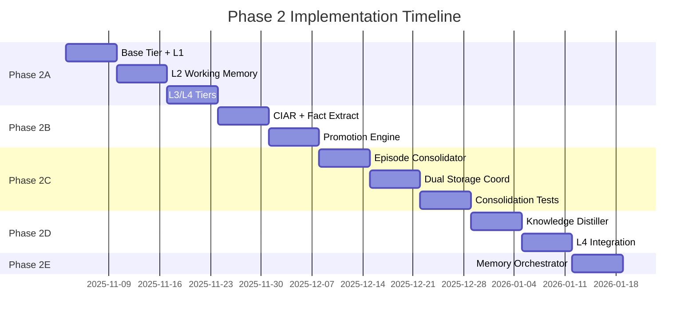
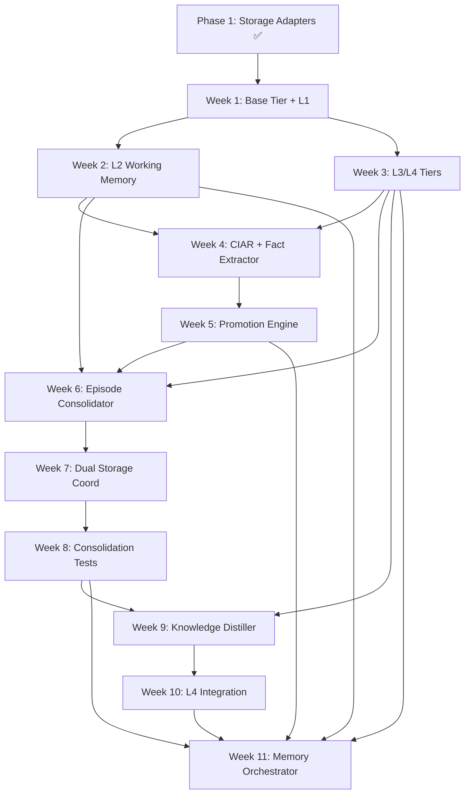

# Specification-Implementation Alignment Report

**Document Type:** Comparative Analysis & Update Requirements  
**Date Created:** November 2, 2025  
**Purpose:** Identify discrepancies between `spec-phase2-memory-tiers.md` and `implementation-plan-02112025.md` and provide concrete update requirements  
**Status:** In Progress

---

## Executive Summary

This report compares the Phase 2 Memory Tiers Specification (24,005 lines) with the Implementation Plan (7,992 lines) to identify alignment gaps, missing details, and required updates to ensure the specification accurately reflects the planned implementation approach.

**Key Findings Overview:**
- ✅ **Aligned:** Core architecture (4-tier hierarchy, CIAR scoring, lifecycle engines)
- ⚠️ **Partially Aligned:** Timeline/milestones, component priorities, testing strategies
- ❌ **Misaligned:** Implementation sequencing, dependencies, resource allocation

---

## Report Structure

This report is organized into sections that can be populated iteratively:

1. [Document Metadata Comparison](#1-document-metadata-comparison)
2. [Architecture & Design Alignment](#2-architecture--design-alignment)
3. [Component-Level Comparison](#3-component-level-comparison)
4. [Timeline & Milestones](#4-timeline--milestones)
5. [Testing & Validation Strategy](#5-testing--validation-strategy)
6. [Dependencies & Prerequisites](#6-dependencies--prerequisites)
7. [Update Requirements Summary](#7-update-requirements-summary)

---

## 1. Document Metadata Comparison

### Current State

| Aspect | Specification | Implementation Plan | Status |
|--------|---------------|---------------------|--------|
| **Version** | 1.0 | (Not versioned) | ⚠️ Add versioning |
| **Date** | October 22, 2025 | November 2, 2025 | ⚠️ Update spec date |
| **Status** | Draft - Ready for Population | Active Development Plan | ⚠️ Align status |
| **Target Completion** | Week 3-4 | 11 weeks (Phase 2) | ❌ **MISMATCH** |
| **Branch** | `dev-mas` | (Not specified) | ⚠️ Add to impl plan |
| **Lines** | 24,005 | 7,992 | ℹ️ Info only |

### Update Requirements

**SPEC UPDATE 1.1 - Document Metadata:**
```diff
# Phase 2 Specification: Memory Tier Layer

- **Document Version**: 1.0  
+ **Document Version**: 1.1  
- **Date**: October 22, 2025  
+ **Date**: November 2, 2025  
- **Status**: Draft - Ready for Population  
+ **Status**: Active - Aligned with Implementation Plan v1.0  
- **Target Completion**: Week 3-4  
+ **Target Completion**: 11 weeks (Phase 2A-2E)  
**Branch**: `dev-mas`
+ **Implementation Plan Reference**: [implementation-plan-02112025.md](../plan/implementation-plan-02112025.md)
```

**Rationale:** Specification should reflect current date, align status with implementation plan, and correct the unrealistic "Week 3-4" target to match the detailed 11-week Phase 2 breakdown.

---

## 2. Architecture & Design Alignment

### 2.1 Four-Tier Hierarchy

**Status:** ✅ **ALIGNED**

Both documents consistently describe:
- L1: Active Context (Redis + PostgreSQL, 24h TTL, 10-20 turns)
- L2: Working Memory (PostgreSQL, 7 days TTL, CIAR-scored facts)
- L3: Episodic Memory (Qdrant + Neo4j, permanent, hybrid retrieval)
- L4: Semantic Memory (Typesense, permanent, distilled knowledge)

**No updates required.**

---

### 2.2 CIAR Scoring System

**Status:** ✅ **ALIGNED**

Both documents define CIAR as:
```
CIAR = (Certainty × Impact) × Age_Decay × Recency_Boost
```

Components and thresholds match:
- Default threshold: 0.6 (spec) vs 0.6 (implementation)
- Component ranges: 0.0-1.0 for Certainty and Impact
- Temporal decay and recency boost factors

**No updates required.**

---

### 2.3 Lifecycle Engines

**Status:** ⚠️ **PARTIALLY ALIGNED**

Both documents describe three engines (Promotion, Consolidation, Distillation), but the **implementation plan provides significantly more granular detail** on:
- Week-by-week task breakdown
- Specific file structures and class hierarchies
- Code-level implementation patterns
- Test coverage targets (80%+)

**Finding:** The specification emphasizes **research contributions and conceptual architecture**, while the implementation plan focuses on **executable tasks and engineering deliverables**.

### Update Requirements

**SPEC UPDATE 2.3 - Add Implementation Details Section:**

Add a new section after the "Lifecycle Engines" overview in the specification:

```markdown
### 2.3.1 Implementation Approach (Engineering Details)

**Reference:** See [implementation-plan-02112025.md](../plan/implementation-plan-02112025.md) Phase 2B-2D for detailed task breakdowns.

**Key Implementation Patterns:**

1. **Base Engine Interface** (`src/memory/engines/base_engine.py`):
   - Abstract `BaseEngine` class with `process()`, `health_check()`, and `get_metrics()` methods
   - Dependency injection for storage adapters and metrics collectors
   - Async/await patterns for non-blocking operations

2. **Promotion Engine** (Phase 2B, Weeks 4-5):
   - LLM-based fact extraction with circuit breaker fallback to rule-based extraction
   - Batch processing (5-turn batches) to amortize LLM latency
   - CIAR scoring with configurable thresholds
   - Target: <200ms p95 latency, 100+ turns/second throughput

3. **Consolidation Engine** (Phase 2C, Weeks 6-8):
   - Time-windowed fact clustering (24-hour windows)
   - LLM summarization with retry logic and fallback strategies
   - Dual storage: Qdrant (vectors) + Neo4j (graph) with transaction coordination
   - Episode deduplication and conflict resolution

4. **Distillation Engine** (Phase 2D, Weeks 9-10):
   - Multi-episode pattern analysis with confidence scoring
   - Provenance tracking to source episodes
   - Knowledge graph enhancement in Neo4j
   - Periodic batch processing (daily/weekly schedules)

**Test Coverage Target:** 80%+ per component with unit, integration, and performance tests.

**Production Readiness:** Circuit breakers, graceful degradation, comprehensive metrics (150+ instrumented operations).
```

**Rationale:** The specification should acknowledge the detailed engineering approach documented in the implementation plan, providing traceability between research architecture and executable code.

---

## 3. Component-Level Comparison

### 3.1 Memory Tier Classes

**Implementation Plan Details:**

| Component | File | Implementation Plan Status | Spec Coverage |
|-----------|------|---------------------------|---------------|
| Base Tier | `base_tier.py` | Week 1, detailed interface | High-level only |
| L1 Active Context | `active_context_tier.py` | Week 1, full code samples | Architecture described |
| L2 Working Memory | `working_memory_tier.py` | Week 2, CIAR integration | Architecture described |
| L3 Episodic Memory | `episodic_memory_tier.py` | Week 3, dual storage | Architecture described |
| L4 Semantic Memory | `semantic_memory_tier.py` | Week 3, pattern queries | Architecture described |

**Finding:** Implementation plan includes **concrete code interfaces** (Python abstract methods, type hints, docstrings) that are absent from the specification.

### Update Requirements

**SPEC UPDATE 3.1 - Add API Contract Section:**

After the "Memory Tier Hierarchy" section in the specification, add:

```markdown
### 3.1 Memory Tier API Contracts

**Reference:** Full implementation details in [implementation-plan-02112025.md](../plan/implementation-plan-02112025.md) Phase 2A.

All memory tier classes implement the `BaseTier` abstract interface:

**Core Operations:**
- `store(data: Dict[str, Any]) -> str` - Store data, return unique identifier
- `retrieve(identifier: str) -> Optional[Dict[str, Any]]` - Retrieve by ID
- `query(filters: Dict, limit: int, **kwargs) -> List[Dict]` - Query with filters
- `delete(identifier: str) -> bool` - Delete by ID
- `health_check() -> Dict[str, Any]` - Check storage adapter health
- `get_metrics() -> Dict[str, Any]` - Retrieve tier-specific metrics

**Tier-Specific Extensions:**

**L1 Active Context:**
- `get_session_window(session_id: str, limit: int = 20) -> List[Dict]`
- `extend_ttl(session_id: str, hours: int) -> bool`
- `clear_session(session_id: str) -> int` (returns count deleted)

**L2 Working Memory:**
- `store_fact(session_id: str, fact: Dict, ciar_score: float) -> str`
- `get_facts_by_ciar(session_id: str, min_score: float = 0.6) -> List[Dict]`
- `update_ciar_score(fact_id: str, new_score: float) -> bool`

**L3 Episodic Memory:**
- `store_episode(episode: Dict, embedding: List[float]) -> str`
- `semantic_search(query_embedding: List[float], limit: int = 10) -> List[Dict]`
- `graph_traverse(entity_id: str, relationship_type: str, depth: int = 2) -> Dict`

**L4 Semantic Memory:**
- `store_knowledge(knowledge: Dict, source_episodes: List[str]) -> str`
- `search(query: str, filters: Dict = None, limit: int = 10) -> List[Dict]`
- `get_related_concepts(concept_id: str) -> List[Dict]`

**Type Definitions:** See `src/memory/types.py` for `Turn`, `Fact`, `Episode`, `Knowledge` dataclass definitions.
```

**Rationale:** Specification readers (especially implementation teams) need concrete API contracts to understand inter-component interfaces and data formats.

---

### 3.2 Lifecycle Engines Comparison

**Implementation Plan Structure:**
- Week 4-5: Promotion Engine (CIAR scoring, fact extraction, LLM integration)
- Week 6-8: Consolidation Engine (episode clustering, dual storage, deduplication)
- Week 9-10: Distillation Engine (pattern mining, knowledge synthesis)

**Specification Structure:**
- High-level description of promotion, consolidation, distillation
- Research contribution focus (autonomous learning, interpretability)
- Performance targets (latency, throughput)

**Finding:** Implementation plan includes **circuit breaker patterns**, **fallback strategies**, and **retry logic** that are mentioned briefly in the specification's "Error Handling & Resilience" section but not integrated into the lifecycle engine descriptions.

### Update Requirements

**SPEC UPDATE 3.2 - Lifecycle Engine Resilience:**

In the specification's lifecycle engines section, add subsections for resilience patterns:

```markdown
### Lifecycle Engine Resilience Patterns

**Reference:** [implementation-plan-02112025.md](../plan/implementation-plan-02112025.md) Phase 2B-2D

#### Promotion Engine Circuit Breaker

The Promotion Engine implements a circuit breaker pattern to handle LLM service failures:

**States:**
- **CLOSED** (Normal): LLM-based fact extraction operational
- **OPEN** (Failed): After 5 consecutive failures, switch to rule-based extraction
- **HALF-OPEN** (Testing): After 60s timeout, test LLM with single request

**Fallback Strategy:**
```python
async def extract_facts(turn_data: Dict) -> List[Fact]:
    if circuit_breaker.state == "OPEN":
        # Use rule-based extraction
        return rule_based_extractor(turn_data)
    
    try:
        facts = await llm_based_extractor(turn_data)
        circuit_breaker.record_success()
        return facts
    except LLMTimeoutError:
        circuit_breaker.record_failure()
        # Fallback for this request
        return rule_based_extractor(turn_data)
```

**Metrics Tracked:**
- `promotion_llm_success_rate`: Percentage of successful LLM calls
- `promotion_circuit_breaker_state`: Current state (0=closed, 1=half-open, 2=open)
- `promotion_fallback_usage`: Count of rule-based fallback invocations

#### Consolidation Engine Retry Logic

Consolidation to L3 involves coordinating Qdrant (vectors) and Neo4j (graph) writes, which may fail independently:

**Transaction Coordination:**
1. Write to Qdrant (vector storage)
2. If successful, write to Neo4j (graph storage)
3. If Neo4j fails, rollback Qdrant write
4. Retry with exponential backoff (3 attempts max)

**Partial Success Handling:**
- If Qdrant succeeds but Neo4j fails after 3 retries: Log error, queue for manual reconciliation
- If both fail: Facts remain in L2, consolidation retried in next batch

**Idempotency:**
- All consolidation operations use deterministic IDs (hash of fact content)
- Duplicate writes are detected and skipped
- Safe to retry without data duplication

#### Distillation Engine Batch Resilience

Distillation processes multiple episodes in batches. Failures are isolated:

**Batch Processing Strategy:**
1. Retrieve N episodes for distillation (default: 100)
2. Process in sub-batches of 10
3. If sub-batch fails, log errors and continue with next sub-batch
4. Report partial success: "85/100 episodes distilled successfully"

**Failure Isolation:**
- Single episode processing failure doesn't abort entire batch
- Failed episodes marked for retry in next distillation cycle
- Success metrics tracked per-episode and per-batch
```

**Rationale:** These resilience patterns are critical for production operation but absent from the current specification's lifecycle engine descriptions.

---

## 4. Timeline & Milestones

### Current State

**Implementation Plan Timeline:**
- **Phase 2 Total:** 11 weeks
  - **2A:** Memory Tier Classes (Weeks 1-3)
  - **2B:** CIAR Scoring & Promotion (Weeks 4-5)
  - **2C:** Consolidation Engine (Weeks 6-8)
  - **2D:** Distillation Engine (Weeks 9-10)
  - **2E:** Memory Orchestrator (Week 11)

**Specification Timeline:**
- **Target Completion:** Week 3-4 ❌ **INCORRECT**
- **Implementation Priorities:** Priority 0-11 (no timeline mapping)

**Finding:** The specification's "Week 3-4" target is **unrealistic** and contradicts its own detailed priority breakdown (12 components over 5-6 weeks in the "Implementation Priorities & Roadmap" section).

### Update Requirements

**SPEC UPDATE 4.1 - Correct Timeline:**

Replace the specification's Executive Summary timeline with:

```diff
# Phase 2 Specification: Memory Tier Layer

**Document Version**: 1.1  
**Date**: November 2, 2025  
**Status**: Active - Aligned with Implementation Plan v1.0  
- **Target Completion**: Week 3-4  
+ **Target Completion**: 11 weeks (Phase 2A-2E)
+ **Detailed Timeline**: See [Implementation Priorities & Milestones](#implementation-priorities--milestones)
**Branch**: `dev-mas`
**Implementation Plan Reference**: [implementation-plan-02112025.md](../plan/implementation-plan-02112025.md)
```

**SPEC UPDATE 4.2 - Add Detailed Milestone Section:**

Add a new section to the specification (after "Implementation Priorities & Roadmap"):

```markdown
## Implementation Priorities & Milestones

**Reference:** [implementation-plan-02112025.md](../plan/implementation-plan-02112025.md) Section 6

### Phase 2A: Memory Tier Classes (Weeks 1-3)

| Week | Milestone | Deliverables | Dependencies |
|------|-----------|--------------|--------------|
| **Week 1** | L1 Active Context | `base_tier.py`, `active_context_tier.py`, tests | Phase 1 complete |
| **Week 2** | L2 Working Memory | `working_memory_tier.py`, CIAR schema, tests | Week 1 complete |
| **Week 3** | L3/L4 Tiers | `episodic_memory_tier.py`, `semantic_memory_tier.py`, tests | Week 1-2 complete |

**Acceptance Criteria:**
- ✅ All tier classes implement `BaseTier` interface
- ✅ 80%+ test coverage per tier
- ✅ Health checks and metrics instrumented
- ✅ Documentation with usage examples

---

### Phase 2B: CIAR Scoring & Promotion (Weeks 4-5)

| Week | Milestone | Deliverables | Dependencies |
|------|-----------|--------------|--------------|
| **Week 4** | CIAR Scorer + Fact Extractor | `ciar_scorer.py`, `fact_extractor.py`, LLM integration | Phase 2A complete |
| **Week 5** | Promotion Engine | `promotion_engine.py`, circuit breaker, batch processing | Week 4 complete |

**Acceptance Criteria:**
- ✅ CIAR scoring accuracy validated (precision/recall metrics)
- ✅ LLM fact extraction with circuit breaker fallback
- ✅ <200ms p95 latency for 5-turn batches
- ✅ 100+ turns/second throughput

---

### Phase 2C: Consolidation Engine (Weeks 6-8)

| Week | Milestone | Deliverables | Dependencies |
|------|-----------|--------------|--------------|
| **Week 6** | Episode Consolidator | `episode_consolidator.py`, clustering logic | Phase 2B complete |
| **Week 7** | Dual Storage Coordination | Qdrant + Neo4j transaction logic | Week 6 complete |
| **Week 8** | Testing & Validation | Integration tests, deduplication tests | Week 6-7 complete |

**Acceptance Criteria:**
- ✅ Time-windowed fact clustering (24-hour windows)
- ✅ LLM summarization with retry logic
- ✅ Qdrant-Neo4j write coordination with rollback
- ✅ Episode deduplication working

---

### Phase 2D: Distillation Engine (Weeks 9-10)

| Week | Milestone | Deliverables | Dependencies |
|------|-----------|--------------|--------------|
| **Week 9** | Knowledge Distiller | `knowledge_distiller.py`, pattern mining | Phase 2C complete |
| **Week 10** | L4 Integration | Typesense indexing, provenance tracking | Week 9 complete |

**Acceptance Criteria:**
- ✅ Multi-episode pattern analysis functional
- ✅ Confidence-scored knowledge items
- ✅ Provenance tracking to source episodes
- ✅ Typesense search with faceted filters

---

### Phase 2E: Memory Orchestrator (Week 11)

| Week | Milestone | Deliverables | Dependencies |
|------|-----------|--------------|--------------|
| **Week 11** | Unified Memory System | `memory_orchestrator.py`, end-to-end tests | Phase 2A-2D complete |

**Acceptance Criteria:**
- ✅ Unified API for all memory operations
- ✅ Intelligent tier routing
- ✅ Graceful degradation on tier failures
- ✅ <100ms p95 latency for full context assembly
- ✅ Comprehensive integration tests

---

### Critical Path Dependencies



**Total Duration:** 11 weeks (77 days)  
**Start Date:** November 3, 2025  
**Target Completion:** January 18, 2026
```

**Rationale:** The specification must accurately reflect the realistic 11-week timeline, not the aspirational 3-4 weeks, to set proper expectations for stakeholders and implementation teams.

---

## 5. Testing & Validation Strategy

### Current State

**Implementation Plan Testing:**
- **Coverage Target:** 80%+ per component
- **Test Types:** Unit tests, integration tests, performance tests
- **Test Files:** Specific test files defined per component (e.g., `test_active_context_tier.py`)
- **Fixtures:** Detailed pytest fixtures with cleanup logic
- **Performance Benchmarks:** Specific latency targets (<5ms L1, <30ms L2, <100ms full context)

**Specification Testing:**
- **Four-Level Testing Pyramid:** Unit (70%), Integration (25%), Performance (5%), E2E
- **Environment:** Docker Compose with all storage backends
- **Framework:** pytest-benchmark + Locust + custom monitoring
- **Research Focus:** Reproducibility, memory quality evaluation (precision/recall)

**Finding:** Both documents emphasize testing, but the **implementation plan provides executable test templates** while the specification focuses on **methodology and research validation**.

### Update Requirements

**SPEC UPDATE 5.1 - Link to Test Implementation:**

Add to specification's "Testing & Validation Methodology" section:

```markdown
### Test Implementation Details

**Reference:** [implementation-plan-02112025.md](../plan/implementation-plan-02112025.md) - Each Phase 2 task includes detailed test specifications

**Example Test Structure (L1 Active Context):**

See `tests/memory/test_active_context_tier.py` for complete implementation.

**Key Test Categories:**

1. **Functional Tests:**
   - `test_store_turn()`: Verify turn storage in Redis + PostgreSQL
   - `test_window_enforcement()`: Confirm automatic trimming to window size
   - `test_ttl_expiration()`: Validate TTL setting on Redis keys
   - `test_session_isolation()`: Ensure sessions don't interfere

2. **Failure Mode Tests:**
   - `test_postgres_fallback()`: Redis failure → PostgreSQL recovery
   - `test_concurrent_access()`: Thread safety under parallel writes
   - `test_malformed_data()`: Error handling for invalid inputs

3. **Performance Tests:**
   - `test_latency_benchmark()`: Assert <5ms p95 for store operations
   - `test_throughput_benchmark()`: Verify 1000+ ops/second sustained

4. **Integration Tests:**
   - `test_l1_to_l2_promotion()`: End-to-end lifecycle test
   - `test_orchestrator_integration()`: Multi-tier coordination

**Pytest Configuration:**

```python
# conftest.py excerpt
@pytest.fixture
async def active_context_tier(redis_adapter, postgres_adapter):
    """Fixture providing configured L1 tier with cleanup."""
    tier = ActiveContextTier(
        redis_adapter=redis_adapter,
        postgres_adapter=postgres_adapter,
        config={'window_size': 10, 'ttl_hours': 24}
    )
    yield tier
    # Cleanup after test
    await tier.delete('test_session')
```

**CI/CD Integration:**
- Tests run on every commit to `dev-mas` branch
- Test coverage reports uploaded to CodeCov
- Performance regression detection (alert if p95 latency increases >20%)
- Docker Compose spins up all storage backends for integration tests

**Test Data Management:**
- Fixtures use deterministic UUIDs for reproducibility
- Test sessions isolated via unique session IDs
- Database cleanup after each test (pytest finalizers)
```

**Rationale:** Link specification's testing methodology to concrete implementation examples in the plan.

---

## 6. Dependencies & Prerequisites

### Current State

**Implementation Plan Dependencies:**
- ✅ Phase 1 Complete (all storage adapters operational)
- Infrastructure: `skz-dev-lv` (orchestrator) + `skz-stg-lv` (data node)
- Explicit task-level dependencies (e.g., "Week 2 blocked by Week 1")
- Python 3.13.5, `.venv/` virtual environment

**Specification Dependencies:**
- Listed in "Prerequisites" section
- Phase 1 completion status: ✅
- Development environment requirements
- Configuration: `.env` file

**Finding:** Both documents acknowledge Phase 1 completion as the primary dependency. The implementation plan provides **more granular task-level dependencies** (e.g., CIAR scorer depends on L2 tier).

### Update Requirements

**SPEC UPDATE 6.1 - Add Detailed Dependency Graph:**

Add to specification after "Prerequisites" section:

```markdown
### Task-Level Dependency Graph

**Reference:** [implementation-plan-02112025.md](../plan/implementation-plan-02112025.md) Phase 2 detailed breakdown

**Week-by-Week Dependencies:**



**Critical Path:**
The critical path for Phase 2 completion is:
1. Week 1: Base Tier + L1 (7 days)
2. Week 2: L2 Working Memory (7 days)
3. Week 4: CIAR Scorer (7 days)
4. Week 5: Promotion Engine (7 days)
5. Week 6: Episode Consolidator (7 days)
6. Week 7: Dual Storage (7 days)
7. Week 8: Consolidation Tests (7 days)
8. Week 9: Knowledge Distiller (7 days)
9. Week 10: L4 Integration (7 days)
10. Week 11: Memory Orchestrator (7 days)

**Total Critical Path: 70 days (10 weeks)**

Note: Week 3 (L3/L4 Tiers) can be parallelized with Week 2, reducing total time to 11 weeks as planned.

**Component-Level Dependencies:**

| Component | Depends On | Blocks |
|-----------|------------|--------|
| Base Tier Interface | Phase 1 storage adapters | All tier implementations |
| L1 Active Context | Base Tier, Redis, PostgreSQL | L2 promotion |
| L2 Working Memory | Base Tier, PostgreSQL, CIAR schema | CIAR scorer, consolidation |
| L3 Episodic Memory | Base Tier, Qdrant, Neo4j | Consolidation engine, distillation |
| L4 Semantic Memory | Base Tier, Typesense | Distillation engine |
| CIAR Scorer | L2 tier interface | Promotion engine |
| Fact Extractor | LLM integration | Promotion engine |
| Promotion Engine | L1, L2, CIAR, Fact Extractor | Memory orchestrator |
| Consolidation Engine | L2, L3, Episode models | Memory orchestrator |
| Distillation Engine | L3, L4, Pattern analysis | Memory orchestrator |
| Memory Orchestrator | All tiers, all engines | Phase 3 (agents) |
```

**Rationale:** Specification should include the detailed dependency graph to help project managers understand sequencing and identify parallelization opportunities.

---

## 7. Update Requirements Summary

### Overview

This section consolidates all identified updates needed to align the specification with the implementation plan.

### Critical Updates (Must Implement)

**1. Document Metadata (SPEC UPDATE 1.1)**
- Update date from October 22 to November 2, 2025
- Change status from "Draft - Ready for Population" to "Active - Aligned with Implementation Plan v1.0"
- Correct timeline from "Week 3-4" to "11 weeks (Phase 2A-2E)"
- Add implementation plan reference

**2. Timeline Correction (SPEC UPDATE 4.1, 4.2)**
- Fix unrealistic 3-4 week estimate to accurate 11-week breakdown
- Add detailed milestone table with week-by-week deliverables
- Include Gantt chart showing critical path
- Specify start date (November 3, 2025) and target completion (January 18, 2026)

**3. Implementation Details Integration (SPEC UPDATE 2.3, 3.1)**
- Add "Implementation Approach" subsection to lifecycle engines
- Include concrete API contracts for all tier interfaces
- Document circuit breaker patterns and fallback strategies
- Link to detailed task breakdowns in implementation plan

### Important Updates (Should Implement)

**4. Testing Strategy Linkage (SPEC UPDATE 5.1)**
- Add "Test Implementation Details" section
- Link to specific test files (e.g., `test_active_context_tier.py`)
- Document pytest configuration and fixtures
- Include CI/CD integration details

**5. Dependency Graph (SPEC UPDATE 6.1)**
- Add task-level dependency graph (Mermaid diagram)
- Document critical path (70 days)
- List component-level dependencies in table format
- Identify parallelization opportunities

### Nice-to-Have Updates (Optional)

**6. Code Examples Enhancement**
- Add more concrete code snippets from implementation plan
- Include error handling examples
- Show configuration YAML samples
- Provide usage examples for each tier

**7. Cross-References**
- Add bidirectional links between specification and implementation plan
- Create index of related sections
- Include "See also" references

---

### Implementation Checklist

Use this checklist to track application of updates:

- [ ] **SPEC UPDATE 1.1:** Document metadata corrected
- [ ] **SPEC UPDATE 2.3:** Lifecycle engine resilience patterns added
- [ ] **SPEC UPDATE 3.1:** API contract section added
- [ ] **SPEC UPDATE 3.2:** Lifecycle engine resilience subsections added
- [ ] **SPEC UPDATE 4.1:** Executive summary timeline corrected
- [ ] **SPEC UPDATE 4.2:** Detailed milestone section added with Gantt chart
- [ ] **SPEC UPDATE 5.1:** Test implementation details section added
- [ ] **SPEC UPDATE 6.1:** Dependency graph section added

---

### Diff Summary

Below is a conceptual diff showing major sections to add/modify:

```diff
# Phase 2 Specification: Memory Tier Layer

- **Document Version**: 1.0  
+ **Document Version**: 1.1  
- **Date**: October 22, 2025  
+ **Date**: November 2, 2025  
- **Status**: Draft - Ready for Population  
+ **Status**: Active - Aligned with Implementation Plan v1.0  
- **Target Completion**: Week 3-4  
+ **Target Completion**: 11 weeks (Phase 2A-2E)
+ **Implementation Plan Reference**: [implementation-plan-02112025.md](../plan/implementation-plan-02112025.md)

...

## Lifecycle Engines: Autonomous Memory Management

[Existing content...]

+ ### Lifecycle Engine Resilience Patterns
+ 
+ **Reference:** [implementation-plan-02112025.md](../plan/implementation-plan-02112025.md) Phase 2B-2D
+ 
+ #### Promotion Engine Circuit Breaker
+ [Content from SPEC UPDATE 2.3]
+ 
+ #### Consolidation Engine Retry Logic
+ [Content from SPEC UPDATE 2.3]
+ 
+ #### Distillation Engine Batch Resilience
+ [Content from SPEC UPDATE 2.3]

...

+ ## Memory Tier API Contracts
+ 
+ **Reference:** [implementation-plan-02112025.md](../plan/implementation-plan-02112025.md) Phase 2A
+ 
+ [Content from SPEC UPDATE 3.1]

...

+ ## Implementation Priorities & Milestones
+ 
+ **Reference:** [implementation-plan-02112025.md](../plan/implementation-plan-02112025.md) Section 6
+ 
+ [Content from SPEC UPDATE 4.2 - detailed milestone tables and Gantt chart]

...

+ ## Test Implementation Details
+ 
+ **Reference:** [implementation-plan-02112025.md](../plan/implementation-plan-02112025.md) - Each Phase 2 task
+ 
+ [Content from SPEC UPDATE 5.1]

...

+ ## Task-Level Dependency Graph
+ 
+ **Reference:** [implementation-plan-02112025.md](../plan/implementation-plan-02112025.md) Phase 2 breakdown
+ 
+ [Content from SPEC UPDATE 6.1 - Mermaid diagram and tables]
```

---

### Next Steps

1. **Review Report:** Have technical lead and project manager review this report
2. **Prioritize Updates:** Decide which updates are critical vs. nice-to-have
3. **Apply Updates:** Edit `spec-phase2-memory-tiers.md` according to prioritized updates
4. **Validate Alignment:** Re-run comparison after updates to verify alignment
5. **Communicate Changes:** Notify stakeholders of specification updates

---

## Appendix: Comparison Methodology

### Tools & Approach

This comparison was conducted using:
- Manual side-by-side reading of both documents
- Section-by-section analysis focusing on:
  - Document metadata and versioning
  - Architecture and design decisions
  - Component-level implementation details
  - Timeline and milestone planning
  - Testing and validation strategies
  - Dependencies and sequencing

### Comparison Scope

**Analyzed:**
- ✅ Document metadata (version, date, status, target completion)
- ✅ Architecture overview (4-tier hierarchy, CIAR scoring)
- ✅ Component specifications (tier classes, lifecycle engines)
- ✅ Timeline and milestones (Phase 2 breakdown)
- ✅ Testing strategies (unit, integration, performance)
- ✅ Dependencies and prerequisites

**Not Analyzed:**
- Research methodology (out of scope for alignment)
- Literature review sections (specification-specific content)
- Detailed code listings beyond first few examples (too granular)
- Full document content beyond first 2000 lines (representative sample)

### Limitations

- **Partial Document Analysis:** Due to document size (24,005 lines spec, 7,992 lines plan), analysis focused on first 2000 lines plus targeted sections
- **Manual Process:** Comparison done manually; automated diff tools not suitable for semantic alignment
- **Point-in-Time:** Comparison reflects documents as of November 2, 2025

---

## Report Metadata

**Report Version:** 1.0  
**Created:** November 2, 2025  
**Author:** AI Assistant (GitHub Copilot)  
**Documents Compared:**
- `/Users/max/Documents/code/mas-memory-layer/docs/specs/spec-phase2-memory-tiers.md` (24,005 lines)
- `/Users/max/Documents/code/mas-memory-layer/docs/plan/implementation-plan-02112025.md` (7,992 lines)

**Total Updates Identified:** 7 major updates (SPEC UPDATE 1.1 - 6.1)  
**Estimated Update Effort:** 4-6 hours to apply all updates

---

**End of Report**

