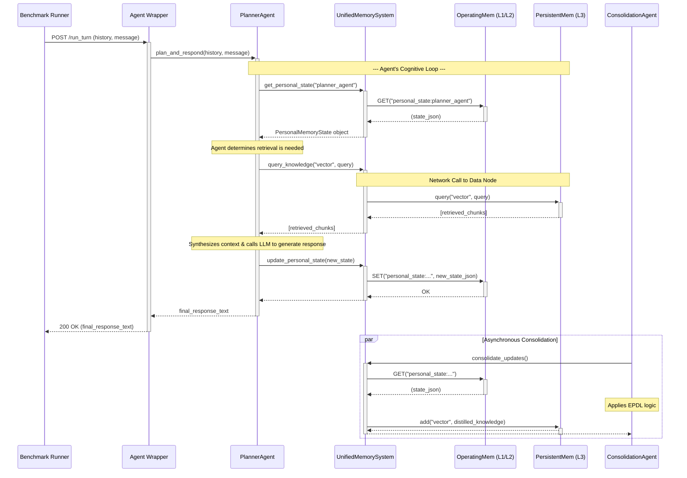

Here is the Mermaid sequence diagram that visually represents the "Run GoodAI LTM Benchmark Test" use case (UC-01).

### **Mermaid Sequence Diagram Code**

You can copy and paste this code block into any Markdown editor that supports Mermaid (like GitHub, GitLab, or Obsidian) or into the Mermaid Live Editor to render the diagram.

### **Code Mentor Notes: How to Read This Diagram**

*   **Lifelines:** Each vertical line represents a component from our architecture. I've separated `Redis` and `KSM (KnowledgeStoreManager)` from the main `UnifiedMemorySystem` to clearly show which layer is being accessed.
*   **Solid Arrows (`->>`)**: These represent active function calls or requests. The `+` and `-` signs at the ends of the arrows show the activation/deactivation of a component on the call stack.
*   **Dashed Arrows (`-->>`)**: These represent the return value from a function call.
*   **Notes:** The `Note over...` boxes provide context for what's happening "inside the agent's head" or across the system, like the agent's internal decision to perform a retrieval or the fact that a call to `KSM` is a network call.
*   **Parallel Block (`par`)**: The `par...end` block at the bottom is crucial. It correctly visualizes the **Asynchronous Consolidation** process, showing that the `ConsolidationAgent` runs in parallel to the main request-response flow, as specified in our Use Case. This is a key feature of our architecture's design for efficiency.

This diagram, combined with the Use Case Specification, provides a comprehensive picture of the first benchmark run.