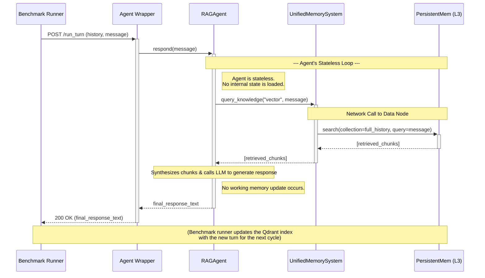

Here is the Mermaid sequence diagram for the second experimental run, the **"Standard RAG Agent"** baseline (UC-02).

This diagram is intentionally simpler than the first. Its simplicity is key to visually communicating the architectural trade-offs to the reviewers. It highlights the direct, stateless nature of the RAG agent and contrasts it with the more complex, stateful interactions of our full system.

### **Mermaid Sequence Diagram Code (Standard RAG Agent)**

### **Code Mentor Notes: How to Read This Diagram & Its Strategic Importance**

*   **Fewer Lifelines:** Notice there is no `Redis` (Operating Memory) or `ConsolidationAgent`. This immediately shows that the architecture is flatter and less complex.
*   **Stateless by Design:** The `Note` blocks explicitly call out that the agent does not load any internal state at the beginning of its turn and does not save any state at the end. It starts "fresh" every time, relying solely on retrieval. This is the definition of a standard RAG agent.
*   **Single, Heavy Retrieval:** The diagram shows only **one** interaction with memory: a single, large `search` query to the `Qdrant` collection that contains the entire history. This visually contrasts with the Full System's multi-step `get_personal_state` followed by `query_knowledge`.
*   **No Asynchronous Process:** There is no `par...end` block. The process is a simple, linear request-response. The responsibility of updating the knowledge base for the next turn is pushed outside the agent's core logic (handled by the benchmark runner itself).

When placed next to the sequence diagram for our full system, this diagram will powerfully and intuitively communicate the architectural differences we are testing. It tells the reviewers: "This is the simple, standard way. The other diagram shows our more sophisticated, stateful, and multi-layered approach."