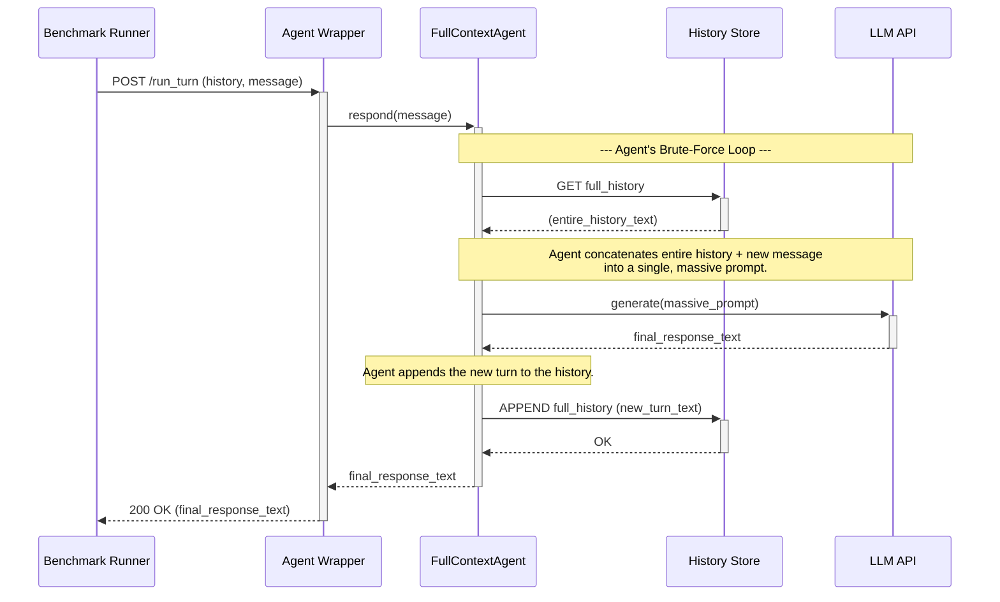

This diagram is designed to visually emphasize the brute-force nature of this approach. The most important part of this diagram is the single, massive call to the LLM, which represents the extreme inefficiency we are trying to solve with our architecture.

### **Mermaid Sequence Diagram Code (Full-Context Agent)**

### **Code Mentor Notes: How to Read This Diagram & Its Strategic Importance**

*   **Different Role for Redis:** Notice the lifeline is labeled **`History Store`**. This is a deliberate choice to distinguish it from the `OperatingMem (L1/L2)` in the full system diagram. Here, Redis is not being used as a sophisticated, structured cache or workspace; it's just a simple, "dumb" container for a single, massive string of text.
*   **The Massive LLM Call:** The central and most important interaction is the call to the `LLM API`. The `Note` explicitly states that the prompt is "massive." This visually communicates the core weakness of this approach: immense token consumption and high latency. This single arrow represents the primary source of inefficiency that our hybrid architecture is designed to eliminate.
*   **No Persistent Layer:** There is no `KSM` or Persistent Knowledge Layer involved. The agent cannot learn or access structured, long-term knowledge. Its only memory is the linear, raw text of the conversation.
*   **Simplicity as a Weakness:** The diagram is very simple—a loop of "read all, process all, write all." This simplicity is not a strength; it's the reason for the inefficiency. When compared to the other diagrams, it powerfully illustrates that sophistication (like tiered retrieval and consolidation) is necessary for performance.

This diagram completes the visual narrative for our three experimental conditions. Together, the three diagrams will provide the reviewers with an immediate and intuitive understanding of the architectural differences we are testing.